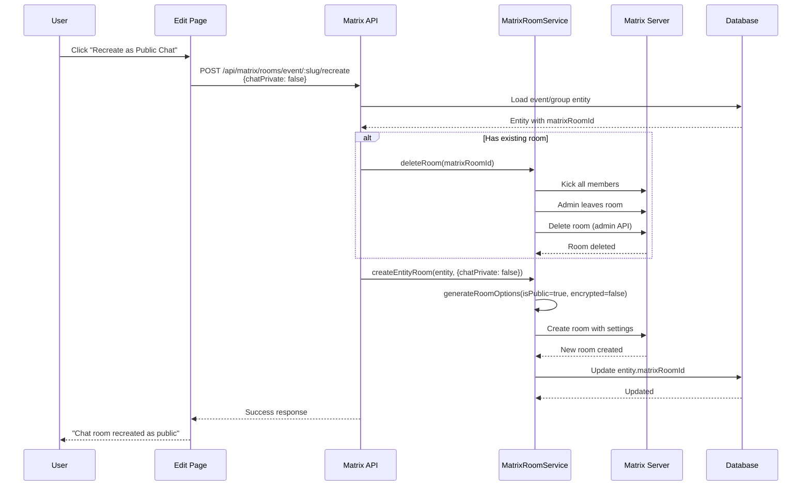

# Chat Room Recreation Feature

**Status**: In Development (November 2025)
**Related Issue**: [#249 - Matrix Integration UX](https://github.com/OpenMeet-Team/openmeet-platform/issues/249)

## Background

### The Problem

Matrix E2EE (End-to-End Encryption) creates significant UX friction:
- Requires manual consent screens when creating Matrix sessions
- Users must verify encryption keys for each encrypted room
- Session management complexity causes "prominently under-developed" perception
- Blocks immediate chat access that users expect

### Legacy Behavior (Pre-November 2025)

Chat room encryption was automatically determined by entity visibility:

```typescript
// Old logic in matrix-room.service.ts
const shouldEncrypt = entity.visibility === 'private';
```

**Result:**
- `visibility='private'` → Encrypted room (E2EE friction)
- `visibility='public'` → Public room (better UX)
- No user control over chat encryption separate from event/group visibility

### Current State Analysis (Dev Database - November 2025)

**Events:**
- 1,512 total events
- 181 public events with Matrix rooms (unencrypted)
- **38 private events with Matrix rooms** (encrypted under old logic)
  - **9 of these are active** (upcoming or recent)

**Groups:**
- 52 total groups
- 20 public groups with Matrix rooms (unencrypted)
- **23 private groups with Matrix rooms** (encrypted under old logic)
  - **7 have multiple members** (active)
  - 33 total members across private groups

**Estimated Impact:**
- ~61 potentially encrypted rooms total
- **~16 appear active** and would benefit from migration
- Affects user experience for chat access and participation

## Solution: New Default for All Future Rooms

### New Default Behavior (November 2025)

**All NEW rooms are created as public, unencrypted by default:**

```typescript
// New logic in matrix-room.service.ts
const isPublic = true;
const encrypted = false;
```

**Rationale:**
- Better UX: No E2EE setup screens after initial Matrix consent
- Immediate chat access for all public rooms
- E2EE still available but opt-in (experimental)

### What About Existing Encrypted Rooms?

**Existing private/encrypted chat rooms will continue to work** - no breaking changes.

**To get a public chat for an existing event/group:**
- Users must **create a new event or group**
- The new entity will automatically get a public chat room
- Old encrypted rooms remain accessible until the event/group is deleted

**Why not convert existing rooms?**
- Simpler implementation: no API endpoints needed for Phase 1
- Avoids complexity of room deletion and recreation
- Users have clear migration path: create new event/group
- Preserves existing chat history for active events/groups

### Recreation API

Allow users to recreate chat rooms with explicit privacy settings.

**Endpoints:**

```
POST /api/matrix/rooms/event/:slug/recreate
POST /api/matrix/rooms/group/:slug/recreate

Request Body:
{
  "chatPrivate": boolean  // false = public (default), true = encrypted (experimental)
}

Response:
{
  "success": true,
  "matrixRoomId": "!newRoomId:matrix.openmeet.net",
  "settings": {
    "isPublic": boolean,
    "encrypted": boolean
  },
  "message": "Chat room recreated successfully"
}
```

### Room Recreation Flow



### Privacy Settings Matrix

| Setting | isPublic | encrypted | Join Rule | User Experience |
|---------|----------|-----------|-----------|-----------------|
| **Public (Recommended)** | `true` | `false` | `public` | Initial Matrix consent → immediate access to all public chats |
| **Private/Encrypted (Experimental)** | `false` | `true` | `invite` | Initial Matrix consent + E2EE key verification per room |

## Technical Implementation

### 1. API Endpoints (MatrixController)

Location: `src/matrix/matrix.controller.ts`

```typescript
@Post('rooms/event/:slug/recreate')
@UseGuards(JWTAuthGuard)
async recreateEventChatRoom(
  @Param('slug') slug: string,
  @Body() body: { chatPrivate: boolean },
  @AuthUser() user: User,
  @Req() req: Request,
): Promise<RecreateRoomResponse> {
  // 1. Verify user has permission to edit event
  // 2. Load event from EventQueryService
  // 3. Delete existing room if exists
  // 4. Create new room with chatPrivate setting
  // 5. Update event.matrixRoomId
  // 6. Return success response
}

@Post('rooms/group/:slug/recreate')
@UseGuards(JWTAuthGuard)
async recreateGroupChatRoom(
  @Param('slug') slug: string,
  @Body() body: { chatPrivate: boolean },
  @AuthUser() user: User,
  @Req() req: Request,
): Promise<RecreateRoomResponse> {
  // Similar to event recreation
}
```

### 2. MatrixRoomService Updates

Add method to support explicit chat privacy settings:

```typescript
async createEntityRoom(
  entity: RoomEntity,
  tenantId: string,
  options?: { chatPrivate?: boolean }
): Promise<{ room_id: string }> {
  const localpart = this.roomAliasUtils.generateRoomLocalpart(
    entity.slug,
    'event', // or 'group'
    tenantId,
  );

  // Use explicit setting if provided, otherwise default to public
  const isPublic = options?.chatPrivate === true ? false : true;
  const encrypted = options?.chatPrivate === true ? true : false;

  const roomOptions = {
    room_alias_name: localpart,
    name: `${entity.name} Chat`,
    topic: `Chat room for ${entity.name}`,
    isPublic: isPublic,
    encrypted: encrypted,
  };

  return await this.createRoom(roomOptions);
}
```

### 3. Permission Checks

**Event Recreation:**
- User must be event creator OR
- User must have event edit permissions (group leader, etc.)

**Group Recreation:**
- User must be group leader OR
- User must have group admin permissions

### 4. Database Schema

**No migration needed** - rooms are lazy-created by appservice.

The `matrixRoomId` field already exists on both `events` and `groups` tables.

## UI/UX Design

### Event/Group Edit Pages

Add "Chat Room Settings" section to edit pages:

**Location:**
- Event: `openmeet-platform/src/pages/dashboard/DashboardEventPage.vue`
- Group: `openmeet-platform/src/pages/dashboard/group/DashboardGroupPage.vue`

**UI Mockup:**

```
┌─────────────────────────────────────────────────┐
│ Chat Room Settings                              │
├─────────────────────────────────────────────────┤
│                                                 │
│ Current: Public chat room                       │
│   ℹ️ Anyone can join and see messages          │
│                                                 │
│ [ Recreate as Public Chat ]  (Recommended)      │
│   • Immediate access after Matrix setup         │
│   • No encryption key management                │
│                                                 │
│ [ Recreate as Private Chat ] (⚠️ Experimental)  │
│   • Requires E2EE session verification          │
│   • More privacy, more setup friction           │
│                                                 │
│ ⚠️ Warning: Recreation will delete the existing │
│    chat room and create a new one. All message  │
│    history will be lost.                        │
└─────────────────────────────────────────────────┘
```

**Confirmation Dialog:**

```
┌─────────────────────────────────────────────────┐
│ Recreate Chat Room?                             │
├─────────────────────────────────────────────────┤
│                                                 │
│ This will:                                      │
│   • Delete the existing chat room               │
│   • Create a new public chat room               │
│   • Remove all message history                  │
│                                                 │
│ Members will need to rejoin the new chat.       │
│                                                 │
│          [ Cancel ]    [ Recreate Chat ]        │
└─────────────────────────────────────────────────┘
```

### Visual Indicators

**Show current chat status:**
- 🔓 Public chat (unencrypted)
- 🔒 Private chat (encrypted)
- ⚠️ No chat room yet (will be created on first access)

## Migration Strategy

### Phase 1: Deploy New Default (CURRENT - November 2025)

**Changes:**
✅ All new rooms created as public/unencrypted
✅ Updated `generateRoomOptions()` in `matrix-room.service.ts`
✅ Updated tests to be flexible with encryption settings
✅ Created comprehensive design documentation

**User Impact:**
- **New events/groups:** Automatically get public chat rooms
- **Existing events/groups:** Continue working with existing encrypted rooms
- **Migration path:** Users create new events/groups to get public chats

**Deployment:**
- No database migration required
- No breaking changes to existing functionality
- Deploy to production when ready

### Phase 2: Recreation API (FUTURE - Optional)

**When to implement:**
- If users request ability to migrate without recreating event/group
- If ~16 active encrypted rooms cause significant friction
- If UX data shows recreation feature would be valuable

**What it includes:**
1. **Backend:** Add recreation endpoints to MatrixController
2. **Frontend:** Add chat room settings UI to edit pages
3. **Testing:** Verify recreation flow works correctly
4. **Documentation:** Update user-facing docs

**Design already documented** - see "Recreation API" section above

### Phase 3: User Communication (Post Phase 1 Deploy)

**For existing encrypted rooms:**
- No immediate action required
- Existing encrypted rooms continue to work
- Users can create new events/groups for public chats

**Communication channels:**
- Help documentation explaining the change
- In-app tooltip: "New events get public chat rooms for easier access"
- Optional: Email to active group leaders explaining migration path

### Phase 4: Analytics (Optional)

Track adoption:
- Ratio of new public rooms vs legacy encrypted rooms
- User feedback on chat UX improvements
- Number of new events/groups created (potential migration signal)

## Future Enhancements

### Automatic Room Configuration

Store chat privacy preference at entity level:

```typescript
// Future schema addition
interface Event {
  // ... existing fields
  chatPrivate: boolean; // Default: false
  chatEncrypted: boolean; // Default: false (for future fine-grained control)
}
```

### Chat Privacy During Creation

Add chat privacy toggle to event/group creation forms:

```
┌─────────────────────────────────────────────────┐
│ Chat Settings                                   │
│                                                 │
│ ☐ Private encrypted chat (⚠️ Experimental)      │
│   ℹ️ If unchecked, anyone can join the chat    │
└─────────────────────────────────────────────────┘
```

### Bulk Migration Tool

Admin tool to migrate all encrypted rooms to public:

```bash
POST /api/matrix/admin/migrate-all-to-public
```

## Security Considerations

### Permission Validation

- Only authorized users can recreate rooms
- Validate tenant context to prevent cross-tenant access
- Rate limiting to prevent abuse

### Data Loss Warning

- Clear UX warning that message history will be lost
- Require explicit confirmation
- Consider optional backup/export feature (future)

### Audit Logging

Log all room recreation events:
```typescript
{
  timestamp: "2025-11-14T...",
  userId: 123,
  action: "chat_room_recreated",
  entityType: "event",
  entitySlug: "my-event",
  oldRoomId: "!old:matrix.openmeet.net",
  newRoomId: "!new:matrix.openmeet.net",
  settings: { chatPrivate: false }
}
```

## Testing Plan

### Unit Tests

- `MatrixRoomService.createEntityRoom()` with chat privacy options
- Permission checks for recreation endpoints
- Room deletion flow

### E2E Tests

1. Create event with encrypted room (old behavior simulation)
2. Recreate as public room
3. Verify new room is public/unencrypted
4. Verify old room is deleted
5. Verify matrixRoomId is updated

### Manual Testing Checklist

- [ ] Recreate encrypted event room → public
- [ ] Recreate public event room → encrypted (experimental)
- [ ] Recreate encrypted group room → public
- [ ] Permission denied for non-owner
- [ ] Warning message displays correctly
- [ ] Confirmation dialog works
- [ ] Message history is lost (expected)
- [ ] New room is accessible immediately

## Related Documentation

- [Matrix Architecture](./matrix-architecture.md)
- [Matrix Bot Architecture](./matrix-bot-architecture.md)
- [Matrix Implementation](./matrix-implementation.md)
- [Issue #249 - Matrix Integration UX](https://github.com/OpenMeet-Team/openmeet-platform/issues/249)

## Summary

**Phase 1 Implementation (Ready to Deploy):**
- ✅ All NEW chat rooms are public/unencrypted
- ✅ Existing encrypted rooms continue to work (no breaking changes)
- ✅ Users create new events/groups to get public chats
- ✅ No database migration or API changes needed
- ✅ Addresses Issue #249 - Matrix UX friction

**Phase 2 (Future - Optional):**
- Recreation API for migrating existing rooms without recreating event/group
- Only implement if user demand justifies the complexity

## Changelog

- **2025-11-14**: Initial design document created
- **2025-11-14**: Database analysis completed (dev environment)
- **2025-11-14**: Default room behavior changed to public/unencrypted (code changes complete)
- **2025-11-14**: Clarified Phase 1 approach - new rooms only, existing rooms unchanged
