# Matrix Authentication Service (MAS) Authentication Flows

## Overview

This document explains how users and bots authenticate with Matrix through our MAS (Matrix Authentication Service) setup, reflecting the current implementation as of September 2025.

## Authentication Flow Diagrams

### 1. Frontend Platform Integration Flow (Dynamic Client Registration)

```mermaid
sequenceDiagram
    participant User as 👤 User
    participant Frontend as 💻 OpenMeet Platform
    participant MAS as 🔐 MAS
    participant API as 🌐 OpenMeet API
    participant Synapse as 🏠 Matrix Synapse

    User->>Frontend: Click "Connect to Matrix"
    Frontend->>MAS: Dynamic client registration
    MAS->>Frontend: Client credentials
    Frontend->>MAS: Authorization request (with login_hint)
    MAS->>API: Redirect to OpenMeet OIDC
    API->>User: Show login form (if not logged in)
    User->>API: Enter credentials
    API->>MAS: Return auth code + tenant context
    MAS->>API: Exchange code for tokens
    API->>MAS: Return access token with tenant_id
    MAS->>Frontend: Return Matrix credentials
    Frontend->>Synapse: Access Matrix with Bearer token
    Synapse->>MAS: Introspect token (MSC3861)
    MAS->>Synapse: User verified
    Synapse->>Frontend: Matrix operations allowed
```



**Key Points:**
- **Dynamic client registration** like Element-web (no static client config needed)
- **login_hint forwarding** passes tenant context to OpenMeet OIDC
- **MSC3861 token introspection** for server-side validation
- **Authorization header authentication** required for web clients
- **Single sign-on** experience with tenant isolation

### 2. Bot Operations Flow (Server-to-Server)

```mermaid
sequenceDiagram
    participant Bot as 🤖 OpenMeet Bot
    participant Synapse as 🏠 Matrix Synapse
    participant AppService as ⚙️ App Service

    Bot->>Synapse: Create room (with AS token)
    Synapse->>AppService: Validate token
    AppService->>Synapse: Token valid
    Synapse->>Bot: Room created
    
    Bot->>Synapse: Send message (with AS token)
    Synapse->>AppService: Validate token
    AppService->>Synapse: Token valid
    Synapse->>Bot: Message sent
```



**Key Points:**
- **Bot** uses a special "Application Service" token
- **No user login required** - direct server access
- **App Service** validates bot permissions
- **Bypasses MAS entirely** for bot operations

### 3. Client Credentials Flow (Bot Authentication via MAS)

```mermaid
sequenceDiagram
    participant Bot as 🤖 OpenMeet Bot
    participant MAS as 🔐 MAS
    participant API as 🌐 OpenMeet API
    participant Synapse as 🏠 Matrix Synapse

    Bot->>MAS: Client credentials grant
    MAS->>API: Validate bot client
    API->>MAS: Bot client valid
    MAS->>Bot: Access token
    Bot->>Synapse: Matrix operations (with Bearer token)
    Synapse->>MAS: Introspect token (MSC3861)
    MAS->>Synapse: Bot verified
    Synapse->>Bot: Operations allowed
```



**Key Points:**
- **Client credentials grant** for server-side automation
- **No user interaction** required
- **MAS token introspection** validates bot permissions
- **Controlled bot access** via policy configuration

## Component Architecture

```mermaid
graph TD
    User[👤 User] --> Frontend[💻 OpenMeet Platform]
    Bot[🤖 OpenMeet Bot] --> API[🌐 OpenMeet API]
    
    Frontend --> |Dynamic Registration| MAS[🔐 MAS v0.18.0]
    Frontend --> |Bearer Token| Synapse[🏠 Matrix Synapse]
    Bot --> |App Service Token| Synapse
    Bot --> |Client Credentials| MAS
    
    Synapse --> |MSC3861 Introspection| MAS
    Synapse --> |Bot Validation| AppService[⚙️ App Service]
    
    MAS --> |OAuth2 Flow| API
    MAS --> |login_hint forwarding| API
    
    API --> |OIDC Provider| MAS
    API --> |Tenant Context| MAS
    
    classDef user fill:#e1f5fe
    classDef service fill:#f3e5f5
    classDef auth fill:#fff3e0
    classDef api fill:#e8f5e8
    
    class User,Frontend user
    class Synapse,MAS,AppService service
    class API api
    class Bot auth
```



## Client Types and Current Implementation

### 1. Synapse Client (`0000000000000000000SYNAPSE`)

```mermaid
graph LR
    Synapse[🏠 Matrix Synapse] --> MAS[🔐 MAS]
    MAS --> Introspect{MSC3861 Token<br/>Introspection}
    Introspect --> Valid[✅ User/Bot Valid]
    Introspect --> Invalid[❌ Token Invalid]
```


**Purpose:** Allows Matrix server to validate tokens via MSC3861 introspection
**When used:** Every time a user or bot makes a Matrix API call
**Configuration:** Static client in MAS config with shared secret

### 2. Dynamic Frontend Clients (Runtime Generated)

```mermaid
graph LR
    Frontend[💻 OpenMeet Platform] --> Register[📝 Dynamic Client<br/>Registration]
    Register --> MAS[🔐 MAS]
    MAS --> Redirect[↗️ OAuth2 Flow]
    Redirect --> Login[🔑 OpenMeet Login]
    Login --> Token[🎟️ Matrix Credentials]
```


**Purpose:** Handles OAuth2 login flow for web applications
**When used:** When users connect to Matrix through OpenMeet platform
**Configuration:** Dynamic registration like Element-web (no static config)

### 3. Bot Client (`01JAYS74TCG3BTWKADN5Q4518E`)

```mermaid
graph LR
    Bot[🤖 OpenMeet Bot] --> Credentials[🔑 Client Credentials<br/>Grant]
    Credentials --> MAS[🔐 MAS]
    MAS --> BotToken[🎟️ Bot Access Token]
    BotToken --> Operations[🔧 Matrix Operations]
```


**Purpose:** Allows automated bot operations via client credentials flow
**When used:** Server-side operations like creating rooms, sending notifications
**Configuration:** Static client in MAS config with client secret

## Authentication Methods Comparison

```mermaid
graph TD
    Auth[Authentication Needed] --> UserAuth{User or Bot?}
    
    UserAuth -->|User| UserFlow[👤 User Authentication]
    UserAuth -->|Bot| BotFlow[🤖 Bot Authentication]
    
    UserFlow --> DynamicReg[📝 Dynamic Client Registration]
    DynamicReg --> MAS[🔐 MAS OAuth2 Flow]
    MAS --> OpenMeet[🌐 OpenMeet OIDC + Tenant Context]
    OpenMeet --> MatrixToken[🎟️ Matrix Bearer Token]
    
    BotFlow --> BotMethod{Bot Method?}
    BotMethod -->|App Service| AppService[⚙️ App Service Token]
    BotMethod -->|MAS OAuth2| ClientCreds[🔑 Client Credentials]
    AppService --> DirectAccess[⚡ Direct Matrix Access]
    ClientCreds --> MASBotToken[🎟️ MAS Bot Token]
    
    classDef user fill:#e1f5fe
    classDef bot fill:#fff3e0
    classDef auth fill:#f3e5f5
    
    class UserFlow,DynamicReg,MAS,OpenMeet,MatrixToken user
    class BotFlow,AppService,ClientCreds,DirectAccess,MASBotToken bot
```



## Current Implementation Architecture

### MAS (Matrix Authentication Service) v0.18.0
- **Dynamic client registration** for frontend applications (no static config)
- **login_hint forwarding** to pass tenant context to OpenMeet OIDC
- **MSC3861 token introspection** for server-side validation
- **OAuth2 upstream provider** integration with OpenMeet API
- **Policy-based access control** with allow_all for development
- **Disabled password authentication** (OAuth2 only)

### Application Service
- **Bot namespace management** for automated operations
- **Rate limit bypass** for server-side automation
- **Direct Matrix access** without user interaction
- **Token-based authentication** independent of MAS

### OpenMeet OIDC Provider
- **Tenant-aware authentication** with JWT tokens containing tenant_id
- **Session-based user lookup** across tenant boundaries
- **Environment-specific client validation** (local, dev, prod)
- **Token refresh capabilities** for long-lived sessions

### Matrix JS SDK Configuration
- **useAuthorizationHeader: true** for MSC3861 compatibility
- **Bearer token authentication** instead of query parameters
- **Automatic token refresh** with sessionStorage/localStorage
- **Encryption support** with IndexedDB persistence

#### Critical Configuration Requirements

**REQUIRED for MSC3861 compatibility**:
```typescript
this.client = createClient({
    baseUrl,
    accessToken: credentials.accessToken,
    userId: credentials.userId,
    deviceId: credentials.deviceId,
    timelineSupport: true,
    useAuthorizationHeader: true, // CRITICAL: Required for MSC3861 compatibility
    cryptoStore,
    pickleKey: credentials.userId
})
```

**Why This Matters**:
- Without `useAuthorizationHeader: true`, Matrix client sends tokens in query parameters
- MSC3861/MAS expects tokens in Authorization headers for proper server-side introspection
- Element Web sets this flag by default, which is why it works seamlessly
- Query parameter authentication fails with `access_token_id` errors when using MAS

**Environment-Specific Client Validation Pattern**:
```typescript
const validClientIds = [
  'matrix_synapse', // Legacy client ID
  '0000000000000000000SYNAPSE', // Synapse ULID client ID
  process.env.OAUTH_CLIENT_ID, // Environment-specific frontend client ID
  process.env.BOT_CLIENT_ID, // Environment-specific bot client ID
].filter(Boolean); // Remove undefined values
```

This supports different client IDs across local/CI/dev/prod environments while maintaining backward compatibility.

## Key Technical Insights

### 1. Authentication Header Requirements
Web clients **must** use `Authorization: Bearer <token>` headers because:
- MSC3861 requires server-side token introspection
- Query parameter tokens don't work with MAS validation
- Element-web uses authorization headers by default
- Browser security prevents cross-origin session access

### 2. Dynamic vs Static Client Registration
- **Dynamic**: Frontend applications register at runtime (like Element-web)
- **Static**: Bot and Synapse clients use pre-configured credentials
- **Hybrid**: Supports both approaches for different use cases

### 3. Tenant Context Flow
- **login_hint**: Passes tenant context from frontend to MAS
- **Forward to OIDC**: MAS forwards login_hint to OpenMeet
- **JWT Claims**: OpenMeet includes tenant_id in JWT tokens
- **MAS Integration**: MAS extracts tenant context for user mapping

### 4. Environment-Specific Configuration
- **Local**: Uses localhost endpoints with Docker container names
- **Dev/Prod**: Uses environment-specific URLs and client IDs
- **CI**: Maintains backward compatibility with legacy client IDs

## Simplified Summary

1. **Frontend users** → Dynamic client registration → MAS OAuth2 → OpenMeet OIDC → Matrix Bearer tokens
2. **Bots** → Either App Service tokens (direct) or Client Credentials flow (via MAS)
3. **All Matrix API calls** → MSC3861 introspection → MAS validates tokens
4. **Tenant isolation** → JWT tokens contain tenant_id → Cross-tenant security

The architecture provides secure, scalable Matrix authentication while maintaining OpenMeet's multi-tenant design.