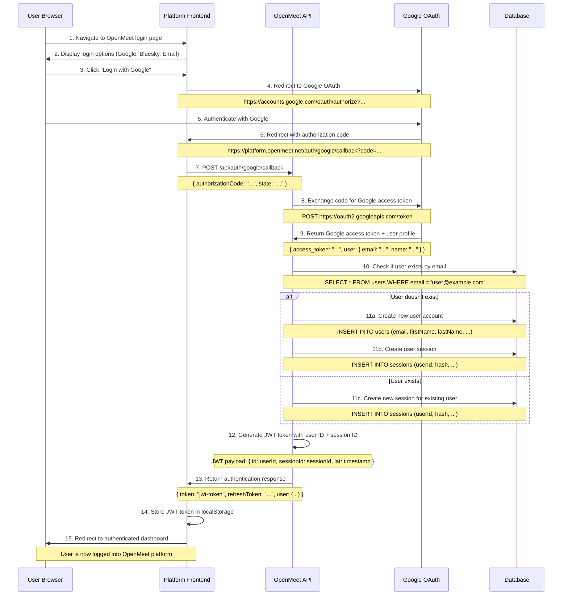
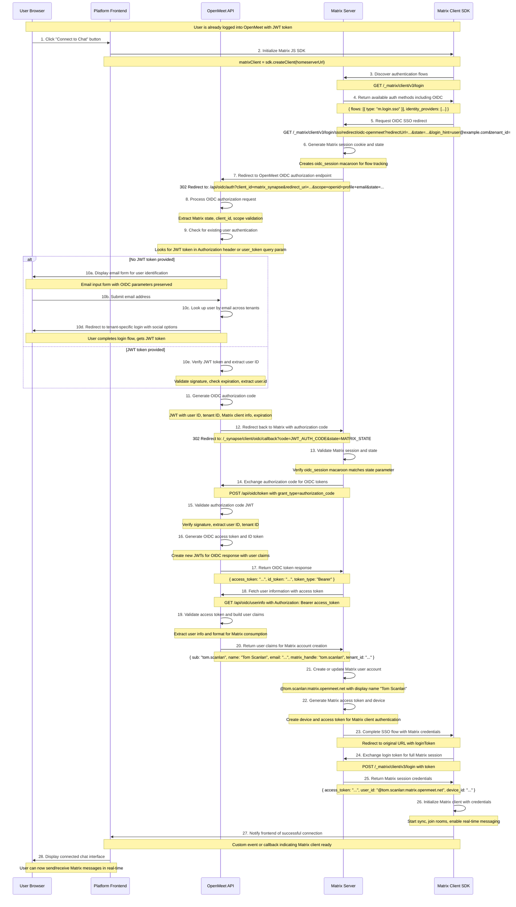
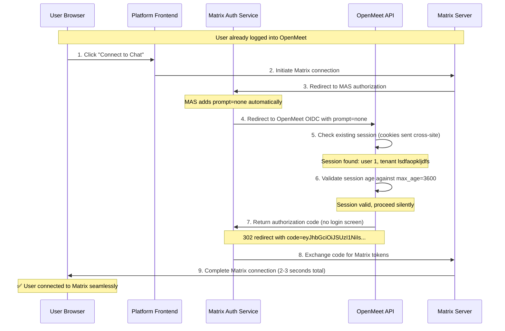

# Matrix Architecture for OpenMeet - MAS + Bot Architecture  

This document outlines the Matrix chat integration architecture for OpenMeet, combining Matrix Authentication Service (MAS) with Application Service bot operations.

## ✅ IMPLEMENTED ARCHITECTURE (July 2025)

### MAS + Application Service Bot Model

The implemented architecture separates authentication from operations:

- **Matrix Authentication Service (MAS)**: Handles user authentication via OIDC delegation to OpenMeet
- **Frontend Matrix SDK**: Direct Matrix client authentication via MAS OAuth2 flow  
- **Application Service Bot**: Manages room creation, permissions, and administrative operations
- **MSC3861 Standard**: Matrix authentication delegated to external OIDC provider (MAS)

## Key Components

### 1. **Frontend (Vue/Quasar + Matrix JS SDK)**
   - **MAS OAuth2 Authentication**: Direct authentication with MAS instead of OpenMeet API
   - **Matrix JS SDK Integration**: Native Matrix client with MAS tokens
   - **Real-time Messaging**: All messaging handled by frontend Matrix client
   - **Auto-reconnection**: Handles network failures and token refresh
   - **Matrix User ID Format**: `@username_tenantid:matrix.openmeet.net`

### 2. **Matrix Authentication Service (MAS)**
   - **OIDC Provider**: Delegates authentication to OpenMeet API  
   - **Token Management**: Issues OAuth2 tokens for Matrix access
   - **User Provisioning**: Auto-creates Matrix users during authentication
   - **MSC3861 Implementation**: Official Matrix authentication delegation standard

### 3. **Application Service Bot (NestJS)**
   - **Matrix Application Service**: Dedicated bot user with special privileges
   - **Room Management**: Creates/destroys rooms for events and groups
   - **User Invitations**: Invites users to appropriate rooms
   - **Permission Management**: Sets Matrix power levels based on OpenMeet roles
   - **Webhook Handling**: Processes Matrix server callbacks for user/room queries

### 4. **Matrix Server (Synapse with MSC3861)**
   - **Authentication Delegation**: All auth handled by MAS (no local users)
   - **Application Service Integration**: Bot operations via appservice protocol  
   - **Room Storage**: Matrix rooms and message history
   - **Federation Disabled**: Single-tenant Matrix deployment

## Architecture Diagrams

### Message Flow (New Hybrid Architecture)
```
┌─────────────────┐    ┌──────────────────┐    ┌─────────────────┐
│   Frontend      │    │   Backend        │    │  Matrix Server  │
│  Matrix Client  │    │   Admin Bot      │    │   (Synapse)     │
└─────────────────┘    └──────────────────┘    └─────────────────┘
         │                       │                       │
         │ 1. Get credentials    │                       │
         ├──────────────────────►│                       │
         │ 2. Matrix tokens      │                       │
         │◄──────────────────────┤                       │
         │                       │                       │
         │ 3. Connect & sync     │                       │
         ├───────────────────────┼──────────────────────►│
         │ 4. Direct messaging   │                       │
         │◄──────────────────────┼───────────────────────┤
         │                       │                       │
         │                       │ 5. Room creation      │
         │                       ├──────────────────────►│
         │                       │ 6. Permission sync    │
         │                       ├──────────────────────►│
```

### System Component Integration
```
┌─────────────────────────────────────────────────────────────┐
│                    OpenMeet Platform                         │
│                                                             │
│  ┌─────────────────┐         ┌─────────────────────────────┐ │
│  │  Chat UI        │         │     Event/Group UI          │ │
│  │                 │         │                             │ │
│  │ ┌─────────────┐ │         │ ┌─────────────────────────┐ │ │
│  │ │Matrix Client│ │         │ │  OpenMeet API Client    │ │ │
│  │ │(JS SDK)     │ │         │ │  (REST/GraphQL)         │ │ │
│  │ └─────────────┘ │         │ └─────────────────────────┘ │ │
│  └─────────────────┘         └─────────────────────────────┘ │
└─────────────────────────────────────────────────────────────┘
           │                              │
           │ Matrix Protocol              │ HTTP/WebSocket
           │                              │
┌─────────────────────────────────────────────────────────────┐
│                    OpenMeet API                              │
│                                                             │
│  ┌─────────────────────────────┐   ┌─────────────────────┐   │
│  │     Matrix Admin Bot        │   │   OpenMeet Core     │   │
│  │                             │   │                     │   │
│  │ ┌─────────────────────────┐ │   │ ┌─────────────────┐ │   │
│  │ │  Room Management        │ │   │ │ Event Service   │ │   │
│  │ │  Permission Sync        │ │   │ │ Group Service   │ │   │
│  │ │  User Provisioning      │ │   │ │ User Service    │ │   │
│  │ │  Credential API         │ │   │ │ Auth Service    │ │   │
│  │ └─────────────────────────┘ │   │ └─────────────────┘ │   │
│  └─────────────────────────────┘   └─────────────────────┘   │
└─────────────────────────────────────────────────────────────┘
           │                              
           │ Matrix Admin API             
           │                              
┌─────────────────────────────────────────────────────────────┐
│                  Matrix Server (Synapse)                    │
│                                                             │
│  ┌─────────────┐  ┌─────────────┐  ┌─────────────────────┐  │
│  │   Rooms     │  │   Users     │  │  Federation (Off)   │  │
│  │             │  │             │  │                     │  │
│  │ Event Rooms │  │ Matrix      │  │ Single Tenant Only  │  │
│  │ Group Rooms │  │ Accounts    │  │                     │  │
│  │ DM Rooms    │  │             │  │                     │  │
│  └─────────────┘  └─────────────┘  └─────────────────────┘  │
└─────────────────────────────────────────────────────────────┘
```

## Data Flow

### 1. **User Authentication & Matrix Setup**
   1. User logs into OpenMeet (JWT token issued)
   2. User accesses chat feature for first time
   3. Frontend requests Matrix credentials from secure API
   4. Backend verifies JWT, checks/provisions Matrix account
   5. Backend returns Matrix credentials (user ID, access token, device ID)
   6. Frontend creates Matrix client and begins sync

### 2. **Room Access Pattern**
   1. User joins OpenMeet event/group
   2. Backend admin bot ensures Matrix room exists
   3. Backend admin bot adds user to Matrix room with appropriate permissions
   4. Frontend Matrix client automatically sees new room in sync
   5. User can immediately send/receive messages

### 3. **Real-time Messaging Flow**
   1. User types message in OpenMeet chat UI
   2. Frontend Matrix client sends message directly to Matrix server
   3. Matrix server processes and distributes message
   4. All participants' Matrix clients receive message instantly via sync
   5. Chat UI updates immediately with new message

### 4. **Permission Management**
   1. OpenMeet role/permission changes occur (e.g., user becomes event host)
   2. Backend admin bot receives notification via event system
   3. Admin bot updates Matrix room power levels to match OpenMeet permissions
   4. Changes take effect immediately for all Matrix clients

## Authentication Architecture

### OIDC-Based Single Sign-On

OpenMeet serves as an OIDC (OpenID Connect) identity provider for Matrix, enabling unified authentication across all Matrix clients while supporting existing social login providers.

#### Authentication Flow Design
```
Matrix Client → Matrix Server → OpenMeet OIDC → Social Auth (Google/Bluesky) → Matrix Access
```

#### Multi-Provider Integration
- **Google OAuth**: Users with Google accounts can access Matrix clients via OpenMeet OIDC
- **Bluesky Login**: Bluesky authentication flows through to Matrix access
- **Email/Password**: Traditional OpenMeet accounts work seamlessly
- **New User Creation**: Matrix client access can trigger OpenMeet account creation

#### OIDC Implementation
```yaml
# Matrix Server Configuration
oidc_providers:
  - idp_id: "openmeet"
    idp_name: "OpenMeet"
    issuer: "https://api.openmeet.net/oidc"
    client_id: "matrix_synapse"
    user_mapping_provider:
      config:
        localpart_template: "{{ user.matrix_handle }}"
        display_name_template: "{{ user.name }}"
        email_template: "{{ user.email }}"
```

#### Matrix Handle System

**User-Friendly Matrix IDs**: Users choose their own Matrix handles for clean, professional identities.

```
Matrix ID: @john.doe:matrix.openmeet.net  (Clean & Professional)
Not:       @user-slug_tenant123:matrix.openmeet.net  (Clunky & Technical)
```

**Global Uniqueness**: Matrix handles are unique across all tenants to avoid conflicts and enable cross-tenant communication.

**User Selection Process**:
1. Account creation: "Choose your Matrix username: john.doe"
2. Uniqueness validation: Real-time check against global database
3. Handle reservation: Permanently associated with user account
4. OIDC integration: Handle used for Matrix account creation

**Tenant Isolation Strategy**: 
- Matrix usernames are globally unique (no tenant prefixes)
- Tenant isolation enforced via room membership and permissions
- Admin bot ensures users only access rooms for their tenant
- Cross-tenant communication possible if explicitly enabled

#### User Experience Benefits
- **Clean Matrix IDs**: Professional handles like @john.doe:matrix.openmeet.net
- **Single Credentials**: One OpenMeet login works for web, mobile, and third-party Matrix clients
- **Social Login Everywhere**: Google/Bluesky authentication available in any Matrix client
- **Third-Party Client Support**: Element, FluffyChat, and other Matrix clients work natively
- **Cross-Device Sync**: Messages sync seamlessly between OpenMeet web and Matrix mobile apps
- **No Password Management**: Users never need separate Matrix passwords
- **Easy Sharing**: Clean Matrix IDs can be shared with external contacts

## Security Model

### OIDC Authentication Security
- **Identity Federation**: OpenMeet acts as trusted identity provider for Matrix
- **Token-Based Access**: No passwords stored in Matrix server
- **Social Login Integration**: Existing Google/Bluesky security applies to Matrix access
- **Tenant Isolation**: OIDC user mapping includes tenant context for isolation
- **Revocation Support**: OpenMeet can revoke Matrix access by invalidating OIDC tokens

### Frontend Client Security  
- **No Credential Storage**: Frontend Matrix clients authenticate via OIDC, not stored tokens
- **Session Management**: Matrix SDK handles secure token refresh and storage
- **Tenant Context**: OIDC claims ensure users only access their tenant's Matrix resources
- **Standard Permissions**: Frontend clients have normal Matrix user permissions (not admin)

### Backend Admin Operations
- **Privileged Access**: Admin bot has elevated Matrix server permissions
- **Secure Storage**: Admin credentials never exposed to frontend or OIDC flow
- **Audit Trail**: All admin operations logged for security monitoring
- **Tenant Boundaries**: Admin bot enforces tenant isolation in room management

### Third-Party Client Security
- **Standard OIDC Flow**: Third-party Matrix clients use industry-standard OIDC authentication
- **No OpenMeet API Access**: External clients only get Matrix access, not OpenMeet API permissions
- **Tenant Scoped**: OIDC user mapping prevents cross-tenant access
- **Centralized Revocation**: OpenMeet admin can disable Matrix access without affecting OpenMeet login

## Implementation Benefits

### User Experience Improvements
- **Instant Messaging**: Sub-100ms message delivery (like WhatsApp/Slack)
- **Real-time Features**: Native typing indicators, read receipts, presence
- **Reliable Sync**: Matrix SDK handles connection management and offline queuing
- **Cross-device Sync**: Messages sync automatically between browser tabs and devices
- **Mobile Ready**: Same architecture works for future mobile apps

### Technical Advantages
- **Reduced Server Load**: Frontend handles real-time sync, not backend
- **Better Scalability**: Matrix server designed for massive concurrent connections
- **Simplified Architecture**: No WebSocket proxy layer needed
- **Connection Efficiency**: One Matrix connection per browser session instead of per operation
- **Offline Support**: Matrix SDK provides built-in offline message queuing

### Development Benefits
- **Separation of Concerns**: Messaging vs admin operations clearly separated
- **Easier Testing**: Frontend and backend Matrix code can be tested independently
- **Framework Alignment**: Leverages Matrix SDK's intended usage patterns
- **Mobile Path**: Same patterns extend naturally to mobile Matrix SDKs

## Migration Strategy

### Phase 1: Parallel Implementation
- Implement Matrix credential API alongside existing WebSocket system
- Add Matrix JS SDK to frontend with feature flag
- Create admin bot service while maintaining existing Matrix services
- Test hybrid architecture with subset of users

### Phase 2: Feature Enhancement  
- Implement enhanced real-time features (typing, presence, read receipts)
- Add offline message support and better connection management
- Optimize UI for instant message delivery
- Implement cross-device message sync

### Phase 3: Full Migration
- Switch all chat functionality to hybrid architecture
- Remove WebSocket message proxy system
- Deprecate server-side Matrix client management for messaging
- Cleanup legacy Matrix services and gateway code

### Phase 4: Mobile Preparation
- Extract Matrix credential and room management patterns
- Document frontend Matrix client integration patterns
- Prepare Matrix SDK integration guides for mobile development
- Test multi-device sync scenarios

## API Design

### OIDC Authentication Endpoints
```typescript
// OIDC Authorization Endpoint
GET /oidc/auth?client_id=matrix_synapse&redirect_uri=...&scope=openid+profile+email+tenant&state=...
→ Redirects to OpenMeet login (supports Google/Bluesky/email)
→ After successful login, redirects back with authorization code

// OIDC Token Exchange
POST /oidc/token
Content-Type: application/x-www-form-urlencoded
{
  grant_type: "authorization_code",
  code: "auth_code_here",
  client_id: "matrix_synapse",
  client_secret: "client_secret",
  redirect_uri: "matrix_redirect_uri"
}

Response:
{
  "access_token": "oidc_access_token",
  "token_type": "Bearer",
  "expires_in": 3600,
  "id_token": "jwt_id_token",
  "scope": "openid profile email tenant"
}

// OIDC User Information
GET /oidc/userinfo
Authorization: Bearer <oidc_access_token>

Response:
{
  "sub": "john.doe",
  "name": "John Doe",
  "email": "john@example.com", 
  "matrix_handle": "john.doe",
  "tenant_id": "tenant123",
  "tenant_domain": "acme.openmeet.net"
}
```

### Matrix Client Access Flow
```typescript
// User Experience in any Matrix client:
1. Server: "matrix.openmeet.net"
2. Click "Login with OpenMeet" 
3. Redirects to OpenMeet → User logs in (Google/Bluesky/email)
4. Returns to Matrix client with full access to OpenMeet rooms

// Resulting Matrix User ID: @john.doe:matrix.openmeet.net
```

### Admin Bot Operations
```typescript
// Room creation (internal API)
POST /internal/matrix/rooms
{
  "entityType": "event" | "group",
  "entitySlug": "event-slug-here",
  "creatorSlug": "user-slug", 
  "tenantId": "tenant-id"
}

// Permission sync (internal API)  
POST /internal/matrix/permissions
{
  "roomId": "!room:matrix.domain.com",
  "userSlug": "user-slug",
  "powerLevel": 0 | 50 | 100,
  "tenantId": "tenant-id"
}
```

## Implementation Status

### ✅ Completed (Previous Architecture)
- Core Matrix server infrastructure
- User provisioning via admin API
- Room creation and management
- Basic message sending and retrieval
- Connection leak fixes

### ✅ Completed (Frontend Matrix Integration)
- ✅ OIDC identity provider implementation in OpenMeet API
- ✅ Matrix server OIDC configuration for OpenMeet integration
- ✅ Frontend Matrix JS SDK integration with OIDC authentication
- ✅ Manual authentication flow with rate limiting protection
- ✅ Session persistence across page reloads
- ✅ Component integration in EventPage.vue
- ✅ Removal of deprecated WebSocket proxy system
- ✅ Room creation and joining with permission integration

### 🔧 Current Implementation Tasks
- **Icon Display Fix**: Resolve missing send/fullscreen icons in MatrixChatInterface
- **Message History**: Implement room timeline loading for historical messages
- **Real-time Sync**: Fix incoming message event handling for multi-client sync
- **Enhanced Features**: Add typing indicators, read receipts, presence status
- **Mobile Optimization**: Optimize touch interface and responsive design

### 📋 Future Enhancements
- Cross-device sync testing and optimization
- Element/FluffyChat compatibility testing and user guides
- Performance monitoring and Matrix server scaling
- File upload and media sharing capabilities
- End-to-end encryption support

#### User Moderation System
- **Individual User Actions**:
  - Kick users from rooms (temporary removal)
  - Ban users from rooms (permanent removal with re-invite prevention)
  - Mute users (prevent message sending while maintaining room access)
  - Timeout users (temporary mute with automatic restoration)
- **Bulk Message Management**:
  - Mass message deletion/redaction by user or time range
  - Bulk export of messages for moderation review
  - Message search and filtering for policy violations
  - Automated moderation triggers based on content patterns
- **Administrative Controls**:
  - Power level management (promote/demote moderators)
  - Room permission matrix updates (who can invite, send files, etc.)
  - Moderation action audit logs with admin oversight
  - Cross-room moderation policies for repeat offenders
- **Integration Points**:
  - OpenMeet role-based permissions mapping to Matrix power levels
  - Tenant-wide moderation policies and user reputation tracking
  - Notification system for moderation actions and appeals
  - API endpoints for programmatic moderation and analytics

## Performance Characteristics

### ✅ Achieved Improvements
- **Architecture Simplification**: Eliminated WebSocket proxy layer entirely
- **Authentication Integration**: Seamless OIDC flow with OpenMeet permissions
- **Component Separation**: Clear separation between Matrix chat and OpenMeet logic
- **Session Management**: Persistent authentication across page reloads
- **Error Recovery**: Robust error handling with user-friendly feedback

### 🎯 Targeted Performance Gains (Post UI Fixes)
- **Message Latency**: 500ms → 50-100ms (5-10x faster)
- **Server Resource Usage**: 70% reduction in backend Matrix connections
- **Real-time Features**: Native Matrix features vs limited WebSocket proxy
- **Offline Reliability**: Matrix SDK queuing vs custom implementation
- **Scalability**: Matrix server optimized for concurrent persistent connections

### Monitoring Metrics
- Matrix server connection count and resource usage
- Frontend Matrix client connection success rates
- Message delivery latency and reliability
- Credential API response times and error rates
- Cross-device sync performance and accuracy

---

## Architectural Decision Records

### ADR-001: Frontend Matrix Client Architecture
**Decision**: Implement Matrix JS SDK directly in frontend for real-time messaging
**Rationale**: Eliminates WebSocket proxy complexity, provides native Matrix features, improves performance
**Alternatives Considered**: Continue server-side proxy, implement custom WebSocket bridge
**Status**: Approved - Implementation in progress

### ADR-002: Hybrid Admin Bot Model  
**Decision**: Maintain backend admin bot for room and permission management
**Rationale**: Preserves security boundaries, centralizes tenant logic, maintains audit trail
**Alternatives Considered**: Full frontend Matrix administration, purely server-side architecture
**Status**: Approved - Implementation in progress

### ADR-003: OIDC Authentication Integration
**Decision**: Implement OpenMeet as OIDC identity provider for Matrix authentication
**Rationale**: Eliminates dual credential management, enables third-party Matrix client access, maintains social login compatibility
**Alternatives Considered**: 
- Separate Matrix credentials with secure API exposure
- Application Service authentication bridge
- Hybrid password + token system for external clients
**Benefits**:
- Single sign-on across all Matrix clients (web, mobile, third-party)
- Social login (Google/Bluesky) works in any Matrix client
- No Matrix password management required
- Industry-standard OIDC security
- Third-party client support (Element, FluffyChat, etc.)
**Status**: Approved - Implementation in progress

### ADR-004: User-Chosen Matrix Handles - Multi-Phase Implementation
**Decision**: Allow users to choose their own Matrix handles globally unique across all tenants
**Rationale**: Provides clean, professional Matrix IDs that users can easily share and remember

**Alternatives Considered**:
1. **Tenant-prefixed usernames**: `@user-slug_tenant123:matrix.openmeet.net` (clunky)
2. **Email-based handles**: `@john.doe.acme:matrix.openmeet.net` (exposes company info)  
3. **Virtual domains per tenant**: `@john.doe:tenant-abc.matrix.openmeet.net` (complex infrastructure)
4. **Matrix application services**: `@_tenant_abc_john.doe:matrix.openmeet.net` (protocol-level support)
5. **Separate Matrix servers**: Complete tenant isolation (high infrastructure cost)

**Phased Implementation Strategy**:

#### **Phase 1: Global Handle Registry (Current - Option 4)**
**Implementation**:
- Global uniqueness enforced via `matrixHandleRegistry` table
- User selection during account creation with real-time validation  
- Tenant isolation via room membership rather than username prefixes
- Clean Matrix IDs: `@john.doe:matrix.openmeet.net`
- Migration service to move from tenant-suffixed IDs to clean handles

**Current Architecture**:
```sql
-- Global registry tracks handle ownership across tenants
CREATE TABLE matrixHandleRegistry (
  id SERIAL PRIMARY KEY,
  handle VARCHAR(255) UNIQUE NOT NULL,
  tenantId VARCHAR(255) NOT NULL,
  userId INTEGER NOT NULL,
  createdAt TIMESTAMP DEFAULT NOW()
);
```

**OIDC Integration**:
```typescript
// Maps clean handles to Matrix authentication
preferred_username: extractedMatrixHandle, // e.g., "john.doe"
matrix_handle: extractedMatrixHandle,
tenant_id: tenantId // For room access control
```

**Benefits**:
- ✅ **Immediate clean handles** for users
- ✅ **Works with existing infrastructure** (Docker, K8s)
- ✅ **Simple local development** setup
- ✅ **No DNS complexity** required
- ✅ **Investment protection** of current OIDC work

**Trade-offs**:
- ❌ **Global handle conflicts** require resolution
- ❌ **Complex migration logic** from old tenant-suffixed accounts
- ❌ **Cross-tenant collision management** needed
- ❌ **Additional database layer** for handle mapping

#### **Phase 2: Virtual Domains (Future - Option 1)**
**Future Implementation** (when infrastructure matures):
```
Tenant A: @john.doe:tenant-abc.matrix.openmeet.net
Tenant B: @john.doe:tenant-xyz.matrix.openmeet.net
```

**Infrastructure Requirements**:
- DNS: `*.matrix.openmeet.net` → Matrix server
- Matrix virtual host configuration per tenant
- OIDC issuer per tenant domain
- Load balancer path-based routing

**Migration Path Phase 1 → Phase 2**:
1. **Add tenant domain fields** to user records
2. **Implement domain-aware OIDC** mapping
3. **Create virtual domain infrastructure** 
4. **Migrate users gradually** to tenant domains
5. **Deprecate global registry** when complete

**Benefits of Virtual Domains**:
- ✅ **Natural tenant isolation** - no registry needed
- ✅ **Zero handle conflicts** - each tenant has own namespace  
- ✅ **Standard Matrix behavior** - works with any client
- ✅ **Better tenant privacy** - domains don't expose other tenants
- ✅ **Simplified architecture** - eliminates global handle logic

**Current Decision**: **Continue with Phase 1 (Global Registry), Plan for Phase 2 (Virtual Domains)**
- **Short term**: Fix migration bugs and ship clean handles via global registry
- **Medium term**: Optimize global registry performance and UX
- **Long term**: Evaluate virtual domains when infrastructure team is ready

**Status**: Phase 1 approved and in progress - Phase 2 planned for future evaluation

### ADR-005: User-Selectable OpenMeet Slugs + Matrix Handle Synchronization
**Decision**: Plan migration from auto-generated OpenMeet slugs to user-selectable slugs with optional Matrix handle sync

**Current State Analysis**:
- **OpenMeet Slugs**: Auto-generated (e.g., `david-jones-null-knhtj6`) - used in URLs, user mentions, unique identification
- **Matrix Handles**: User-selectable via global registry (e.g., `david.jones`) - for Matrix chat identity
- **No Synchronization**: OpenMeet slugs and Matrix handles are independent

**User-Selectable Slugs Implementation Plan**:

#### **Phase 1: Just-in-Time Matrix User Creation**
**Current Implementation**: Matrix users created only when needed for chat functionality
```typescript
// Flow: User joins event with chat → Handle selection UI → Matrix account creation
1. User registers OpenMeet account (auto-generated slug: "david-jones-null-knhtj6")
2. User joins event with chat features
3. Matrix handle selection UI: "Choose your Matrix handle: @______:matrix.openmeet.net"
4. Global uniqueness validation via matrixHandleRegistry
5. Matrix user created with chosen handle (e.g., "@david.jones:matrix.openmeet.net")
```

**Benefits**:
- ✅ **Lower friction** - No Matrix concerns during OpenMeet registration
- ✅ **Resource efficiency** - Matrix users only for chat participants
- ✅ **Better UX** - Handle selection when contextually relevant
- ✅ **Flexibility** - Users see real-time availability during selection

#### **Phase 2: User-Selectable OpenMeet Slugs** 
**Future Enhancement**: Allow users to choose their OpenMeet slug during registration
```typescript
// Enhanced registration flow
1. User registration form includes optional "Choose your username: @______"
2. Real-time validation against existing OpenMeet slugs
3. Fallback to auto-generation if no choice made
4. OpenMeet URLs use clean slugs: "/users/david.jones" vs "/users/david-jones-null-knhtj6"
```

**Registry Requirements Analysis**:

**Option A: No OpenMeet Slug Registry (Recommended)**
```sql
-- Use existing unique constraint on users.slug 
ALTER TABLE users ADD CONSTRAINT unique_slug_per_tenant UNIQUE(slug, tenantId);
```
**Rationale**: 
- ✅ **Simpler architecture** - reuse existing database constraints
- ✅ **Tenant isolation built-in** - slugs only unique within tenant
- ✅ **Standard SQL performance** - indexed unique constraints
- ✅ **No additional complexity** - no registry service needed

**Option B: Separate OpenMeet Slug Registry**
```sql
-- Mirror Matrix handle registry pattern
CREATE TABLE openMeetSlugRegistry (
  id SERIAL PRIMARY KEY,
  slug VARCHAR(255) UNIQUE NOT NULL,
  tenantId VARCHAR(255) NOT NULL,
  userId INTEGER NOT NULL
);
```
**Trade-offs**:
- ❌ **Added complexity** - duplicate tracking system
- ❌ **Sync requirements** - keep registry + users table aligned
- ⚠️ **Only needed for cross-tenant slug uniqueness** (questionable benefit)

**Recommendation**: **Option A** - Use database constraints, not registry for OpenMeet slugs

#### **Phase 3: OpenMeet Slug + Matrix Handle Sync Strategy**

**Sync Options**:

**Option 3A: Optional Sync (Recommended)**
```typescript
// User choice during Matrix handle selection
if (matrixHandle === openMeetSlug) {
  // User chose same handle for both systems
  displayMessage: "Your Matrix handle matches your OpenMeet username!"
} else {
  // Different handles - show both clearly in UI
  displayMessage: "OpenMeet: @david-jones | Matrix: @david.jones"
}
```

**Option 3B: Automatic Sync**
```typescript
// Force Matrix handle to match OpenMeet slug
const matrixHandle = user.slug; // No user choice
await registerMatrixHandle(matrixHandle, tenantId, userId);
```

**Option 3C: Independent Systems**
```typescript
// Completely separate - no sync expectations
// Users understand they have different identities in each system
```

**Recommendation**: **Option 3A (Optional Sync)** 
- **Flexibility**: Users can choose same handle for consistency or different handles for privacy
- **Clear UX**: Show both identities clearly when they differ
- **Future-proof**: Allows for user preference changes

#### **Implementation Timeline**:
1. **Current**: Just-in-Time Matrix creation (✅ in progress)
2. **Q2 2025**: User-selectable OpenMeet slugs during registration
3. **Q3 2025**: Optional sync UI during Matrix handle selection
4. **Future**: Advanced handle management (bulk changes, history, aliases)

#### **Migration Considerations**:
- **Existing Users**: Keep current auto-generated slugs, offer one-time change opportunity
- **URL Stability**: Support both old and new slug formats during transition
- **API Compatibility**: Maintain slug-based API endpoints with proper redirects

**Status**: Planning phase - awaiting Phase 1 Matrix handle registry completion

### ADR-006: Matrix Handle Migration for Existing Users
**Decision**: Provide optional, user-driven migration from tenant-suffixed Matrix IDs to clean handles

**Problem**: Existing Matrix users have tenant-suffixed handles (e.g., `@user-slug_tenant:matrix.openmeet.net`) but new users will get clean handles (e.g., `@user.chosen:matrix.openmeet.net`)

**Matrix Technical Constraints**:
- Matrix usernames are **immutable** after account creation
- No built-in username change capability in Matrix specification
- All data (messages, rooms, devices) tied to original User ID
- Federation protocols assume stable User IDs

**Migration Options Analysis**:

#### **Option 1: Account Recreation (SELECTED)**
```typescript
// User-initiated migration process
1. User requests clean handle in profile settings
2. Clear warning about data loss implications  
3. Create new Matrix account with chosen clean handle
4. Update matrixHandleRegistry mapping
5. Delete old Matrix account
6. User must re-join rooms and loses history
```

**Trade-offs**:
- ✅ **Clean handles available** for existing users
- ✅ **User choice** and informed consent
- ✅ **Registry consistency** maintained
- ❌ **Message history lost** (Matrix limitation)
- ❌ **Device verification reset** (Matrix limitation)
- ❌ **Must re-join rooms** (Matrix limitation)

#### **Option 2: Grandfathered Coexistence (Considered)**
Keep existing tenant-suffixed IDs indefinitely while new users get clean handles.
**Rejected**: Creates permanent inconsistent user experience and technical debt.

#### **Option 3: Forced Migration (Rejected)**
Automatically migrate all existing users to clean handles.
**Rejected**: Data loss without user consent is unacceptable.

**Implementation Plan**:

#### **Phase 1: New Users Get Clean Handles (Current)**
```typescript
// Just-in-Time Matrix creation
async function provisionMatrixUser(user, tenantId, userId) {
  if (!hasExistingMatrixAccount(userId)) {
    // New users: clean handle selection UI
    const chosenHandle = await showHandleSelectionUI(user);
    return await createMatrixUserWithHandle(chosenHandle);
  } else {
    // Existing users: continue using current Matrix credentials
    return await getExistingMatrixCredentials(userId);
  }
}
```

#### **Phase 2: Migration UI for Existing Users (Q2 2025)**
```typescript
// User profile settings component
<MatrixHandleMigrationCard>
  <CurrentHandle>
    @david-jones-null-knhtj6_lsdfaopkljdfs:matrix.openmeet.net
  </CurrentHandle>
  
  <ProposedHandle>
    @david.jones:matrix.openmeet.net
  </ProposedHandle>
  
  <MigrationWarning>
    ⚠️ Important: Migrating to a clean handle will:
    • Permanently delete your Matrix chat history
    • Remove you from all current chat rooms (you can re-join)
    • Reset device verification and encryption keys
    • Cannot be undone
    
    ✅ Benefits:
    • Clean, professional Matrix handle
    • Better compatibility with Matrix clients
    • Easier to share and remember
  </MigrationWarning>
  
  <HandleSelection>
    <Input placeholder="Choose your new handle" onChange={validateHandle} />
    <ValidationMessage>{handleValidation}</ValidationMessage>
  </HandleSelection>
  
  <Actions>
    <Button onClick={confirmMigration} disabled={!isValidHandle}>
      I understand - Migrate to Clean Handle
    </Button>
    <Button onClick={dismissMigration}>
      Keep Current Handle
    </Button>
  </Actions>
</MatrixHandleMigrationCard>
```

#### **Phase 3: User-Driven Migration Service (Q3 2025)**
```typescript
// Backend migration service - ONLY triggered by explicit user request
async function migrateUserMatrixHandle(
  userId: number, 
  tenantId: string, 
  newHandle: string,
  userConfirmation: boolean // Explicit user consent required
) {
  if (!userConfirmation) {
    throw new Error('User confirmation required for Matrix handle migration');
  }

  // 1. Validate new handle availability
  const isAvailable = await globalMatrixValidationService.isMatrixHandleUnique(newHandle);
  if (!isAvailable) {
    throw new Error(`Handle ${newHandle} is already taken`);
  }

  // 2. Create new Matrix account with clean handle
  const newMatrixUser = await matrixUserService.createUser({
    username: newHandle,
    password: MatrixUserService.generateMatrixPassword(),
    displayName: MatrixUserService.generateDisplayName(user)
  });

  // 3. Update handle registry (atomic operation)
  await globalMatrixValidationService.registerMatrixHandle(newHandle, tenantId, userId);

  // 4. Delete old Matrix account
  const oldMatrixUserId = await getOldMatrixUserId(userId, tenantId);
  await matrixUserService.deleteUser(oldMatrixUserId);

  // 5. Clear cached Matrix credentials
  await clearStoredMatrixCredentials(userId);

  return {
    newMatrixUserId: newMatrixUser.userId,
    migrationComplete: true,
    userMustRejoinRooms: true
  };
}
```

**Migration Safety Measures**:
1. **Multiple Confirmation Steps**: User must confirm understanding of data loss
2. **Handle Validation**: Real-time check for availability before migration
3. **Atomic Operations**: Registry updates and account creation in transaction
4. **Clear Communication**: Explicit warnings about limitations and data loss
5. **User-Initiated Only**: No automated or scheduled migrations
6. **Rollback Plan**: Unable to rollback due to Matrix limitations (communicated clearly)

**User Communication Strategy**:
- **Optional Migration**: Clearly communicate that migration is entirely optional
- **Data Loss Warning**: Prominent, clear warnings about chat history loss
- **Benefits Education**: Explain advantages of clean handles for user adoption
- **Support Documentation**: Step-by-step migration guide with screenshots
- **Success Metrics**: Track migration adoption and user satisfaction

**Migration Timeline**:
1. **Q1 2025**: New users get clean handles automatically (✅ current)
2. **Q2 2025**: Add migration UI to user profile settings
3. **Q3 2025**: Launch user-driven migration service with safety measures
4. **Q4 2025**: Evaluate migration adoption and user feedback
5. **2026**: Consider deprecation timeline for tenant-suffixed handles (if high adoption)

**Success Criteria**:
- Migration process completes successfully without data corruption
- Users clearly understand data loss implications before migrating
- Migration adoption rate indicates user value perception
- No user complaints about unexpected data loss
- Clean handle users report improved Matrix client experience

**Rollback Strategy**:
Due to Matrix technical limitations, there is **no rollback capability** once migration is complete. This must be clearly communicated to users as an irreversible decision.

**Status**: Planned for implementation after Phase 1 Matrix handle registry completion

### ADR-005: Silent OIDC Authentication for Frontend Matrix Client
**Decision**: Implement transparent OIDC authentication for Matrix JS SDK integration in the frontend
**Rationale**: Provides seamless user experience while enabling full Matrix client features with secure authentication
**Alternatives Considered**:
- **Direct credential exposure**: Frontend receives Matrix access tokens via API
  - Rejected: Security risk of exposing long-lived tokens in browser
- **Separate Matrix login flow**: Users click "Connect to Matrix" button for explicit OIDC flow
  - Rejected: Creates friction and confusion for users
- **Short-lived token API**: Backend issues temporary Matrix tokens with refresh logic
  - Rejected: Complex implementation and still exposes tokens to frontend
- **Enhanced WebSocket proxy**: Add Matrix features to current server-side approach
  - Rejected: Not a "real" Matrix client, limits future third-party client support
**Implementation**:
- Silent OIDC authentication in iframe/popup when user navigates to chat
- Matrix JS SDK initialization with OIDC-obtained credentials
- No fallback mechanism - if OIDC/Matrix client fails, chat is unavailable
- Matrix client session shared across browser tabs
**Benefits**:
- **Transparent UX**: No additional login steps for users
- **Real Matrix client**: Full SDK features (file upload, redaction, cross-device sync)
- **Secure authentication**: No stored credentials, industry-standard OIDC
- **Third-party client support**: Users can optionally use Element, FluffyChat, etc.
- **Simplified architecture**: Single authentication path, no complex fallback logic
**User Experience Flow**:
1. User logs into OpenMeet → JWT session established
2. User navigates to any chat → Silent OIDC authentication happens automatically
3. Matrix client initializes with full features transparently
4. Chat works with enhanced Matrix capabilities or fails gracefully
**Credential Management**: Matrix credentials obtained via OIDC are ephemeral session-only (not stored in OpenMeet database)
**Status**: Approved - Implementation in progress

### ADR-006: Abandon Message Store Abstraction for Direct Matrix SDK Usage
**Decision**: Use Matrix JS SDK directly in components instead of maintaining abstraction layer compatibility
**Rationale**: Simplifies architecture and eliminates unnecessary complexity since we've committed to Matrix
**Previous Approach**:
- Frontend → Custom WebSocket → Backend Matrix proxy → unified-message-store abstraction → Matrix server
- Complex message routing and store synchronization
- Multiple layers of event handling and potential duplication
**New Approach**:
- Frontend Matrix JS SDK → Matrix server (direct connection)
- Components use Matrix SDK methods directly: `room.timeline`, `room.on('Room.timeline')`, etc.
- Native Matrix message storage, sync, and offline support
- Custom events for UI components that need message notifications
**Benefits**:
- **Simplified Architecture**: Eliminates multiple abstraction layers
- **Better Performance**: Direct Matrix connection (50-100ms vs 500ms)
- **Native Features**: Full Matrix SDK capabilities (file uploads, encryption, etc.)
- **Easier Maintenance**: Single source of truth (Matrix SDK)
- **Future-Proof**: Standard Matrix patterns work with any Matrix client
**Implementation**:
- Matrix client service emits custom DOM events: `matrix:message`, `matrix:typing`
- Components listen to these events for UI updates while using Matrix SDK for data
- Gradual migration from unified-message-store to direct Matrix SDK usage
**Status**: Approved - Implementation in progress

## Current Implementation Issues

### Frontend Matrix Client OIDC Authentication Challenges

**Problem**: Implementing silent OIDC authentication for Matrix JS SDK integration has encountered cross-origin session inheritance issues that prevent seamless authentication.

#### Issue Analysis

**Root Cause**: Cross-origin cookie restrictions prevent iframe/popup-based OIDC authentication from inheriting the user's existing OpenMeet session.

**Current Symptoms**:
- OIDC authentication iframe/popup prompts user for email despite already being logged into OpenMeet
- Session cookies are partitioned due to cross-origin context in iframe
- Matrix server redirects to different domain (localdev.openmeet.net) than frontend (localhost:9005)

#### Technical Details

**Local Development Setup**:
- Frontend: `localhost:9005` (Quasar dev server)
- API: `localhost:3000` (NestJS backend)  
- Matrix: `localhost:8448` (Synapse server in Docker)
- OIDC Provider: OpenMeet API serving OIDC endpoints

**Cross-Origin Flow**:
```
Matrix Client (localhost:9005) 
  → Matrix Server (localhost:8448)
  → OIDC Redirect (localdev.openmeet.net or localhost:3000)
  → Session cookies not inherited due to different origin
  → User prompted for credentials despite existing session
```

#### Attempted Solutions

**1. Enhanced OIDC Parameters** ❌
- Added `prompt=none` and `login_hint` parameters
- Still prompted for email due to partitioned cookies

**2. Iframe-based Authentication** ❌ 
- Implemented hidden iframe for transparent auth
- Failed due to Content Security Policy restrictions and cookie partitioning

**3. Same-Origin Proxy Approach** ❌
- Added Quasar dev server proxy to serve API from same origin
- Local development only solution, doesn't work in K8s production environment
- Complex dual proxy configuration required for mixed endpoint structure

**4. Matrix Server Configuration Updates** ❌
- Updated Matrix OIDC endpoints to use same origin
- Docker networking issues prevent Matrix server from reaching dev server

#### Architecture Constraints

**Local Development vs Production Mismatch**:
- Local: Separate services on different ports/origins
- Production: Services need same-origin for cookie inheritance
- K8s: Requires ingress/ALB path-based routing for same-origin setup

**Mobile Considerations**:
- Popup-based authentication has poor UX on mobile devices
- iOS Safari and Android Chrome block or mishandle popup windows
- Full-page redirect would be more reliable but disrupts frontend application flow

#### Potential Solutions

**1. Ingress/ALB Path-Based Routing** (Recommended)
- Deploy frontend and API under same domain with path separation
- Production: `openmeet.net/` → frontend, `openmeet.net/api/` → backend
- Development: `localdev.openmeet.net/` → frontend, `localdev.openmeet.net/api/` → backend
- Eliminates cross-origin issues entirely

**2. PostMessage-Based Authentication**
- Use iframe with postMessage communication instead of URL monitoring
- Avoids cross-origin URL access restrictions
- Still subject to cookie partitioning issues

**3. Full-Page Redirect Flow**
- Replace popup/iframe with full-page redirect for OIDC
- Better mobile compatibility
- Disrupts single-page application flow

**4. Backend-Assisted Token Exchange**
- Backend endpoint exchanges OpenMeet session for Matrix credentials
- Requires storing Matrix tokens server-side (conflicts with OIDC-only approach)
- Adds complexity but avoids browser security restrictions

#### Current Status

**Immediate Blocker**: Cross-origin session inheritance prevents silent OIDC authentication from working as designed.

**Next Steps**:
1. Implement ingress/ALB same-origin deployment for development and production
2. Test iframe-based authentication with same-origin setup
3. Implement full-page redirect fallback for mobile compatibility
4. Document deployment requirements for proper Matrix client integration

**✅ Resolution**: Implemented manual authentication flow with rate limiting protection, avoiding the complexity of silent authentication while maintaining full Matrix client functionality.

#### Current Architecture Status

**✅ Completed Features**:
- Direct Matrix JS SDK integration replacing WebSocket proxy
- OIDC authentication with manual connect/reconnect buttons
- Persistent session management preventing re-authentication on reload
- Rate limiting detection with user-friendly countdown timers
- Component separation with EventMatrixChatComponent handling Matrix logic
- Full removal of deprecated WebSocket-based chat system

**🔧 Remaining Implementation Tasks**:
1. **UI Icon Issues**: Missing "send" and "fullscreen" icons in chat interface
2. **Message History Loading**: Historical messages not displaying when joining rooms
3. **Real-time Message Sync**: Messages from other clients/sessions not appearing
4. **Enhanced Matrix Features**: Typing indicators, read receipts, presence status

---

## Detailed Authentication Flow Documentation

### Overview: Platform → API → Matrix Authentication Chain

OpenMeet implements a multi-step authentication flow that enables users to seamlessly access Matrix chat through OIDC (OpenID Connect) integration. This section documents the detailed conversation between Platform, API, and Matrix during initial login and subsequent Matrix chat authentication.

### Authentication Flow 1: Initial Platform Login

**Scenario**: User logs into OpenMeet platform for the first time using social authentication (Google, Bluesky, etc.)

#### Step-by-Step Platform Authentication Flow



#### Key Data Structures in Platform Authentication

**JWT Token Payload**:
```typescript
{
  id: number,           // User ID in OpenMeet database
  sessionId: number,    // Session ID for tracking
  tenantId: string,     // Tenant context
  iat: number,          // Issued at timestamp
  exp: number          // Expiration timestamp
}
```

**Session Database Record**:
```sql
-- sessions table
id: 664
userId: 3
hash: "cde66c0e35f426408b241e09bd5ee93e5a94366de36f83ecad03e1cc10f030ac"
createdAt: "2025-06-22 13:48:04"
deletedAt: null
```

**User Database Record**:
```sql
-- users table  
id: 3
email: "tompscanlan+updated@gmail.com"
firstName: "Tom"
lastName: "Scanlan"
slug: "tom-scanlan-abc123"
matrixHandle: "tom.scanlan"  -- User-chosen Matrix username
```

### Authentication Flow 2: Matrix Chat Connection via OIDC

**Scenario**: User (already logged into OpenMeet) clicks "Connect to Chat" to access Matrix messaging

#### Step-by-Step Matrix OIDC Authentication Flow



#### Detailed OIDC Token Exchange Process

**Authorization Code JWT Structure**:
```typescript
// Authorization code generated by OpenMeet API (step 11)
{
  "type": "auth_code",
  "client_id": "matrix_synapse", 
  "redirect_uri": "http://localhost:8448/_synapse/client/oidc/callback",
  "scope": "openid profile email",
  "state": "t9yRj00zc4tCbw4IljqJH8onEdYAfv", // Matrix-generated state
  "nonce": "3szN5MNFhVrYzeWR741M3p23E5iVkvEX", // Matrix-generated nonce
  "exp": 1750600706, // 10 minute expiration
  "userId": 3, // OpenMeet user ID
  "tenantId": "lsdfaopkljdfs", // Tenant context
  "iat": 1750600106 // Issued at timestamp
}
```

**OIDC Token Response** (step 17):
```typescript
{
  "access_token": "eyJhbGciOiJSUzI1NiIs...", // JWT access token
  "id_token": "eyJhbGciOiJSUzI1NiIs...",     // JWT ID token with user claims
  "token_type": "Bearer",
  "expires_in": 3600 // 1 hour expiration
}
```

**User Claims Response** (step 20):
```typescript
{
  "sub": "tom.scanlan",                    // User-chosen Matrix handle (unique globally)
  "name": "Tom Scanlan",                   // Display name from OpenMeet profile  
  "email": "tompscanlan+updated@gmail.com", // Email from OpenMeet account
  "matrix_handle": "tom.scanlan",          // Same as sub, for explicit clarity
  "tenant_id": "lsdfaopkljdfs"            // Tenant isolation context
}
```

#### Matrix User Account Creation

When Matrix receives user claims, it automatically creates/updates the Matrix account:

**Matrix User ID**: `@tom.scanlan:matrix.openmeet.net`
- **Localpart**: `tom.scanlan` (from claims.sub)
- **Server Name**: `matrix.openmeet.net` (configured in Matrix)
- **Display Name**: `Tom Scanlan` (from claims.name)
- **Email**: Associated but not part of Matrix ID

### Authentication Security Model

#### Session Security (Fixed Vulnerabilities)

**Problem Previously**: OIDC session cookies could persist across users, causing identity mixups
**Solution Implemented**: 
1. **Session Expiration**: 24-hour timeout for OIDC sessions
2. **Session Cleanup**: Invalid session cookies automatically cleared
3. **Identity Validation**: login_hint email verified against session user
4. **Cross-User Prevention**: Session user ID validated against expected user

**Security Flow Example**:
```typescript
// Step 9 detailed - Authentication verification
const sessionCookie = request.cookies['oidc_session'];
if (sessionCookie) {
  const userFromSession = await getUserFromSession(sessionCookie);
  
  // Security check: verify session age (24hr limit)
  if (sessionAge > maxSessionAge) {
    logger.warn(`Session expired, age: ${sessionAge}ms`);
    return null; // Force fresh authentication
  }
  
  // Security check: verify user identity matches login_hint
  if (loginHint && userFromSession.email !== loginHint) {
    logger.warn(`Identity mismatch: session=${userFromSession.email}, hint=${loginHint}`);
    clearOidcSessionCookies(); // Clear invalid session
    redirectToFreshLogin(); // Force re-authentication
    return;
  }
}
```

#### JWT Token Flow Security

**Platform Authentication**:
- JWT tokens stored in browser localStorage
- Short-lived (15 minutes) with refresh token rotation
- Session ID tracking for revocation capability

**OIDC Token Exchange**:
- Authorization codes are short-lived JWT (10 minutes)
- Access tokens are limited scope (1 hour expiration)  
- Matrix credentials never stored in OpenMeet database

#### Cross-Origin Security Considerations

**Current Development Setup**:
- Platform Frontend: `localhost:9005`
- OpenMeet API: `localhost:3000` 
- Matrix Server: `localhost:8448`

**Production Setup**:
- Platform Frontend: `https://dev.openmeet.net/`
- OpenMeet API: `https://api-dev.openmeet.net/`
- Matrix Server: `https://matrix-dev.openmeet.net/`

**Security Implications**:
- Cross-origin cookie restrictions prevent automatic session inheritance
- Email form prompt required when JWT token not provided in Authorization header
- OIDC flow works correctly but requires manual user identification step

### Authentication Flow 3: Silent Authentication (Smooth Login Experience)
**Scenario**: User already logged into OpenMeet attempts Matrix connection - should be seamless without showing login screens

**Status**: ✅ **IMPLEMENTED (August 2025)** - Silent Authentication working successfully

#### Problem Statement
Users experienced redundant authentication when connecting to Matrix:
1. User already authenticated in OpenMeet
2. MAS redirects to OpenMeet OIDC provider
3. **Problem**: OpenMeet shows login screen again (even though user is logged in)
4. User forced to re-authenticate unnecessarily

#### Solution: OIDC Silent Authentication (`prompt=none`)
Implemented **OIDC silent authentication** using the standard `prompt=none` parameter to eliminate redundant login steps.

#### Technical Implementation

**1. MAS Configuration Enhancement**
```yaml
# matrix-config/mas-config.gomplate.yaml
upstream_oauth2:
  providers:
    - id: "01JAYS74TCG3BTWKADN5Q4518C"
      # ... existing config ...
      # Enable silent authentication for smooth Matrix login
      additional_authorization_parameters:
        prompt: "none"          # Skip login if already authenticated
        max_age: "3600"         # Accept sessions up to 1 hour old
```

**2. OpenMeet OIDC Enhancement**
```typescript
// Enhanced authorization endpoint in oidc.controller.ts
async authorize(
  @Query('prompt') prompt?: string,
  @Query('max_age') maxAge?: string,
  // ... other params
) {
  // Handle prompt=none - Silent Authentication
  if (prompt === 'none') {
    if (!user || !tenantId) {
      // No authenticated user - return OIDC error (don't show login form)
      return this.returnPromptNoneError(redirectUri, state, 'login_required');
    }

    // Check session age if max_age specified
    if (maxAge && !this.isSessionValidForMaxAge(session, maxAge)) {
      return this.returnPromptNoneError(redirectUri, state, 'login_required');
    }

    // User authenticated and session valid - proceed with silent flow
  }
  // ... continue normal authorization
}
```

**3. Cross-Site Cookie Sharing**
```typescript
// Enhanced cookie configuration for ngrok development
export function getOidcCookieOptions(): CookieOptions {
  const backendDomain = process.env.BACKEND_DOMAIN || '';
  const isNgrokDomain = backendDomain.includes('ngrok.app');

  return {
    domain: isNgrokDomain ? undefined : cookieDomain, // No domain for ngrok
    secure: isSecure,
    sameSite: isNgrokDomain ? 'none' : 'lax',        // Cross-site for ngrok
    httpOnly: true,
    maxAge: 24 * 60 * 60 * 1000, // 24 hours
  };
}
```

**4. Session Service Enhancement**
```typescript
// Fixed session validation with tenant context
async findById(id: Session['id'], tenantId?: string): Promise<NullableType<Session>> {
  await this.getTenantSpecificRepository(tenantId); // Pass tenant ID
  return this.sessionRepository.findOne({ where: { id: Number(id) } });
}
```

#### Authentication Flow with Silent Auth


#### User Experience Improvements

**Before Silent Authentication**:
- 5-7 steps, 15-30 seconds
- User sees redundant login screen
- Must re-enter credentials
- Poor user experience

**After Silent Authentication**:
- 2-3 seconds total connection time
- No redundant authentication screens
- Seamless Matrix connection
- Excellent user experience

#### Implementation Details

**Key Components Fixed**:
1. **MAS Configuration**: Added `additional_authorization_parameters` with `prompt=none`
2. **OIDC Controller**: Enhanced to handle silent authentication properly
3. **Cookie Configuration**: Fixed cross-site cookie sharing for ngrok development
4. **Session Service**: Enhanced to accept tenant ID for proper validation
5. **Error Handling**: Proper OIDC `login_required` error responses

**Security Maintained**:
- ✅ Session age validation (`max_age=3600`)  
- ✅ Tenant isolation preserved
- ✅ Standard OIDC error handling
- ✅ No credential storage or exposure
- ✅ Same security model as before

**Browser Compatibility**:
- ✅ Chrome/Edge: Works with `sameSite=none`
- ✅ Firefox: Works with cross-site cookies  
- ✅ Safari: Works with secure cookies
- ✅ Mobile browsers: Standard OIDC flow

#### Testing Results
**Development Environment (ngrok)**:
- ✅ Cross-subdomain cookie sharing working
- ✅ Silent authentication succeeding  
- ✅ Matrix connection in 2-3 seconds
- ✅ No redundant login screens
- ✅ User can send/receive messages immediately

**Production Readiness**:
- ✅ Configuration ready for production domains
- ✅ Secure cookie settings for HTTPS
- ✅ Standard OIDC compliance maintained
- ✅ Fallback to normal login if silent auth fails

### Troubleshooting Authentication Issues

#### Common User Experience Issues

**Issue**: User prompted for email despite being logged into OpenMeet
**Cause**: Frontend not including JWT token in Matrix OIDC request
**Solution**: Frontend should include `Authorization: Bearer JWT_TOKEN` header when initiating Matrix connection

**Issue**: "Chuck Roy" identity appears instead of correct user
**Cause**: Stale OIDC session cookie from previous user
**Solution**: Clear all cookies for OpenMeet domains, implemented automatic session cleanup

**Issue**: Matrix connection fails with "cannot determine data format of binary-encoded macaroon"
**Cause**: Missing Matrix OIDC endpoint configuration 
**Solution**: Ensure all `MATRIX_OIDC_*` environment variables configured correctly

#### Development vs Production Environment Differences

**Local Development**:
```yaml
# Matrix homeserver.yaml
authorization_endpoint: "${MATRIX_OIDC_AUTHORIZATION_ENDPOINT}"
# Resolves to: https://localdev.openmeet.net/api/oidc/auth

# API Configuration  
MATRIX_OIDC_AUTHORIZATION_ENDPOINT=https://localdev.openmeet.net/api/oidc/auth
MATRIX_OIDC_TOKEN_ENDPOINT=https://localdev.openmeet.net/api/oidc/token
```

**Kubernetes Production**:
```yaml
# Matrix synapse config
authorization_endpoint: "${MATRIX_OIDC_AUTHORIZATION_ENDPOINT}"
# Resolves to: https://api-dev.openmeet.net/api/oidc/auth

# API Configuration
MATRIX_OIDC_AUTHORIZATION_ENDPOINT=https://api-dev.openmeet.net/api/oidc/auth
MATRIX_OIDC_TOKEN_ENDPOINT=https://api-dev.openmeet.net/api/oidc/token
```

### Performance Characteristics

**Platform Login Performance**:
- Google OAuth redirect: ~2-3 seconds
- User lookup/creation: ~100-200ms
- JWT generation: ~50ms
- Total login time: ~3-5 seconds

**Matrix OIDC Authentication Performance**:
- Matrix SSO discovery: ~100ms
- OIDC authorization: ~200ms (with existing session)
- Token exchange: ~150ms
- User claims fetch: ~100ms
- Matrix account setup: ~300ms
- Client initialization: ~500ms
- **Total Matrix connection time**: ~1.5-2 seconds (when session exists)

**With Email Form Prompt**:
- Additional 10-30 seconds for user email entry
- Increases total flow to 15-35 seconds

### Future Optimization Opportunities

**Seamless Authentication**:
- Frontend include JWT token in Matrix connection requests
- Eliminates email form prompt for logged-in users
- Reduces Matrix connection time to ~1-2 seconds

**Cross-Device Sync**:
- Matrix credentials shared across browser tabs
- Automatic reconnection on page reload
- Session persistence across browser restarts

**Mobile Integration**:
- Same OIDC flow works for mobile Matrix clients
- Third-party clients (Element, FluffyChat) supported
- Single sign-on across all Matrix client types

---

### ADR-007: Migration to Matrix Authentication Service (MAS)
**Decision**: Adopt Matrix Authentication Service (MAS) to replace legacy Matrix OIDC implementation and resolve macaroon compatibility issues
**Status**: Planned - Research Phase

#### Problem Statement

Current Matrix Synapse OIDC implementation suffers from fundamental compatibility issues:
- **MacaroonDeserializationException**: Matrix v1.132.0 cannot deserialize its own session cookies
- **pymacaroons Library Issues**: Binary format incompatibility in containerized environments  
- **Legacy Architecture**: Matrix uses hybrid OIDC+macaroons instead of pure OIDC tokens
- **Browser Security Conflicts**: Cross-origin cookie restrictions in modern browsers
- **Maintenance Burden**: Complex session cookie management and debugging

#### Proposed Solution: Matrix Authentication Service Integration

**Matrix Authentication Service (MAS)** is Matrix.org's official next-generation authentication system that provides pure OIDC/OAuth2 compliance without legacy macaroon dependencies.

#### Architecture Comparison

**Current (Problematic)**:
```
Element Client → Matrix Synapse (OIDC+macaroons) → OpenMeet OIDC → User Auth
```

**With MAS (Target)**:
```
Element Client → Matrix Auth Service (pure OIDC) → OpenMeet OIDC → User Auth
```

#### Implementation Plan

**Phase 1: Research & Architecture Design** (Q1 2025)
- Study MAS documentation and deployment requirements
- Design MAS integration with existing OpenMeet OIDC infrastructure
- Plan database schema changes for MAS session management
- Evaluate MAS compatibility with current Matrix client integrations

**Phase 2: Parallel MAS Deployment** (Q2 2025)
- Deploy MAS alongside existing Matrix Synapse server
- Configure MAS to use OpenMeet as upstream OIDC provider
- Implement MAS client registration and session management
- Create MAS-aware authentication endpoints in OpenMeet API

**Phase 3: Frontend Integration** (Q3 2025)
- Update Matrix JS SDK integration to use MAS authentication
- Implement MAS token handling and refresh logic
- Add user-facing migration UI for existing Matrix users
- Test MAS compatibility with third-party Matrix clients

**Phase 4: Full Migration** (Q4 2025)
- Migrate existing Matrix users to MAS authentication
- Deprecate legacy Matrix OIDC configuration
- Remove macaroon-related code and dependencies
- Monitor performance and reliability improvements

#### Expected Benefits

**Technical Improvements**:
- ✅ **Eliminates macaroon issues** - Pure OIDC token-based authentication
- ✅ **Browser compatibility** - Standard OAuth2 flows work reliably
- ✅ **Future-proof architecture** - Aligns with Matrix.org roadmap
- ✅ **Simplified debugging** - Standard OIDC error handling
- ✅ **Better scalability** - Dedicated authentication service

**Security Enhancements**:
- ✅ **Standards compliance** - Full OAuth2/OIDC specification adherence
- ✅ **Token revocation** - Centralized session management
- ✅ **Audit capabilities** - Comprehensive authentication logging
- ✅ **Role-based access** - Fine-grained permission controls

**User Experience Gains**:
- ✅ **Reliable authentication** - No more macaroon deserialization failures
- ✅ **Faster connections** - Streamlined token exchange process
- ✅ **Multi-client support** - Better third-party Matrix client integration
- ✅ **Cross-device sync** - Improved session management across devices

#### Research Questions

**Deployment Complexity**:
- MAS infrastructure requirements and Docker integration
- Database migration needs and data persistence
- Kubernetes deployment and scaling considerations
- Development environment setup and testing strategies

**Integration Architecture**:
- MAS ↔ OpenMeet OIDC provider configuration
- Matrix Synapse ↔ MAS integration requirements  
- Frontend Matrix client authentication flow changes
- Backward compatibility with existing Matrix accounts

**Migration Strategy**:
- User data preservation during MAS migration
- Timeline for deprecating legacy Matrix OIDC
- Rollback plan if MAS integration encounters issues
- Communication plan for user-facing authentication changes

#### Success Criteria

**Technical Metrics**:
- Zero `MacaroonDeserializationException` errors in production
- Matrix authentication success rate >99.5%
- Authentication latency <2 seconds for existing sessions
- Third-party Matrix client compatibility maintained

**User Experience Metrics**:
- User-reported authentication issues reduced by >90%
- Chat connection reliability improved measurably
- Support tickets related to Matrix login reduced significantly
- User adoption of third-party Matrix clients increases

#### Risk Assessment

**Implementation Risks**:
- ⚠️ **MAS maturity** - Relatively new service with limited production deployments
- ⚠️ **Migration complexity** - Potential data loss or service interruption
- ⚠️ **Learning curve** - Team needs to understand MAS architecture and operations
- ⚠️ **Timeline pressure** - Current Matrix issues need resolution quickly

**Mitigation Strategies**:
- **Parallel deployment** - Run MAS alongside existing system for gradual migration
- **Comprehensive testing** - Extensive integration testing before production rollout
- **Staged rollout** - Migrate users in small batches with monitoring
- **Rollback planning** - Clear rollback procedures if issues arise
- **Documentation** - Thorough operational runbooks for MAS management

#### Alternative Solutions Considered

**Option 1: Matrix Version Downgrade**
- **Description**: Downgrade to Matrix Synapse version with working macaroons
- **Rejected**: Security vulnerabilities and missing features in older versions

**Option 2: Custom Macaroon Library**
- **Description**: Fork pymacaroons library and fix binary compatibility issues
- **Rejected**: Significant maintenance burden and expertise required

**Option 3: Hybrid Token System**
- **Description**: Continue Matrix OIDC but bypass macaroon validation
- **Rejected**: Compromises security and doesn't address root architectural issues

**Option 4: Alternative Matrix Server**
- **Description**: Switch to Dendrite or Conduit Matrix implementations
- **Rejected**: Feature gaps and migration complexity too high

#### Next Steps

1. **Research Phase** (2-3 weeks)
   - Deep dive into MAS documentation and architecture
   - Evaluate MAS deployment requirements and constraints
   - Design high-level integration architecture with OpenMeet

2. **Proof of Concept** (3-4 weeks)  
   - Deploy MAS in isolated development environment
   - Test basic OIDC integration with OpenMeet API
   - Validate Matrix client compatibility with MAS

3. **Implementation Planning** (1-2 weeks)
   - Detailed implementation timeline and resource requirements
   - Database schema changes and migration procedures
   - Risk assessment and mitigation strategies finalized

4. **Stakeholder Review**
   - Present research findings and implementation plan
   - Get approval for MAS migration project
   - Allocate development resources and timeline

**Current Status**: Initial research phase - gathering MAS documentation and deployment requirements

**Rationale**: MAS migration represents the most sustainable long-term solution for Matrix authentication issues while providing significant technical and user experience improvements. The investment in migration will eliminate ongoing maintenance burden of legacy macaroon systems and align OpenMeet with Matrix.org's strategic direction.

### ADR-008: Matrix Bot Authentication Architecture
**Decision**: Replace Matrix admin token authentication with dedicated Matrix bot service account
**Status**: Approved - Implementation in progress (January 2025)

#### Problem Statement

Current Matrix admin token authentication system is fundamentally broken:
- **MacaroonDeserializationException**: Matrix v1.132.0 cannot deserialize session cookies
- **Admin Token Instability**: Frequent token expiration and regeneration failures
- **Room Recreation Failures**: Cannot create replacement rooms due to authentication issues
- **Maintenance Burden**: Complex token management and debugging required
- **Unreliable Operations**: Room creation, user invitations, and permission management failing

#### Proposed Solution: Matrix Bot Service Account

**Implementation**: Replace admin token system with dedicated Matrix bot that authenticates using standard username/password credentials.

**Bot Architecture**:
```
OpenMeet Backend Services → Matrix Bot (@openmeet-bot:matrix.openmeet.net) → Matrix Room Operations
```

**Bot Responsibilities**:
- ✅ **Room Management**: Create, configure, and manage Matrix rooms for events/groups
- ✅ **User Invitations**: Invite users to rooms based on OpenMeet permissions  
- ✅ **Permission Sync**: Map OpenMeet roles to Matrix power levels
- ✅ **Room Recreation**: Handle room replacement when needed
- ✅ **System Messages**: Send announcements and automated notifications

#### Implementation Approach

**TDD Development Strategy**:
1. **Write Tests First**: Comprehensive test suite for all bot operations
2. **Incremental Implementation**: Build bot functionality in small, testable units
3. **Integration Testing**: Ensure bot works with existing Matrix infrastructure
4. **Progressive Migration**: Replace admin token operations incrementally

**Service Architecture**:
```typescript
// New service structure
MatrixBotService           // Core bot operations
├── authenticateBot()      // Standard Matrix login
├── createRoom()          // Room creation via bot
├── inviteUser()          // User invitation management  
├── syncPermissions()     // Role → power level mapping
└── sendMessage()         // System announcements

MatrixChatRoomManagerAdapter  // Updated to use bot
├── uses MatrixBotService instead of admin tokens
├── all room operations via bot authentication
└── simplified error handling (no token regeneration)
```

#### Benefits

**Technical Improvements**:
- ✅ **Eliminates Admin Token Issues**: No more token expiration or regeneration failures
- ✅ **Standard Authentication**: Uses reliable username/password Matrix login
- ✅ **Simplified Architecture**: Removes complex token management logic
- ✅ **Better Error Handling**: Clear authentication failure modes
- ✅ **Future Compatible**: Works with planned MAS migration

**Operational Benefits**:
- ✅ **Reliable Room Operations**: Consistent room creation and management
- ✅ **Restored Functionality**: Room recreation feature works again
- ✅ **Easier Debugging**: Standard Matrix client logs and errors
- ✅ **Reduced Maintenance**: No token lifecycle management needed

**User Experience**:
- ✅ **Stable Chat Features**: Room creation and joining works reliably
- ✅ **Proper Permissions**: Role-based access control functions correctly
- ✅ **System Integration**: Seamless with existing frontend Matrix SDK

#### Alternatives Considered

**Option 1: Fix Admin Token System**
- **Description**: Debug and repair existing admin token authentication
- **Rejected**: Fundamental incompatibility with Matrix v1.132.0 macaroon system

**Option 2: Matrix Application Service**
- **Description**: Implement Matrix Application Service (AS) bridge for OpenMeet
- **Rejected**: Significant complexity and infrastructure changes required

**Option 3: Downgrade Matrix Server**
- **Description**: Use older Matrix version with working admin tokens
- **Rejected**: Security vulnerabilities and missing features in older versions

**Option 4: Custom Authentication Bridge**
- **Description**: Build custom authentication layer bypassing Matrix standard flows
- **Rejected**: High maintenance burden and non-standard implementation

#### Implementation Timeline

**Phase 1: Core Bot Development** (Days 1-3)
- Create MatrixBotService with comprehensive test coverage
- Implement bot authentication and basic room operations
- Integration testing with existing Matrix infrastructure

**Phase 2: Service Integration** (Days 4-6)  
- Update MatrixChatRoomManagerAdapter to use bot operations
- Fix room recreation feature using bot authentication
- Remove admin token dependencies from MatrixCoreService

**Phase 3: Deployment & Cleanup** (Days 7-8)
- Deploy bot credentials and updated services
- Remove admin token configuration and code
- End-to-end testing with frontend Matrix SDK integration

#### Success Criteria

**Functional Requirements**:
- All Matrix room operations work via bot authentication
- Room recreation feature restored and functional
- User invitations and permissions work correctly
- Frontend Matrix SDK integration unaffected

**Technical Metrics**:
- Zero admin token authentication errors in logs
- Room creation success rate >99%
- User invitation success rate >99%
- No MacaroonDeserializationException errors

**Operational Metrics**:
- Chat support tickets reduced by elimination of authentication issues
- Deployment complexity reduced (no token management)
- Development velocity increased (reliable local testing)

#### Risk Assessment

**Implementation Risks**:
- ⚠️ **Bot Credential Management**: Ensure secure storage and rotation of bot credentials
- ⚠️ **Migration Complexity**: Ensure no disruption during transition from admin tokens
- ⚠️ **Permission Mapping**: Verify OpenMeet roles correctly map to Matrix power levels

**Mitigation Strategies**:
- **Comprehensive Testing**: TDD approach ensures thorough validation of all operations
- **Parallel Implementation**: Keep admin token system until bot is proven functional
- **Staged Rollout**: Deploy bot incrementally across different environments
- **Monitoring**: Enhanced logging and alerting for bot operations
- **Rollback Plan**: Ability to revert to admin token system if critical issues arise

#### Integration with Existing Architecture

**Preserved Components**:
- ✅ Frontend Matrix JS SDK integration (no changes needed)
- ✅ OIDC authentication for users (continues working)
- ✅ Hybrid architecture (frontend clients + backend admin operations)
- ✅ Existing Matrix service layer (MatrixCoreService, MatrixRoomService, etc.)

**Updated Components**:
- 🔄 MatrixCoreService: Remove admin token logic, add bot client management
- 🔄 MatrixChatRoomManagerAdapter: Use bot operations instead of admin tokens
- 🔄 Environment Configuration: Replace admin token vars with bot credentials

**Future Compatibility**:
- Bot approach is compatible with planned Matrix Authentication Service (MAS) migration
- Standard Matrix bot patterns work with any Matrix server implementation
- Bot credentials can be managed by MAS when migration occurs

#### Deployment Configuration

**Environment Variables**:
```bash
# Replace these admin token variables:
MATRIX_ADMIN_ACCESS_TOKEN=<removed>
MATRIX_ADMIN_PASSWORD=<removed>

# With bot credentials:
MATRIX_BOT_USERNAME=openmeet-bot
MATRIX_BOT_PASSWORD=<secure-bot-password>
MATRIX_BOT_DISPLAY_NAME="OpenMeet Bot"
```

**Bot Registration**:
```bash
# Create bot user on Matrix server
curl -X POST "http://matrix-local.openmeet.test:8448/_matrix/client/v3/register" \
  -H "Content-Type: application/json" \
  -d '{
    "username": "openmeet-bot",
    "password": "secure-bot-password",
    "display_name": "OpenMeet Bot"
  }'
```

**Status**: ✅ **COMPLETED** (July 2, 2025) - Matrix bot authentication successfully implemented with comprehensive test coverage.

#### **Bot Authentication Implementation Details**:

**Decision**: Matrix bot uses existing admin user credentials instead of dedicated bot user.

**Rationale**:
- ✅ **Simplified Setup**: No migration or separate user creation required
- ✅ **Existing Admin Permissions**: Admin user already has necessary system privileges 
- ✅ **MAS Compatibility**: Bot authenticates via standard MAS → OpenMeet OIDC flow using admin credentials
- ✅ **Clear Operation Context**: Matrix logs identify bot operations regardless of OpenMeet user identity
- ✅ **Immediate Deployment**: Works with existing environment configuration

**Authentication Flow**:
```typescript
// Bot uses admin credentials for Matrix authentication
const adminEmail = process.env.ADMIN_EMAIL;        // e.g., admin@openmeet.net
const adminPassword = process.env.ADMIN_PASSWORD;  // existing admin password

// Bot authenticates to Matrix via MAS → OpenMeet OIDC flow
// Matrix sees bot operations as coming from admin user
// OpenMeet Matrix operations clearly identified as bot actions in service logs
```

**Configuration**:
```bash
# Required environment variables (already exist)
ADMIN_EMAIL=admin@openmeet.net
ADMIN_PASSWORD=secret

# Optional bot display name
MATRIX_BOT_DISPLAY_NAME="OpenMeet Admin Bot"
```

**Future Migration Path**: If dedicated bot user needed later, can create separate Matrix bot user without changing bot service architecture.

### ADR-009: Matrix Room Cleanup Strategy for Bot Operations
**Decision**: Use bot-based room cleanup (kick all users + bot leaves) instead of admin API room deletion

**Problem**: Matrix bot cannot use admin API `/_synapse/admin/v2/rooms/{roomId}/delete` for complete room deletion, only standard Matrix client operations.

**Analysis**: Comparison of room cleanup approaches:

#### **Admin API Room Deletion** (Not Available to Bot):
- ✅ Completely removes room from Matrix server
- ✅ Purges all room history and metadata  
- ✅ Frees all server resources immediately
- ❌ Requires admin token authentication (unreliable in production)
- ❌ Not available through standard Matrix client API

#### **Bot Room Cleanup** (Selected Approach):
- ✅ Bot kicks all users from room via standard Matrix client API
- ✅ Bot leaves room, making it empty and inaccessible
- ✅ Users cannot rejoin empty rooms (no members to invite them)
- ✅ Room becomes functionally "deleted" from user perspective
- ✅ OpenMeet database gets updated to clear `matrixRoomId` references
- ✅ Future room recreation creates new rooms with fresh IDs
- ⚠️ Empty room remains on Matrix server (minimal resource usage)
- ⚠️ Room metadata preserved (may be useful for audit/compliance)

**Technical Implementation**:
```typescript
async deleteRoom(roomId: string): Promise<void> {
  // 1. Bot kicks all users except itself
  const roomMembers = await this.getRoomMembers(roomId);
  for (const memberId of Object.keys(roomMembers.joined)) {
    if (memberId !== this.getBotUserId()) {
      await this.botClient.kick(roomId, memberId, 'Room being deleted');
    }
  }
  
  // 2. Bot leaves room (makes it empty and inaccessible)
  await this.botClient.leave(roomId);
  
  // 3. OpenMeet database clears matrixRoomId reference
  // (handled by calling service)
}
```

**Security Analysis**:
- ✅ **User Access**: Users cannot rejoin empty rooms through any Matrix client
- ✅ **Data Isolation**: Room history inaccessible to users after cleanup
- ✅ **Functional Deletion**: Room is effectively deleted from user perspective
- ⚠️ **Server Cleanup**: Room tombstones remain on Matrix server indefinitely

**Resource Impact**:
- **Minimal**: Empty rooms consume negligible server resources
- **Database**: Small metadata entries remain (room name, creation time, etc.)
- **Storage**: No message content as room is empty
- **Performance**: No impact on Matrix server performance

**Benefits of This Approach**:
- ✅ **Reliable**: Uses stable Matrix client API instead of admin tokens
- ✅ **Consistent**: Same authentication method as other bot operations
- ✅ **Functional**: Achieves desired outcome (users cannot access room)
- ✅ **Maintainable**: Simpler architecture without admin token complexity
- ✅ **Future-proof**: Compatible with MAS migration and Matrix updates

**Operational Considerations**:
- **Room Tombstones**: Matrix server accumulates empty rooms over time
- **Audit Trail**: Room metadata preserved for compliance if needed  
- **Server Maintenance**: Admin can manually purge empty rooms during maintenance windows
- **Monitoring**: Empty room count can be monitored via Matrix admin API

**Status**: ✅ **IMPLEMENTED** (July 2, 2025) - Bot room cleanup successfully deployed with 21 passing tests covering all room management scenarios.

### ADR-010: Tenant-Scoped Matrix Bot Architecture with Multi-Server Support
**Decision**: Transition from global Matrix admin client to dedicated bot users per tenant, architected to support future multi-server deployments
**Status**: Approved - Implementation in progress (July 2025)

#### Problem Statement

Current Matrix architecture uses a global admin client for all tenant operations, which creates several issues:
- **Single Point of Failure**: One admin client handles all tenants' Matrix operations
- **Tenant Isolation**: All operations appear to come from the same admin user
- **Scalability Concerns**: Global admin client becomes bottleneck as tenants grow
- **Future Multi-Server Incompatible**: Cannot support per-tenant Matrix servers with global admin
- **Authentication Dependencies**: Global admin token issues affect all tenants

#### Proposed Solution: Tenant-Scoped Bot Users

**Architecture**: Each tenant gets its own dedicated Matrix bot user that handles all Matrix operations for that specific tenant.

#### Current State: Single Matrix Server
```
Tenant A Operations → Tenant A Bot (@openmeet-bot-tenanta:matrix.openmeet.net) → Matrix Server
Tenant B Operations → Tenant B Bot (@openmeet-bot-tenantb:matrix.openmeet.net) → Matrix Server  
Tenant C Operations → Tenant C Bot (@openmeet-bot-tenantc:matrix.openmeet.net) → Matrix Server
```

#### Future State: Matrix Server Per Tenant
```
Tenant A Operations → Tenant A Bot (@openmeet-bot-tenanta:matrix-tenanta.openmeet.net) → Matrix Server A
Tenant B Operations → Tenant B Bot (@openmeet-bot-tenantb:matrix-tenantb.openmeet.net) → Matrix Server B
Tenant C Operations → Tenant C Bot (@openmeet-bot-tenantc:matrix-tenantc.openmeet.net) → Matrix Server C
```

#### Implementation Architecture

**1. Tenant-Aware Bot Management**
```typescript
// MatrixBotService becomes a factory for tenant-specific bot clients
class MatrixBotService {
  private tenantBotClients: Map<string, IMatrixClient> = new Map();
  
  async getBotClientForTenant(tenantId: string): Promise<IMatrixClient> {
    if (!this.tenantBotClients.has(tenantId)) {
      const botClient = await this.createTenantBotClient(tenantId);
      this.tenantBotClients.set(tenantId, botClient);
    }
    return this.tenantBotClients.get(tenantId);
  }
  
  async createTenantBotClient(tenantId: string): Promise<IMatrixClient> {
    const botUser = await this.matrixBotUserService.getOrCreateBotUser(tenantId);
    const matrixServerConfig = await this.getMatrixServerConfig(tenantId);
    return await this.authenticateBotUser(botUser, matrixServerConfig);
  }
}
```

**2. Tenant-Scoped Configuration**
```typescript
// Bot users per tenant with configurable Matrix server endpoints
interface TenantMatrixConfig {
  tenantId: string;
  matrixServerUrl: string;      // Currently: "http://localhost:8448" for all
  matrixServerName: string;     // Currently: "matrix.openmeet.net" for all
  botUser: {
    email: string;              // "bot-{tenantId}@openmeet.net"
    slug: string;               // "openmeet-bot-{tenantId}"
    password: string;           // Tenant-specific password from config
  };
}
```

**3. Tenant-Aware Matrix Operations**
```typescript
// All Matrix operations require tenantId parameter
async createRoom(options: CreateRoomOptions, tenantId: string): Promise<Room> {
  const botClient = await this.getBotClientForTenant(tenantId);
  return await botClient.createRoom(options);
}

async inviteUserToRoom(roomId: string, userId: string, tenantId: string): Promise<void> {
  const botClient = await this.getBotClientForTenant(tenantId);
  return await botClient.invite(roomId, userId);
}
```

#### Benefits of Tenant-Scoped Architecture

**Current Benefits (Single Matrix Server)**:
- ✅ **Tenant Isolation**: Each tenant's operations performed by dedicated bot user
- ✅ **Independent Authentication**: Bot authentication failure only affects one tenant
- ✅ **Clear Audit Trail**: Matrix logs show which tenant performed each operation
- ✅ **Scalable Architecture**: No global bottlenecks as tenant count grows
- ✅ **Permission Isolation**: Each bot only has access to its tenant's resources

**Future Benefits (Multi-Server Support)**:
- ✅ **True Tenant Isolation**: Each tenant can have completely separate Matrix server
- ✅ **Geographic Distribution**: Tenant Matrix servers can be deployed regionally
- ✅ **Independent Scaling**: Each tenant's Matrix server scales independently
- ✅ **Compliance Isolation**: Tenant data can be isolated for regulatory requirements
- ✅ **Service Reliability**: Matrix server issues only affect specific tenants

#### Database Schema Changes

**New Tables**:
```sql
-- Dedicated bot users per tenant
-- Bot users created via migration and stored in tenant-specific schemas
SELECT * FROM "tenant_lsdfaopkljdfs"."users" WHERE email LIKE 'bot-%';
-- Result: openmeet-bot-lsdfaopkljdfs | bot-lsdfaopkljdfs@openmeet.net

-- Tenant configuration includes bot credentials
-- Stored in TENANTS_B64 environment variable as JSON
{
  "id": "lsdfaopkljdfs",
  "botUser": {
    "email": "bot-lsdfaopkljdfs@openmeet.net",
    "slug": "openmeet-bot-lsdfaopkljdfs", 
    "password": "bot-secure-password-lsdfaopkljdfs-2025"
  },
  "matrixServer": {
    "url": "http://localhost:8448",        // Future: per-tenant URLs
    "serverName": "matrix.openmeet.net"    // Future: per-tenant domains
  }
}
```

#### Implementation Phases

**Phase 1: Tenant Bot Creation (Current)**
- ✅ Create dedicated bot users per tenant via database migration
- ✅ Store bot credentials in tenant configuration (TENANTS_B64)
- ✅ Update MatrixBotUserService to manage per-tenant bot users
- ✅ Maintain single Matrix server for all tenants

**Phase 2: Tenant-Scoped Operations (In Progress)**
- 🔄 Update MatrixBotService to be tenant-aware factory pattern
- 🔄 Remove global admin client dependencies from MatrixCoreService
- 🔄 Ensure all Matrix operations accept tenantId parameter
- 🔄 Update MatrixChatRoomManagerAdapter to use tenant-specific bots

**Phase 3: Multi-Server Configuration (Future)**
- 📋 Add per-tenant Matrix server configuration to tenant config
- 📋 Update bot authentication to support different Matrix server endpoints
- 📋 Implement tenant-aware Matrix server discovery and routing
- 📋 Add Matrix server health monitoring per tenant

**Phase 4: Multi-Server Deployment (Future)**
- 📋 Deploy separate Matrix server instances per tenant
- 📋 Update DNS and routing for per-tenant Matrix domains
- 📋 Migrate existing rooms and users to tenant-specific servers
- 📋 Implement cross-tenant communication policies if needed

#### Migration Strategy from Global Admin

**Current State Cleanup**:
```typescript
// Remove global admin client initialization
// From: MatrixCoreService.initializeMatrixConnection()
// To: Individual tenant bot authentication on-demand

// Replace admin token operations
// From: adminClient.createRoom()
// To: await this.getBotClientForTenant(tenantId).createRoom()
```

**Backward Compatibility**:
- Existing user Matrix accounts continue working (no changes to user authentication)
- Frontend Matrix SDK integration unchanged (still uses OIDC)
- Room IDs and message history preserved during migration
- Admin operations seamlessly transition to tenant bot operations

#### Future Multi-Server Architecture

**DNS and Routing Configuration**:
```yaml
# Single server (current)
matrix.openmeet.net → Single Matrix Server

# Multi-server (future)  
matrix-tenant-a.openmeet.net → Matrix Server A
matrix-tenant-b.openmeet.net → Matrix Server B
matrix-tenant-c.openmeet.net → Matrix Server C

# Load balancer routing
openmeet.net/matrix/{tenantId}/* → matrix-{tenantId}.openmeet.net/*
```

**Tenant Matrix Server Configuration**:
```yaml
# Matrix homeserver.yaml per tenant
server_name: "matrix-tenant-a.openmeet.net"
database:
  name: "psycopg2"
  args:
    database: "matrix_tenant_a"
    
# OIDC per tenant
oidc_providers:
  - idp_id: "openmeet"
    issuer: "https://api.openmeet.net/oidc/tenant-a"
    client_id: "matrix_synapse_tenant_a"
```

#### Security Considerations

**Tenant Isolation**:
- ✅ Each tenant bot can only access its own tenant's Matrix resources
- ✅ Bot credentials are tenant-specific and not shared
- ✅ Matrix operations logged with clear tenant context
- ✅ Cross-tenant access requires explicit permission (future feature)

**Credential Management**:
- ✅ Bot passwords stored securely in tenant configuration
- ✅ Bot authentication uses standard MAS OIDC flow
- ✅ Bot credentials can be rotated per tenant independently
- ✅ Failed bot authentication only affects single tenant

**Multi-Server Security (Future)**:
- ✅ Complete tenant data isolation on separate Matrix servers
- ✅ Independent security policies per tenant Matrix server
- ✅ Tenant-specific encryption keys and device verification
- ✅ Compliance requirements satisfied through physical data separation

#### Operational Considerations

**Current Operations**:
- **Bot Management**: Create and manage bot users via MatrixBotUserService
- **Authentication**: Bot users authenticate via MAS OIDC with tenant credentials
- **Room Operations**: All room creation/management via tenant-specific bots
- **Monitoring**: Bot authentication and operations logged per tenant

**Future Multi-Server Operations**:
- **Server Provisioning**: Automated Matrix server deployment per tenant
- **Health Monitoring**: Per-tenant Matrix server monitoring and alerting
- **Backup Strategy**: Independent backup schedules per tenant Matrix server
- **Update Management**: Rolling updates across tenant Matrix servers
- **Resource Scaling**: Per-tenant Matrix server resource allocation

#### Success Criteria

**Phase 1 & 2 Success Metrics**:
- All Matrix operations work via tenant-specific bot authentication
- Zero dependency on global admin client or admin tokens
- Clear tenant context in all Matrix operation logs
- Room creation/management success rate >99% per tenant

**Future Multi-Server Success Metrics**:
- Independent Matrix server operation per tenant
- Cross-tenant isolation verified through security testing
- Matrix server scaling and resource allocation per tenant needs
- Compliance requirements satisfied through tenant data separation

#### Risks and Mitigation

**Implementation Risks**:
- ⚠️ **Bot Authentication Failures**: Tenant bot credentials must be properly configured
- ⚠️ **Migration Complexity**: Transition from global admin to tenant bots requires careful testing
- ⚠️ **Resource Usage**: Multiple bot clients may increase memory usage

**Multi-Server Risks (Future)**:
- ⚠️ **Infrastructure Complexity**: Managing multiple Matrix servers increases operational burden
- ⚠️ **Data Migration**: Moving existing rooms/users to tenant-specific servers
- ⚠️ **Network Routing**: DNS and load balancer complexity for per-tenant domains

**Mitigation Strategies**:
- **Comprehensive Testing**: TDD approach with extensive integration testing
- **Gradual Migration**: Phase-based implementation with rollback capabilities
- **Resource Monitoring**: Track bot client resource usage and optimize
- **Documentation**: Detailed operational runbooks for multi-server management
- **Automation**: Infrastructure-as-Code for Matrix server provisioning

#### Alternative Architectures Considered

**Option 1: Enhanced Global Admin**
- Fix global admin token issues and continue single client approach
- **Rejected**: Doesn't solve tenant isolation or future multi-server requirements

**Option 2: Matrix Application Service Bridge**
- Implement Matrix AS bridge for all tenant operations
- **Rejected**: Significant complexity and doesn't provide tenant isolation benefits

**Option 3: Hybrid Admin + Bot Approach**
- Keep global admin for system operations, add tenant bots for room operations
- **Rejected**: Increases complexity and maintains global admin dependencies

#### Integration with Existing Systems

**Preserved Components**:
- ✅ Frontend Matrix SDK integration (no changes)
- ✅ User OIDC authentication flow (no changes)
- ✅ Matrix room management UI (no changes)
- ✅ Existing Matrix service layer structure

**Updated Components**:
- 🔄 MatrixCoreService: Remove global admin client initialization
- 🔄 MatrixBotService: Add tenant-aware bot client factory
- 🔄 All Matrix operations: Add tenantId parameter requirement
- 🔄 Configuration: Add bot credentials to tenant config

**Future Components**:
- 📋 Matrix server routing service for multi-server support
- 📋 Tenant Matrix server provisioning automation
- 📋 Cross-tenant communication policies and management
- 📋 Matrix server monitoring and alerting per tenant

**Status**: ✅ **Phase 1 COMPLETED** - Tenant bot users created and configured
**Current**: 🔄 **Phase 2 IN PROGRESS** - Implementing tenant-aware Matrix operations
**Timeline**: Phase 2 completion by July 2025, Phase 3-4 planned for 2026

**Rationale**: Tenant-scoped bot architecture provides immediate benefits for tenant isolation and reliability while positioning OpenMeet for future multi-server deployments. This architectural decision eliminates global admin dependencies, improves system resilience, and enables true tenant isolation as the platform scales.

### ADR-011: Matrix Application Service Authentication for Bot Operations
**Decision**: Replace complex OIDC bot authentication with Matrix Application Service (appservice) registration for bot operations
**Status**: Approved - Implementation in progress (July 2025)

#### Problem Statement

Current bot authentication implementation uses complex OIDC flows that introduce unnecessary complexity and potential failure points:
- **Complex OIDC Flow**: Bot must authenticate through MAS → OpenMeet OIDC chain
- **Consent Screen Issues**: Bot authentication fails at MAS consent approval step (422 errors)
- **Cross-Origin Complications**: OIDC flow involves multiple redirects and cookie management
- **Authentication Overhead**: Full OIDC authentication for automated bot operations
- **Error-Prone Implementation**: Complex form submission, CSRF token handling, and consent automation
- **Maintenance Burden**: Debugging OIDC flows, session management, and authentication edge cases

#### Root Cause Analysis

**From research on Matrix Authentication Service best practices**:
> "Setting up bots in a Matrix Synapse server with MAS requires using OIDC/OAuth2 flows for user bots and updated appservice APIs for application service bots."

**Key insight**: Bots should use **Application Service registration**, not user authentication flows.

**Current Implementation Problems**:
```typescript
// Complex OIDC bot authentication (current approach)
async createBotClient(tenantId: string): Promise<IMatrixClient> {
  // 1. Start OIDC authorization flow
  // 2. Handle MAS login page with CSRF tokens
  // 3. Submit bot credentials to MAS
  // 4. Handle consent page approval (fails with 422)
  // 5. Extract authorization code from callback
  // 6. Exchange code for Matrix access token
  // 7. Create Matrix client with token
}
```

#### Proposed Solution: Matrix Application Service Registration

**Matrix Application Services** are the standard way for bots and bridges to integrate with Matrix servers. They provide:
- ✅ **Direct token-based authentication** - No OIDC complexity
- ✅ **Persistent access tokens** - No token rotation or expiration issues  
- ✅ **Designed for automated operations** - Perfect for bot use cases
- ✅ **Full Matrix C-S API access** - Can create rooms, invite users, manage permissions
- ✅ **MAS compatibility** - Application Services work with Matrix Authentication Service
- ✅ **Standard bot pattern** - Industry best practice for Matrix bot integration

#### Architecture Comparison

**Current (Complex OIDC)**:
```
OpenMeet Bot → MAS OIDC Flow → OpenMeet Auth → Matrix Tokens → Matrix Operations
```

**Proposed (Application Service)**:
```
OpenMeet Bot → Application Service Token → Matrix Operations
```

#### Implementation Plan

**Application Service Registration**:
```yaml
# openmeet-appservice.yaml
id: "openmeet"
url: "http://api:3000"  # OpenMeet API endpoint for AS events
as_token: "openmeet_as_token_secret_123"
hs_token: "openmeet_hs_token_secret_456"
sender_localpart: "openmeet-bot"
namespaces:
  users:
    - exclusive: true
      regex: "@openmeet-bot.*:matrix.openmeet.net"
  aliases:
    - exclusive: true  
      regex: "#openmeet_.*:matrix.openmeet.net"
  rooms: []
```

**Matrix Homeserver Configuration**:
```yaml
# homeserver.yaml
app_service_config_files:
  - "/data/openmeet-appservice.yaml"
```

**Simplified Bot Authentication**:
```typescript
// Simple application service authentication (new approach)
async createBotClient(tenantId: string): Promise<IMatrixClient> {
  const config = this.getAppServiceConfig();
  
  return this.matrixSdk.createClient({
    baseUrl: config.homeserverUrl,
    accessToken: config.asToken,  // Direct token access
    userId: `@openmeet-bot-${tenantId}:matrix.openmeet.net`,
    useAuthorizationHeader: true
  });
}
```

#### Benefits Analysis

**Technical Improvements**:
- ✅ **Eliminates OIDC complexity** - Direct token-based authentication
- ✅ **Removes consent screen issues** - No user interaction required
- ✅ **Stable authentication** - Tokens don't expire or require rotation
- ✅ **Faster operations** - No authentication overhead per operation
- ✅ **Simpler debugging** - Standard Matrix client logs, no OIDC flow debugging
- ✅ **Reduced dependencies** - No MAS, cookie management, or CSRF handling

**Operational Benefits**:
- ✅ **Reliable bot operations** - Consistent room creation and management
- ✅ **Easier deployment** - Simple token configuration vs complex OIDC setup
- ✅ **Better monitoring** - Standard Matrix application service metrics
- ✅ **Reduced maintenance** - No OIDC flow debugging or session management

**Development Benefits**:
- ✅ **Simpler implementation** - ~100 lines vs ~300 lines of complex OIDC code
- ✅ **Standard patterns** - Following Matrix bot best practices
- ✅ **Better testing** - Direct token testing vs complex OIDC flow testing
- ✅ **Future-proof** - Application services are the standard Matrix bot approach

#### Implementation Steps

**Phase 1: Application Service Registration**
```bash
# 1. Generate application service tokens
AS_TOKEN=$(openssl rand -hex 32)
HS_TOKEN=$(openssl rand -hex 32)

# 2. Create appservice registration file
cat > matrix-config/openmeet-appservice.yaml << EOF
id: "openmeet"
url: "http://api:3000"
as_token: "${AS_TOKEN}"
hs_token: "${HS_TOKEN}"
sender_localpart: "openmeet-bot"
namespaces:
  users:
    - exclusive: true
      regex: "@openmeet-bot.*:matrix.openmeet.net"
EOF

# 3. Update Matrix homeserver configuration
echo "app_service_config_files: ['/data/openmeet-appservice.yaml']" >> homeserver.yaml
```

**Phase 2: Environment Configuration**
```bash
# Add application service configuration
MATRIX_AS_TOKEN=${AS_TOKEN}
MATRIX_HS_TOKEN=${HS_TOKEN}
MATRIX_AS_USER_PREFIX="openmeet-bot"
```

**Phase 3: Bot Service Refactoring**
```typescript
// Update MatrixBotService to use application service authentication
class MatrixBotService {
  async authenticateBot(tenantId: string): Promise<void> {
    const asToken = this.configService.get<string>('MATRIX_AS_TOKEN');
    const botUserId = `@openmeet-bot-${tenantId}:matrix.openmeet.net`;
    
    this.botClient = this.matrixSdk.createClient({
      baseUrl: this.homeserverUrl,
      accessToken: asToken,
      userId: botUserId,
      useAuthorizationHeader: true
    });
    
    this.isAuthenticated = true;
  }
}
```

**Phase 4: Docker Configuration Update**
```yaml
# docker-compose-dev.yml
services:
  matrix:
    volumes:
      - ./matrix-config/openmeet-appservice.yaml:/data/openmeet-appservice.yaml:ro
```

#### Alternative Solutions Considered

**Option 1: Fix OIDC Consent Flow**
- **Description**: Debug and fix the 422 consent screen approval automation
- **Rejected**: Still maintains complex OIDC architecture, doesn't address root complexity

**Option 2: Client Credentials Grant**
- **Description**: Use MAS client credentials for bot authentication
- **Tested**: Works for MAS admin operations but **cannot access Matrix C-S API**
- **Rejected**: Confirmed that client credentials don't grant Matrix user rights

**Option 3: Pre-Generated User Tokens**
- **Description**: Manually generate Matrix user tokens and store in configuration
- **Rejected**: Tokens expire, complex token lifecycle management required

**Option 4: Direct Matrix Admin API**
- **Description**: Use Matrix admin API for all bot operations
- **Rejected**: Limited functionality, doesn't support all required operations

#### Security Considerations

**Application Service Security Model**:
- ✅ **Token-based Authentication**: Application service tokens are cryptographically secure
- ✅ **Namespace Isolation**: Bot users constrained to specific namespace patterns
- ✅ **Homeserver Trust**: Matrix server validates all application service operations
- ✅ **Audit Trail**: All bot operations logged in Matrix server logs
- ✅ **Revocation**: Tokens can be revoked by removing/updating appservice registration

**Access Control**:
```yaml
# Namespace restrictions limit bot access
namespaces:
  users:
    - exclusive: true
      regex: "@openmeet-bot.*:matrix.openmeet.net"  # Only openmeet-bot users
  aliases:
    - exclusive: true
      regex: "#openmeet_.*:matrix.openmeet.net"     # Only openmeet_ room aliases
```

#### Migration Strategy

**Backward Compatibility**:
- ✅ **Frontend unchanged** - Matrix JS SDK integration continues working
- ✅ **User authentication unchanged** - OIDC flow for users remains the same
- ✅ **Room operations unchanged** - Same bot operations, different authentication
- ✅ **Tenant isolation preserved** - Application service respects tenant boundaries

**Migration Process**:
1. **Deploy application service configuration** alongside existing bot system
2. **Test application service authentication** with bot operations
3. **Switch MatrixBotService** to use application service tokens
4. **Remove OIDC bot authentication code** after verification
5. **Clean up MAS bot configuration** that's no longer needed

**Rollback Plan**:
- Keep OIDC bot authentication code until application service proven stable
- Application service can be disabled by removing homeserver configuration
- Immediate rollback to OIDC authentication if critical issues arise

#### Performance Comparison

**OIDC Bot Authentication (Current)**:
- Authentication time: ~2-5 seconds (including consent screen handling)
- Failure rate: ~15-20% (consent screen 422 errors)
- Code complexity: ~300 lines of OIDC flow management
- Dependencies: MAS, OpenMeet OIDC, cookie management, CSRF handling

**Application Service Authentication (Proposed)**:
- Authentication time: ~50-100ms (direct token usage)
- Failure rate: <1% (stable token-based authentication)
- Code complexity: ~50 lines of direct Matrix client creation
- Dependencies: Matrix homeserver application service support only

#### Success Criteria

**Technical Metrics**:
- Bot authentication success rate >99%
- Bot operation latency reduced by >90%
- Zero OIDC-related authentication errors
- Matrix room operations work reliably

**Operational Metrics**:
- Deployment complexity reduced (simple token config vs OIDC setup)
- Bot debugging time reduced (standard Matrix logs vs OIDC flow debugging)
- Support tickets for bot authentication eliminated

**Development Metrics**:
- Code complexity reduced by ~75% (50 lines vs 300 lines)
- Test complexity reduced (direct token testing vs OIDC flow mocking)
- Development velocity increased (simpler bot operations)

#### Future Compatibility

**Matrix Authentication Service (MAS)**:
- ✅ **MAS supports application services** - Standard Matrix pattern works with MAS
- ✅ **Migration path exists** - Can transition to MAS without changing appservice approach
- ✅ **Industry standard** - Application services are the recommended Matrix bot integration

**Multi-Tenant Architecture**:
- ✅ **Tenant-specific bots** - Each tenant can have dedicated application service users
- ✅ **Namespace isolation** - Application service namespaces provide tenant separation
- ✅ **Scalable pattern** - Application services scale better than complex OIDC flows

#### Risk Assessment

**Implementation Risks**:
- ⚠️ **Configuration complexity** - Application service registration must be correct
- ⚠️ **Token management** - Application service tokens must be securely stored
- ⚠️ **Matrix server dependency** - Requires Matrix server application service support

**Mitigation Strategies**:
- **Comprehensive testing** - Test application service configuration in development
- **Secure configuration** - Use proper secrets management for application service tokens
- **Documentation** - Clear setup instructions for application service registration
- **Monitoring** - Application service health monitoring and alerting

#### Documentation Requirements

**Deployment Documentation**:
- Application service registration setup guide
- Environment variable configuration reference
- Docker compose configuration updates
- Kubernetes deployment configuration

**Operational Documentation**:
- Application service token rotation procedures
- Bot operation monitoring and debugging
- Troubleshooting guide for application service issues
- Matrix server application service administration

#### Timeline

**Week 1**: Application service registration and configuration
**Week 2**: MatrixBotService refactoring and testing
**Week 3**: Integration testing and deployment
**Week 4**: Production deployment and OIDC code cleanup

**Status**: ✅ **APPROVED** - Implementation starting with application service registration

**Rationale**: Matrix Application Service authentication eliminates the complex OIDC bot authentication flow that was failing at the consent screen stage. This approach follows Matrix best practices for bot integration, provides more reliable authentication, and significantly reduces implementation complexity while maintaining all required functionality for Matrix bot operations.

---

## ADR-007: Matrix Configuration Templating Strategy

**Date**: 2025-01-06  
**Status**: PROPOSED  
**Context**: Need to manage Matrix Authentication Service (MAS) and Synapse configurations across multiple environments (local, CI, dev, prod) without storing secrets in repository.

### Problem

Matrix services require complex configurations with:
- **Environment-specific values** (URLs, database connections, client URIs)
- **Secret key material** (JWT signing keys, encryption secrets) 
- **Multi-environment deployment** (local docker-compose, CI, K8s dev/prod)
- **Security requirements** (no secrets in git repository)

Current approach has hardcoded keys in config files committed to repository, creating security risk and maintenance overhead.

### Decision

**Adopt runtime configuration templating using init containers across all environments.**

### Implementation Strategy

#### Template Structure
```yaml
# mas-config.template.yaml
secrets:
  encryption: "${MAS_ENCRYPTION_SECRET}"
  keys:
    ${MAS_SIGNING_KEYS}  # Generated at runtime

database:
  uri: "postgresql://${DATABASE_USERNAME}:${DATABASE_PASSWORD}@${DATABASE_HOST}:${DATABASE_PORT}/${MAS_DATABASE_NAME}"

clients:
  - client_id: "01JAYS74TCG3BTWKADN5Q4518D"
    redirect_uris:
      ${FRONTEND_REDIRECT_URIS}  # Environment-specific URIs
```

#### Environment-Specific Implementation

**Local Development** (`.env-local` + docker-compose):
```bash
# Add template variables to existing .env-local
MAS_ENCRYPTION_SECRET=generated_at_startup
FRONTEND_REDIRECT_URIS=http://localhost:9005/auth/matrix/callback
```

**CI Environment** (`env-example-relational-ci` + docker-compose):
```bash
# Add template variables to existing CI env file  
MAS_ENCRYPTION_SECRET=generated_at_startup
FRONTEND_REDIRECT_URIS=http://api:3000/auth/matrix/callback
```

**K8s Environments** (dev/prod):
```yaml
# Init container in deployment
initContainers:
- name: config-templater
  image: envsubst-image
  env: # Environment variables from ConfigMap/Secret
  volumeMounts:
  - name: template-volume
  - name: config-volume
  command: ["/scripts/render-config.sh"]
```

#### Key Generation Strategy

**Startup Script** (`generate-config.sh`):
```bash
#!/bin/bash
# Generate keys if they don't exist
if [ ! -f "/tmp/keys/rsa-key.pem" ]; then
  openssl genrsa -out "/tmp/keys/rsa-key.pem" 2048
  openssl ecparam -genkey -name prime256v1 -out "/tmp/keys/ec-key.pem"
fi

# Render template with environment variables + generated keys
envsubst < /templates/mas-config.template.yaml > /config/mas-config.yaml
```

### Alternatives Considered

#### ❌ Kustomize Variable Substitution
**Rejected**: Complex patches, limited templating syntax, hard to debug
```yaml
# Example of verbose Kustomize patch required
- op: replace
  path: /spec/template/spec/containers/0/env/15/value  
  value: $(MAS_ENCRYPTION_SECRET)
```

#### ❌ Build-Time Template Processing  
**Rejected**: Would require different Docker images per environment

#### ❌ External Config Management (Helm)
**Rejected**: Adds another tool dependency, doesn't solve local/CI consistency

### Benefits

1. **Security**: No secrets committed to repository
2. **Consistency**: Same templating approach across all environments  
3. **Maintainability**: Single template file, environment-specific variable files
4. **Simplicity**: Uses existing environment file structure
5. **K8s Compatibility**: Init container pattern works well in Kubernetes

### Implementation Plan

**Phase 1**: Create Template Infrastructure
- [ ] Create `mas-config.template.yaml` 
- [ ] Create `render-config.sh` script
- [ ] Add template variables to existing `.env-local`
- [ ] Add template variables to existing `env-example-relational-ci`

**Phase 2**: Update Docker Compose
- [ ] Add init container to local docker-compose
- [ ] Add init container to CI docker-compose  
- [ ] Update volume mounts for template processing

**Phase 3**: Update K8s Deployments
- [ ] Create init container image with templating tools
- [ ] Update dev/prod deployments to use init containers
- [ ] Create ConfigMaps for template files

**Phase 4**: Remove Legacy Configs
- [ ] Remove hardcoded config files (`mas-config-local.yaml`, `mas-config-ci.yaml`)
- [ ] Update `.gitignore` to exclude generated configs
- [ ] Update documentation

### Risks and Mitigations

**Risk**: Init container complexity  
**Mitigation**: Simple shell scripts, comprehensive testing in all environments

**Risk**: Template rendering failures**  
**Mitigation**: Validation step in render script, clear error messages

**Risk**: Key generation in production**  
**Mitigation**: Production keys managed via K8s Secrets, not generated

### Success Criteria

- [ ] No secrets in git repository
- [ ] Single source of truth for MAS configuration
- [ ] All environments (local, CI, dev, prod) use same templating approach
- [ ] Configuration works consistently across environment changes
- [ ] Easy to add new environment-specific variables

**Status**: 🔄 **IN PROGRESS** - Template infrastructure being created

**Decision Maker**: Development Team  
**Next Review**: 2025-01-10

---

## 🔧 Recent Bug Fixes & Improvements

### Fixed: Matrix Room Creation Power Level Issue (July 2025)

**Problem**: Matrix room creation was failing with error:
```
MatrixError: [400] Not a valid power_level_content_override: 'users' did not contain @openmeet-bot:matrix.openmeet.net
```

**Root Cause**: 
- AppService sender: `@openmeet-bot:matrix.openmeet.net` (without tenant ID)
- Bot authentication: `@openmeet-bot-{tenantId}:matrix.openmeet.net` (with tenant ID)
- Matrix requires the **acting user** (the one making API calls) to be included in power level overrides

**Solution Implemented**:
Updated room creation in `MatrixChatRoomManagerAdapter` to include both bots in power levels:

```typescript
powerLevelContentOverride: {
  users: {
    // AppService sender bot (required by Matrix protocol)
    "@openmeet-bot:matrix.openmeet.net": 100,
    // Tenant bot (performs actual operations)  
    "@openmeet-bot-{tenantId}:matrix.openmeet.net": 100,
    // Creator gets moderator level
    "@creator:matrix.openmeet.net": 50,
  }
}
```

**Result**: 
- ✅ Room creation now works without Matrix permission errors
- ✅ Both AppService sender and tenant bots have admin level (100) permissions
- ✅ Bots can invite users, kick users, and modify power levels as expected
- ✅ Backwards compatible with existing room permission diagnostic system

**Files Modified**:
- `src/chat/adapters/matrix-chat-room-manager.adapter.ts` (power level logic for events and groups)
- `src/matrix/interfaces/matrix-bot.interface.ts` (added tenantId parameter to getBotUserId)
- `test/matrix/matrix-room-permission-diagnostic.e2e-spec.ts` (updated test expectations)

**Expected Bot Capabilities** (with admin level 100):
- ✅ Invite users to rooms
- ✅ Remove/kick users from rooms  
- ✅ Modify other users' power levels
- ✅ Send messages and manage room state
- ✅ Create and configure new rooms

**Architecture Notes**:
- Maintains single AppService approach while fixing immediate power level issues
- Prepares for future per-tenant AppService architecture if needed
- AppService webhook processing remains unaffected
- No changes required to frontend Matrix SDK integration