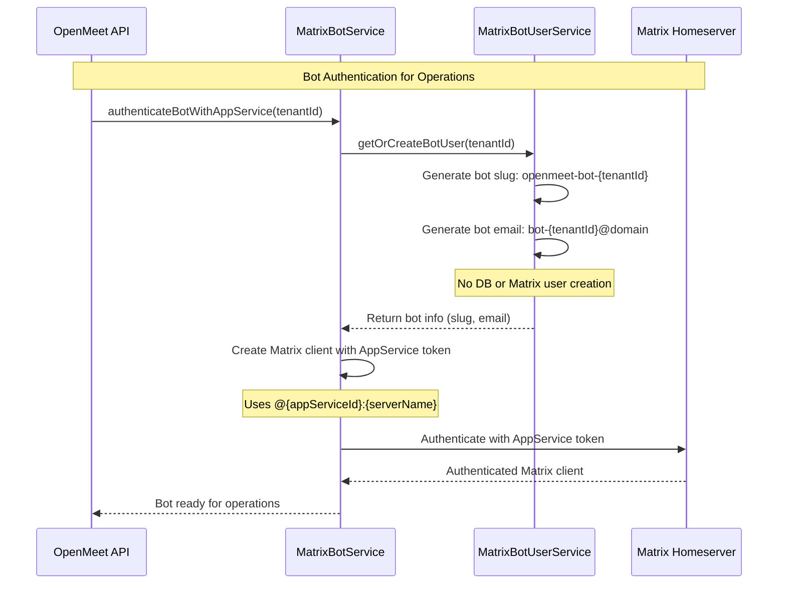
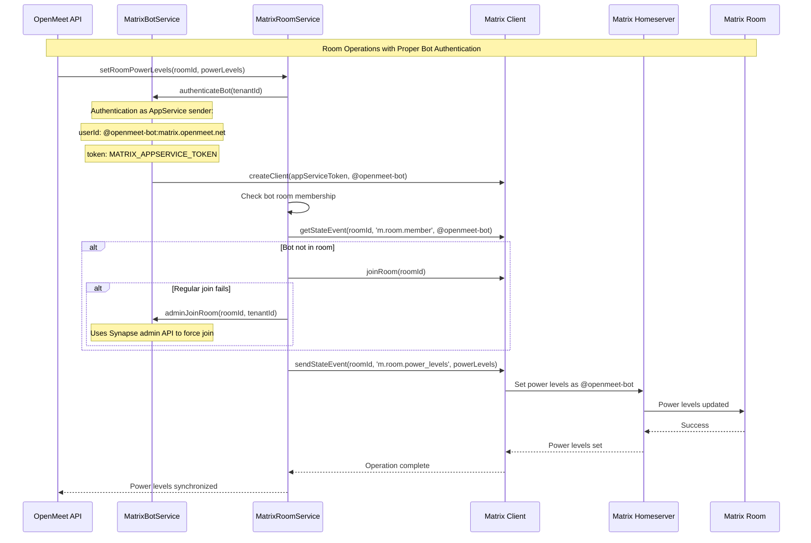
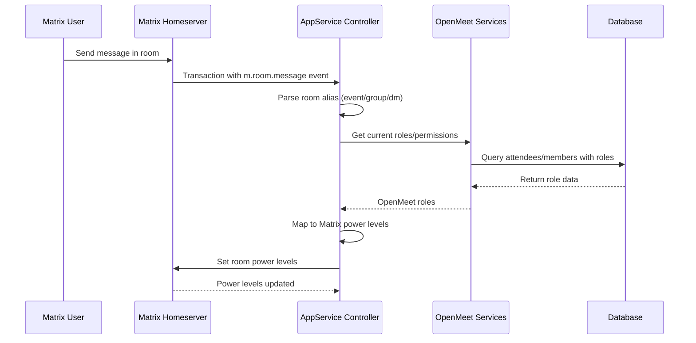

# Matrix Bot Architecture: Creation, Usage, and Configuration

## Overview

The OpenMeet Matrix integration uses a single Application Service bot for all Matrix operations across all tenants. The bot uses AppService authentication and has namespace control to manage rooms and permissions.

## Architecture Components

### Application Service Bot

**Identity**: `@{MATRIX_APPSERVICE_ID}:{serverName}` (typically `@openmeet-bot:matrix.openmeet.net`)

**Purpose**: Single bot that handles all Matrix operations for all tenants.

**Configuration**:
- Defined in `openmeet-appservice.gomplate.yaml` (used in both local dev and k8s)
- Uses `MATRIX_APPSERVICE_ID` environment variable
- Uses `MATRIX_APPSERVICE_TOKEN` for authentication
- Serves as `sender_localpart` in appservice configuration
- Has namespace control over `@openmeet-bot-.*:.*` and `@openmeet-.*:.*`

**Characteristics**:
- Single bot instance for entire platform
- Not a database user - exists only in Matrix homeserver
- Uses Application Service token authentication
- Has elevated privileges across the entire Matrix system
- Handles room creation, invitations, and permission management for all tenants

### MatrixBotUserService

**Purpose**: Generates consistent bot usernames for logging and tracking.

**Implementation** (`src/matrix/services/matrix-bot-user.service.ts`):
- `getOrCreateBotUser(tenantId)` returns slug and email info
- Format: `openmeet-bot-{tenantId}`
- **Does not create database records**
- **Does not create separate Matrix users**
- Used for consistent naming in logs and operations

**Note**: Despite the namespace allowing `@openmeet-bot-{tenantId}` users, we use a single AppService bot for all operations.

## Bot Authentication Flow



## Architecture Rationale

### Why Application Service?

Matrix Application Services provide the necessary privileges for bot operations:

- **Namespace control**: Can manage users matching `@openmeet-bot-.*:.*` pattern
- **Elevated privileges**: Can create rooms, invite users, set power levels
- **Token authentication**: No password management required
- **Automatic user provisioning**: Matrix creates users on-demand within the namespace

### Why Single Bot for All Tenants?

Using a single Application Service bot simplifies the architecture:

- **Simplified authentication**: One AppService token for all operations
- **No credential management**: No passwords to rotate or manage
- **Consistent operations**: All tenants use the same bot with the same privileges
- **Tenant tracking**: `MatrixBotUserService` generates tenant-specific slugs for logging

### Architecture Diagram

```mermaid
graph TB
    subgraph "Matrix Application Service"
        AS[Application Service]
        ASBOT[@openmeet-bot<br/>single bot for all tenants]
        TOKEN[AppService Token]
    end

    subgraph "OpenMeet API"
        MBS[MatrixBotService]
        MBUS[MatrixBotUserService]
    end

    subgraph "Matrix Operations"
        ROOM[Room Creation]
        INVITE[User Invitations]
        POWER[Power Level Management]
    end

    AS --> ASBOT
    AS --> TOKEN

    MBS --> TOKEN
    MBS --> MBUS
    MBUS -.generates slugs for logging.-> MBS

    ASBOT --> ROOM
    ASBOT --> INVITE
    ASBOT --> POWER
```

## Configuration Details

### Application Service Configuration

**File**: `matrix-config/openmeet-appservice.gomplate.yaml`

```yaml
id: {{ .Env.MATRIX_APPSERVICE_ID }}
url: {{ .Env.MATRIX_APPSERVICE_URL }}
as_token: {{ .Env.MATRIX_APPSERVICE_TOKEN }}
hs_token: {{ .Env.MATRIX_APPSERVICE_HS_TOKEN }}
sender_localpart: {{ .Env.MATRIX_APPSERVICE_ID }}  # Main bot identity
rate_limited: false

namespaces:
  users:
    - exclusive: true
      regex: "@openmeet-bot-.*:.*"    # Tenant-specific bots
    - exclusive: true
      regex: "@openmeet-.*:.*"        # General openmeet users
```

### Tenant Matrix Configuration

**File**: `tenant-service/tenants-{env}.yaml`

**Current State (September 2025)**: All tenants use the same Matrix instance:

```yaml
tenants:
  - id: "lsdfaopkljdfs"
    name: "OpenMeet"
    matrixConfig:
      homeserverUrl: "https://matrix.openmeet.net"
      serverName: "matrix.openmeet.net"

  - id: "oiupsdknasfdf"
    name: "Testing"
    matrixConfig:
      homeserverUrl: "https://matrix.openmeet.net"  # Same instance
      serverName: "matrix.openmeet.net"              # Same instance
```

**Future Capability**: Architecture supports per-tenant Matrix instances by specifying different `homeserverUrl` per tenant:

```yaml
tenants:
  - id: "enterprise-tenant"
    name: "Enterprise Customer"
    matrixConfig:
      homeserverUrl: "https://matrix-enterprise.openmeet.net"  # Dedicated instance
      serverName: "matrix-enterprise.openmeet.net"
      # Would require separate AppService configuration on that instance
```

## Matrix Operations Flow

### Bot Authentication Pattern

**Implementation**: The bot service authenticates as the single AppService sender (`@openmeet-bot`) and performs all operations using that identity. The `MatrixBotUserService` generates tenant-specific slugs for logging purposes, but all Matrix operations use the same AppService bot.



## Power Level Issue Resolution

### The Problem We Fixed

**Issue**: The application was failing to set power levels with error:
```
MatrixError: [403] User @openmeet-bot:matrix.openmeet.net not in room
```

**Root Cause**: The AppService bot was authenticated correctly but wasn't joining rooms before attempting to modify power levels. Matrix requires room membership to modify room state.

### The Solution

**Key Changes in `MatrixRoomService.setRoomPowerLevels()`**:

1. **Proper Bot Identity**: Use `this.matrixBotService.getBotUserId(tenantId)` to get the correct AppService sender ID
2. **Room Membership Check**: Verify bot is in room before attempting power level changes
3. **Graceful Join**: Attempt to join room if not already a member
4. **Fallback to Admin Join**: Use Synapse admin API if regular join fails

**Code Pattern**:
```typescript
// Get the correct AppService sender identity
const appServiceSender = this.matrixBotService.getBotUserId(tenantId);

// Check if bot is in room, join if needed
try {
  await botClient.getStateEvent(roomId, 'm.room.member', appServiceSender);
} catch {
  // Bot not in room - join it
  try {
    await botClient.joinRoom(roomId);
  } catch (joinError) {
    // Fallback to admin join if regular join fails
    await this.matrixBotService.adminJoinRoom(roomId, tenantId);
  }
}

// Now safely set power levels
await botClient.sendStateEvent(roomId, 'm.room.power_levels', powerLevels);
```

### Why This Works

1. **AppService Privileges**: The `@openmeet-bot` identity has AppService privileges to join any room in its namespace
2. **Room Membership**: Once in the room, the bot can modify room state including power levels
3. **Admin Fallback**: For protected rooms, the admin API can force join the bot
4. **Proper Error Handling**: Distinguishes between different failure modes and handles each appropriately

## Current Single Bot Architecture

### Why Single Bot Works

The current implementation uses a single AppService bot for all operations:

1. **Simplified Authentication**: One AppService token, no credential management
2. **Efficient Operations**: No per-tenant authentication overhead
3. **Shared Infrastructure**: All tenants on same Matrix instance
4. **Audit via Application**: Tenant context tracked in OpenMeet API, not Matrix
5. **Matrix Isolation**: Users are tenant-isolated via naming (`username_tenantid`)

### Trade-offs

**Advantages**:
- Simpler configuration and deployment
- No bot credential management or rotation
- Faster bot operations (single authenticated client)
- Works well for shared Matrix instance

**Limitations**:
- Bot actions in Matrix don't show tenant attribution
- Audit trail requires application-level logging
- All tenants share bot's rate limits

## Service Responsibilities

### MatrixBotService (`src/matrix/services/matrix-bot.service.ts`)
- Authenticates with AppService token as single bot
- Manages Matrix client instance
- Performs room operations (create, invite, power levels)
- Handles admin operations via Synapse admin API
- Provides bot identity for all Matrix operations

### MatrixBotUserService (`src/matrix/services/matrix-bot-user.service.ts`)
- Generates consistent bot slugs and emails for logging
- Returns `BotUserInfo` (slug, email) for tenant context
- **Does not create database records**
- **Does not create Matrix users**
- Used for consistent naming in logs and operations

## Security Considerations

### Authentication
1. **AppService Token**: Single token provides authentication for all operations
2. **Token Storage**: Stored securely as environment variable
3. **No Password Management**: AppService eliminates credential rotation needs
4. **Namespace Control**: Bot has privileges only within `@openmeet-bot-.*` namespace

### Permission Model
- **AppService Bot**: Has admin privileges in all OpenMeet-created rooms
- **Room Power Levels**: Bot automatically gets power level 100 for room management
- **User Isolation**: Regular users scoped to their tenant via Matrix user ID format

## Smart Matrix Power Level Synchronization

### Implementation Status: ✅ **COMPLETED** (September 2025)

**Solution**: Implemented comprehensive Matrix AppService event handling with automatic power level synchronization triggered by user activity.

**Location**: `src/matrix/controllers/matrix-appservice.controller.ts:handleUserActivity()`

### How It Works

**Trigger**: Matrix `m.room.message` events (when users send messages)
**Scope**: All room types - Events, Groups, and DMs
**Frequency**: Real-time sync on user activity

### Architecture Flow



### Power Level Mapping

#### Event Rooms
- **Host**: 100 (Admin - full room control)
- **Moderator**: 50 (Can moderate, kick users)  
- **Speaker**: 25 (Can change topic, invite)
- **Participant/Guest**: 0 (Regular user)

#### Group Rooms  
- **Owner**: 100 (Admin - full room control)
- **Admin**: 75 (High moderator privileges)
- **Moderator**: 50 (Standard moderation)
- **Member**: 0 (Regular user)

#### DM Rooms
- **Both Users**: 50 (Equal moderation rights)

### Key Features

1. **Universal Coverage**: Handles events, groups, and DMs
2. **Activity-Triggered**: Syncs when users are actually active
3. **Self-Healing**: Corrects power level drift automatically  
4. **Bot Authority**: Ensures AppService bot maintains admin (100)
5. **Tenant Isolation**: Properly scoped per tenant

### Code Structure

```typescript
// Main entry point - triggered by Matrix messages
handleUserActivity(event) → {
  switch (roomType) {
    case 'event': syncEventPowerLevels()
    case 'group': syncGroupPowerLevels() 
    case 'dm': syncDMPowerLevels()
  }
}

// Role mapping functions
buildEventPowerLevelsMap(attendees, tenantId)
buildGroupPowerLevelsMap(members, tenantId)  
buildDMPowerLevelsMap(userHandles, tenantId)

// Application via Matrix bot
applyPowerLevels(roomId, powerLevelsMap, tenantId)
```

### Benefits

- ✅ **Matrix-Native**: Uses standard AppService transaction pattern
- ✅ **Efficient**: Only syncs when users are active (not polling)
- ✅ **Comprehensive**: Covers all OpenMeet chat scenarios
- ✅ **Reliable**: Self-correcting and error-tolerant
- ✅ **Scalable**: Distributed across user activity

### Testing

E2E test at `test/cypress/e2e/matrix-power-levels-bot-fix.cy.ts` validates:
- User role changes in OpenMeet 
- Matrix power level synchronization
- Proper bot authority maintenance
- Cross-tenant isolation

## Conclusion

The dual-bot architecture combined with smart power level synchronization provides a complete Matrix integration solution:

**Architecture Benefits**:
- **Compliance** with Matrix Application Service patterns
- **Isolation** between tenants  
- **Scalability** for operational management
- **Security** through proper credential separation
- **Auditability** of tenant-specific actions

**Power Level Sync Benefits**:
- **Real-time**: Updates when users are active
- **Universal**: Works for all room types  
- **Self-healing**: Corrects inconsistencies automatically
- **Efficient**: No polling or scheduled jobs needed

This ensures OpenMeet operates as a proper Matrix Application Service while maintaining security, isolation, and real-time role synchronization across all chat scenarios.