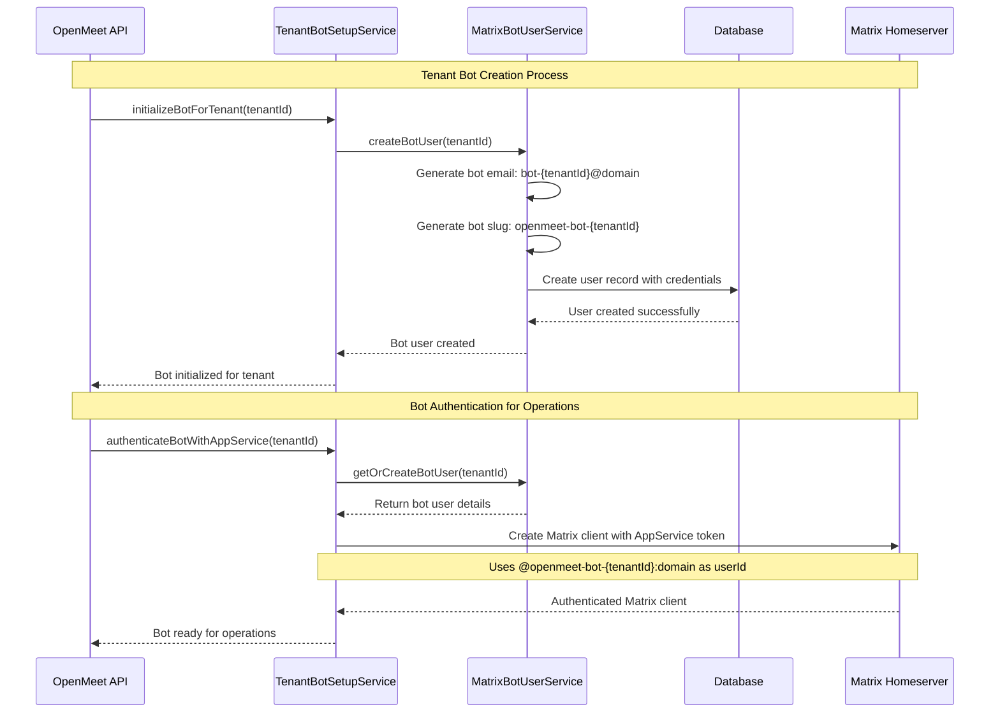
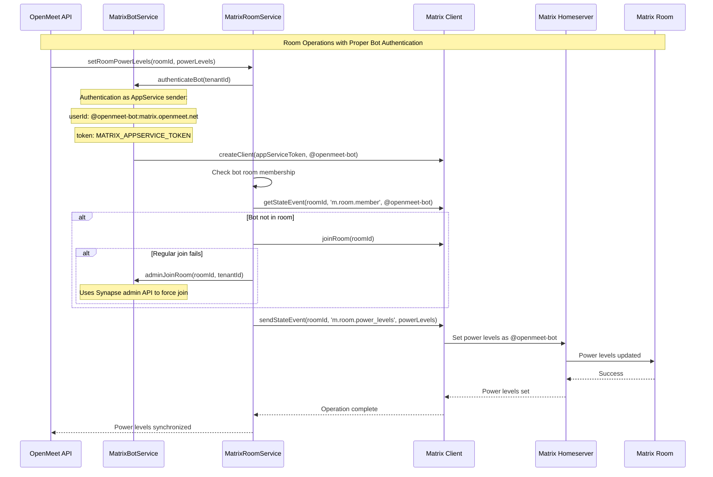
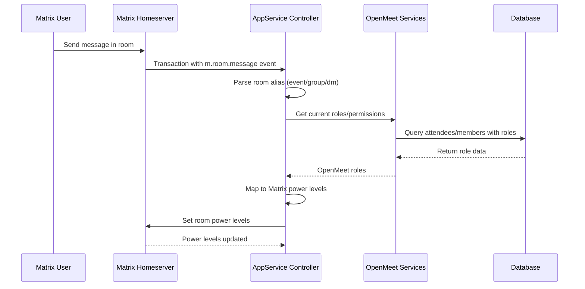

# Matrix Bot Architecture: Creation, Usage, and Configuration

## Overview

The OpenMeet Matrix integration uses a dual-bot architecture that combines a main Application Service bot with tenant-specific bot users. This design ensures proper namespace isolation while maintaining centralized authentication privileges.

## Architecture Components

### 1. Main Application Service Bot (`@openmeet-bot`)

**Purpose**: Provides Matrix Application Service authentication and serves as the default sender for the appservice.

**Configuration**:
- Defined in `matrix-config/openmeet-appservice.gomplate.yaml`
- Uses `MATRIX_APPSERVICE_ID` environment variable
- Serves as `sender_localpart` in appservice configuration
- Has global namespace control over `@openmeet-bot-.*:.*` and `@openmeet-.*:.*`

**Characteristics**:
- Not a "real" user account in our database
- Exists only in Matrix homeserver configuration
- Uses Application Service token authentication
- Has elevated privileges across the entire Matrix system

### 2. Tenant-Specific Bot Users (`@openmeet-bot-{tenantId}`)

**Purpose**: Provides isolated bot identities for each tenant while maintaining namespace compliance.

**Creation Process**:
- Created via `TenantBotSetupService.initializeBotForTenant()`
- Stored as real user records in the database
- Uses tenant-specific credentials and configuration
- Follows format: `openmeet-bot-{tenantId}`

**Characteristics**:
- Real user accounts in OpenMeet database
- Have passwords (with rotation capabilities)
- Use AppService authentication for Matrix operations
- Maintain tenant isolation

## Bot Creation Flow



## Why Two Types of Bots?

### Matrix Application Service Requirements

Matrix Application Services require a `sender_localpart` - this becomes the primary bot identity that Matrix associates with the appservice. This bot:

- **Must exist** for the appservice to function
- **Cannot be deleted** without breaking the appservice
- **Has global privileges** within the defined namespaces
- **Serves as fallback** for operations when no specific user is provided

### Tenant Isolation Requirements

OpenMeet's multi-tenant architecture requires:

- **Separate bot identities** for each tenant
- **Isolated permissions** per tenant
- **Auditable actions** tied to specific tenants
- **Scalable management** of bot credentials

### The Solution: Dual Bot Architecture

```mermaid
graph TB
    subgraph "Matrix Application Service"
        AS[Application Service]
        ASBOT[@openmeet-bot<br/>sender_localpart]
        TOKEN[AppService Token]
    end
    
    subgraph "Tenant A"
        TBOT1[@openmeet-bot-tenantA<br/>Real User Account]
        TCREDS1[Tenant A Credentials]
    end
    
    subgraph "Tenant B"
        TBOT2[@openmeet-bot-tenantB<br/>Real User Account]
        TCREDS2[Tenant B Credentials]
    end
    
    subgraph "Matrix Operations"
        ROOM[Room Creation]
        INVITE[User Invitations]
        POWER[Power Level Management]
    end
    
    AS --> ASBOT
    AS --> TOKEN
    
    TOKEN --> TBOT1
    TOKEN --> TBOT2
    
    TBOT1 --> ROOM
    TBOT1 --> INVITE
    TBOT1 --> POWER
    
    TBOT2 --> ROOM
    TBOT2 --> INVITE
    TBOT2 --> POWER
    
    TCREDS1 --> TBOT1
    TCREDS2 --> TBOT2
```

## Configuration Details

### Application Service Configuration

**File**: `matrix-config/openmeet-appservice.gomplate.yaml`

```yaml
id: {{ .Env.MATRIX_APPSERVICE_ID }}
url: {{ .Env.MATRIX_APPSERVICE_URL }}
as_token: {{ .Env.MATRIX_APPSERVICE_TOKEN }}
hs_token: {{ .Env.MATRIX_APPSERVICE_HS_TOKEN }}
sender_localpart: {{ .Env.MATRIX_APPSERVICE_ID }}  # Main bot identity
rate_limited: false

namespaces:
  users:
    - exclusive: true
      regex: "@openmeet-bot-.*:.*"    # Tenant-specific bots
    - exclusive: true
      regex: "@openmeet-.*:.*"        # General openmeet users
```

### Tenant Configuration

**File**: `tenant-service/tenants-{env}.yaml`

```yaml
tenants:
  - id: "tenantId"
    matrixConfig:
      homeserverUrl: "http://localhost:8448"
      serverName: "matrix.openmeet.net"
      botUser:
        email: "bot-tenantId@openmeet.net"
        slug: "openmeet-bot-tenantId"
        password: "secure-password"
      appservice:
        id: "openmeet-appservice-tenantId"
        token: "as_token_tenantId"
        hsToken: "hs_token_tenantId"
```

## Matrix Operations Flow

### Critical Implementation Detail: Authentication vs. Identity

**The Key Pattern**: The bot service authenticates as the AppService sender (`@openmeet-bot`) but can operate on behalf of any user in the controlled namespace (`@openmeet-bot-{tenantId}`).



## Power Level Issue Resolution

### The Problem We Fixed

**Issue**: The application was failing to set power levels with error:
```
MatrixError: [403] User @openmeet-bot:matrix.openmeet.net not in room
```

**Root Cause**: The AppService bot was authenticated correctly but wasn't joining rooms before attempting to modify power levels. Matrix requires room membership to modify room state.

### The Solution

**Key Changes in `MatrixRoomService.setRoomPowerLevels()`**:

1. **Proper Bot Identity**: Use `this.matrixBotService.getBotUserId(tenantId)` to get the correct AppService sender ID
2. **Room Membership Check**: Verify bot is in room before attempting power level changes
3. **Graceful Join**: Attempt to join room if not already a member
4. **Fallback to Admin Join**: Use Synapse admin API if regular join fails

**Code Pattern**:
```typescript
// Get the correct AppService sender identity
const appServiceSender = this.matrixBotService.getBotUserId(tenantId);

// Check if bot is in room, join if needed
try {
  await botClient.getStateEvent(roomId, 'm.room.member', appServiceSender);
} catch {
  // Bot not in room - join it
  try {
    await botClient.joinRoom(roomId);
  } catch (joinError) {
    // Fallback to admin join if regular join fails
    await this.matrixBotService.adminJoinRoom(roomId, tenantId);
  }
}

// Now safely set power levels
await botClient.sendStateEvent(roomId, 'm.room.power_levels', powerLevels);
```

### Why This Works

1. **AppService Privileges**: The `@openmeet-bot` identity has AppService privileges to join any room in its namespace
2. **Room Membership**: Once in the room, the bot can modify room state including power levels
3. **Admin Fallback**: For protected rooms, the admin API can force join the bot
4. **Proper Error Handling**: Distinguishes between different failure modes and handles each appropriately

## Why Not Just Use the Main Bot?

### The Problem with Single Bot Approach

If we only used `@openmeet-bot` for all operations:

1. **No Tenant Isolation**: All actions would appear to come from the same bot
2. **Audit Trail Issues**: Cannot distinguish which tenant performed actions
3. **Permission Complexity**: Difficult to manage tenant-specific permissions
4. **Scaling Problems**: Single bot becomes bottleneck for all tenants
5. **Security Concerns**: One compromised bot affects all tenants

### The Benefits of Dual Bot Architecture

1. **Clear Separation**: AppService authentication vs. operational identity
2. **Tenant Isolation**: Each tenant has its own bot identity
3. **Scalable Management**: Bot credentials can be rotated per tenant
4. **Audit Trail**: Actions clearly attributed to specific tenants
5. **Namespace Compliance**: Maintains Matrix's expected patterns

## Service Responsibilities

### TenantBotSetupService (`src/matrix/services/tenant-bot-setup.service.ts`)
- Initializes bots for new tenants
- Manages bot lifecycle (creation, verification, cleanup)
- Handles bot health monitoring
- Coordinates with other services

### MatrixBotUserService (`src/matrix/services/matrix-bot-user.service.ts`)
- Creates bot user records in database
- Generates tenant-specific credentials
- Manages password rotation
- Handles bot user queries

### MatrixBotService (`src/matrix/services/matrix-bot.service.ts`)
- Performs actual Matrix operations
- Authenticates bots with AppService
- Manages Matrix client instances
- Handles room operations (create, invite, power levels)

## Security Considerations

### Authentication Flow
1. **AppService Token**: Provides Matrix authentication privileges
2. **Tenant Bot Identity**: Provides user context for operations
3. **Database Credentials**: Secure tenant-specific bot passwords
4. **Rotation Policy**: Regular password rotation (default 30 days)

### Permission Model
- **Main Bot**: Global namespace control, no operational use
- **Tenant Bots**: Operational identity with tenant-scoped permissions
- **Room Power Levels**: Both bots get admin (100) for redundancy

## Smart Matrix Power Level Synchronization

### Implementation Status: ✅ **COMPLETED** (July 2025)

**Solution**: Implemented comprehensive Matrix AppService event handling with automatic power level synchronization triggered by user activity.

**Location**: `src/matrix/controllers/matrix-appservice.controller.ts:handleUserActivity()`

### How It Works

**Trigger**: Matrix `m.room.message` events (when users send messages)
**Scope**: All room types - Events, Groups, and DMs
**Frequency**: Real-time sync on user activity

### Architecture Flow



### Power Level Mapping

#### Event Rooms
- **Host**: 100 (Admin - full room control)
- **Moderator**: 50 (Can moderate, kick users)  
- **Speaker**: 25 (Can change topic, invite)
- **Participant/Guest**: 0 (Regular user)

#### Group Rooms  
- **Owner**: 100 (Admin - full room control)
- **Admin**: 75 (High moderator privileges)
- **Moderator**: 50 (Standard moderation)
- **Member**: 0 (Regular user)

#### DM Rooms
- **Both Users**: 50 (Equal moderation rights)

### Key Features

1. **Universal Coverage**: Handles events, groups, and DMs
2. **Activity-Triggered**: Syncs when users are actually active
3. **Self-Healing**: Corrects power level drift automatically  
4. **Bot Authority**: Ensures AppService bot maintains admin (100)
5. **Tenant Isolation**: Properly scoped per tenant

### Code Structure

```typescript
// Main entry point - triggered by Matrix messages
handleUserActivity(event) → {
  switch (roomType) {
    case 'event': syncEventPowerLevels()
    case 'group': syncGroupPowerLevels() 
    case 'dm': syncDMPowerLevels()
  }
}

// Role mapping functions
buildEventPowerLevelsMap(attendees, tenantId)
buildGroupPowerLevelsMap(members, tenantId)  
buildDMPowerLevelsMap(userHandles, tenantId)

// Application via Matrix bot
applyPowerLevels(roomId, powerLevelsMap, tenantId)
```

### Benefits

- ✅ **Matrix-Native**: Uses standard AppService transaction pattern
- ✅ **Efficient**: Only syncs when users are active (not polling)
- ✅ **Comprehensive**: Covers all OpenMeet chat scenarios
- ✅ **Reliable**: Self-correcting and error-tolerant
- ✅ **Scalable**: Distributed across user activity

### Testing

E2E test at `test/cypress/e2e/matrix-power-levels-bot-fix.cy.ts` validates:
- User role changes in OpenMeet 
- Matrix power level synchronization
- Proper bot authority maintenance
- Cross-tenant isolation

## Conclusion

The dual-bot architecture combined with smart power level synchronization provides a complete Matrix integration solution:

**Architecture Benefits**:
- **Compliance** with Matrix Application Service patterns
- **Isolation** between tenants  
- **Scalability** for operational management
- **Security** through proper credential separation
- **Auditability** of tenant-specific actions

**Power Level Sync Benefits**:
- **Real-time**: Updates when users are active
- **Universal**: Works for all room types  
- **Self-healing**: Corrects inconsistencies automatically
- **Efficient**: No polling or scheduled jobs needed

This ensures OpenMeet operates as a proper Matrix Application Service while maintaining security, isolation, and real-time role synchronization across all chat scenarios.