# Matrix Bot Invitation Flows

This document analyzes the Matrix bot invitation system in OpenMeet, detailing how users are automatically invited to Matrix chat rooms when they RSVP to events or join groups.

## Overview

The Matrix bot invitation system operates through an event-driven architecture where user attendance changes trigger automatic Matrix room invitations. This ensures users have access to historical messages and chat context when they join events or groups.

## Root Cause Analysis & Fixes Applied

### 🔍 **PRIMARY ROOT CAUSE DISCOVERED**

**ChatController was using ChatRoomService instead of ChatRoomManagerInterface** - This was the main reason Matrix bot operations were being skipped entirely in manual invitation flows.

**Architectural Inconsistency**:
- **ChatListener** (automatic flow): Used ChatRoomManagerInterface ✅ - Matrix bots work
- **ChatController** (manual flow): Used ChatRoomService ❌ - Matrix bots skipped

### ✅ **FIXES IMPLEMENTED**

#### 1. Backend Service Injection Fix
**Problem**: ChatController injected ChatRoomService instead of ChatRoomManagerInterface
```typescript
// BEFORE (incorrect - skips Matrix bots)
constructor(private readonly chatRoomService: ChatRoomService) {}

// AFTER (correct - uses Matrix bots)
constructor(private readonly chatRoomManager: ChatRoomManagerInterface) {}
```

**Methods Updated**:
- `addUserToEventChatRoom()` - Now uses `chatRoomManager` instead of `chatRoomService`
- `addUserToGroupChatRoom()` - Now uses `chatRoomManager` instead of `chatRoomService`

#### 2. Frontend Method Name Fix
**Problem**: Retry logic called wrong method name
```typescript
// BEFORE (incorrect method name)
this.actionFetchEventDetails()

// AFTER (correct method name)
this.actionGetEventBySlug()
```

### 🏗️ **ARCHITECTURAL DISCOVERIES**

#### ChatRoomService Should Be Deprecated
- **ChatRoomManagerInterface** already covers 90% of ChatRoomService functionality
- **ChatRoomManagerInterface** properly integrates Matrix bot operations
- **ChatRoomService** bypasses Matrix bots entirely
- **DiscussionService** has heavy coupling to ChatRoomService (dozens of method calls)

#### Missing Implementation
- **`ensureRoomAccess()` method** needs to be added to ChatRoomManagerInterface
- This method exists in ChatRoomService but not in the interface

### 📊 **CURRENT STATE vs DESIRED STATE**

#### Current State (After Fixes)
- ✅ **Automatic Flow** (RSVP): Uses ChatRoomManagerInterface → Matrix bots work
- ✅ **Manual Flow** (retry button): Uses ChatRoomManagerInterface → Matrix bots work
- ❌ **DiscussionService**: Still coupled to ChatRoomService → bypasses Matrix bots
- ❌ **Missing Methods**: `ensureRoomAccess()` not in ChatRoomManagerInterface

#### Desired State
- ✅ **All Flows**: Use ChatRoomManagerInterface exclusively
- ✅ **DiscussionService**: Migrated to use ChatRoomManagerInterface
- ✅ **ChatRoomService**: Completely deprecated and removed
- ✅ **Complete Interface**: All necessary methods in ChatRoomManagerInterface

## ⚠️ **SECONDARY ISSUE IDENTIFIED**

**Error Swallowing in ChatListener**: The system has error swallowing in the ChatListener that masks Matrix bot failures, causing users to appear successfully confirmed for events but not actually receive Matrix room invitations.

## Event-Driven Invitation Flow

### Complete Flow Sequence


### Event Types That Trigger Invitations

```mermaid
graph TD
    A[Attendee Status Changes] --> B{Check Status}
    B -->|confirmed| C[Emit chat.event.member.add]
    B -->|other status| D[No action]
    
    E[New Attendee Created] --> F{Check Initial Status}
    F -->|confirmed| C
    F -->|other status| D
    
    G[Attendee Added] --> H{Check Status}
    H -->|confirmed| C
    H -->|other status| D
    
    C --> I[ChatListener.handleChatEventMemberAdd]
    I --> J[✅ AUTOMATIC FLOW: Uses ChatRoomManagerInterface]
    J --> K[Matrix Bot Invitation Process]
    
    L[Manual Retry Button] --> M[ChatController.addUserToEventChatRoom]
    M --> N[✅ MANUAL FLOW: Now Uses ChatRoomManagerInterface]
    N --> K
    
    O[DiscussionService Operations] --> P[🚧 LEGACY: Still Uses ChatRoomService]
    P --> Q[❌ Bypasses Matrix Bots]
    
    style J fill:#90EE90
    style N fill:#90EE90
    style P fill:#FFB6C1
    style Q fill:#FFB6C1
```



## Fixed Architecture Overview

### Before vs After Fix

```mermaid
graph TB
    subgraph "BEFORE (Broken) - Mixed Architecture"
        A1[RSVP Flow] --> B1[EventListener]
        B1 --> C1[ChatListener]
        C1 --> D1[✅ ChatRoomManagerInterface]
        D1 --> E1[✅ Matrix Bots Invoked]
        
        F1[Manual Retry] --> G1[ChatController]
        G1 --> H1[❌ ChatRoomService]
        H1 --> I1[❌ Matrix Bots Skipped]
        
        J1[Discussion Operations] --> K1[DiscussionService]
        K1 --> H1
    end
    
    subgraph "AFTER (Fixed) - Consistent Architecture"
        A2[RSVP Flow] --> B2[EventListener]
        B2 --> C2[ChatListener]
        C2 --> D2[✅ ChatRoomManagerInterface]
        D2 --> E2[✅ Matrix Bots Invoked]
        
        F2[Manual Retry] --> G2[ChatController]
        G2 --> D2
        
        J2[Discussion Operations] --> K2[DiscussionService]
        K2 --> L2[🚧 Still ChatRoomService]
        L2 --> M2[❌ Matrix Bots Still Skipped]
    end
    
    style D1 fill:#90EE90
    style E1 fill:#90EE90
    style H1 fill:#FFB6C1
    style I1 fill:#FFB6C1
    style D2 fill:#90EE90
    style E2 fill:#90EE90
    style L2 fill:#FFB6C1
    style M2 fill:#FFB6C1
```



### Service Layer Architecture

```mermaid
graph LR
    subgraph "Controllers & Services"
        A[ChatController] 
        B[DiscussionService]
        C[EventListener]
        D[ChatListener]
    end
    
    subgraph "Chat Management Layer"
        E[ChatRoomManagerInterface]
        F[ChatRoomService - Legacy]
    end
    
    subgraph "Matrix Integration"
        G[MatrixChatRoomManager]
        H[MatrixBotService]
        I[Matrix Server]
    end
    
    A -.->|✅ FIXED| E
    A -.->|❌ WAS USING| F
    B -->|🚧 TO MIGRATE| F
    C --> D
    D --> E
    
    E --> G
    G --> H
    H --> I
    
    F -.->|BYPASSES| I
    
    style A fill:#90EE90
    style E fill:#90EE90
    style G fill:#90EE90
    style F fill:#FFB6C1
    style B fill:#FFEB9C
```



## Matrix Bot Service Architecture

### Bot Authentication Flow


### Room Operations Flow


## Issues Analysis

### 1. ✅ FIXED: Service Injection Architecture

**Root Cause**: ChatController was using ChatRoomService instead of ChatRoomManagerInterface

**Before (Broken)**:
```typescript
// ChatController injected ChatRoomService
constructor(private readonly chatRoomService: ChatRoomService) {}

// Methods bypassed Matrix bots
addUserToEventChatRoom() {
  return this.chatRoomService.addUserToEventChatRoom(); // ❌ No Matrix bots
}
```

**After (Fixed)**:
```typescript
// ChatController injects ChatRoomManagerInterface
constructor(private readonly chatRoomManager: ChatRoomManagerInterface) {}

// Methods now use Matrix bots
addUserToEventChatRoom() {
  return this.chatRoomManager.addUserToEventChatRoom(); // ✅ Uses Matrix bots
}
```

**Impact of Fix**:
- ✅ Manual invitation flows now properly invoke Matrix bots
- ✅ Users get Matrix room access when using retry buttons
- ✅ Consistent behavior between automatic (RSVP) and manual (retry) flows

### 2. ✅ FIXED: Frontend Method Name

**Problem**: Retry logic called non-existent method
```typescript
// Before (incorrect method name)
this.actionFetchEventDetails(slug)

// After (correct method name) 
this.actionGetEventBySlug(slug)
```

### 3. Error Swallowing in ChatListener (Secondary Issue)

**Location**: `/src/chat/chat.listener.ts`

**Problem**: All ChatListener methods have try-catch blocks that log errors but don't re-throw them:

```typescript
try {
  await this.chatRoomManager.addUserToEventChatRoom(/*...*/);
  this.logger.log(`Successfully ensured event chat room invitation`);
} catch (error) {
  // 🚨 ERROR IS LOGGED BUT SWALLOWED!
  this.logger.error(`Failed to add user: ${error.message}`, error.stack);
  // No re-throw - execution continues as if nothing failed
}
```

**Impact**:
- Matrix server failures are silently ignored
- Users may confirm attendance but never receive Matrix invitations
- No visibility into Matrix bot failures in monitoring systems
- Backend reports "Successfully ensured event chat room invitation" even when it fails

### 2. Affected Methods

All these ChatListener methods swallow Matrix errors:
- `handleChatEventMemberAdd()` - Adding users to event chat rooms
- `handleChatEventMemberRemove()` - Removing users from event chat rooms  
- `handleChatGroupMemberAdd()` - Adding users to group chat rooms
- `handleChatGroupMemberRemove()` - Removing users from group chat rooms
- `handleChatEventCreated()` - Creating event chat rooms
- `handleEventBeforeDelete()` - Cleaning up event chat rooms
- `handleGroupBeforeDelete()` - Cleaning up group chat rooms

### 3. Error Scenarios That Are Hidden

```mermaid
graph TD
    A[Matrix Bot Operation] --> B{Operation Result}
    B -->|Success| C[✅ User invited successfully]
    B -->|403 Forbidden| D[❌ User not in room]
    B -->|Network Error| E[❌ Matrix server unreachable]
    B -->|Auth Error| F[❌ Bot credentials invalid]
    B -->|Rate Limited| G[❌ Too many requests]
    
    D --> H[🚨 Error logged but swallowed]
    E --> H
    F --> H
    G --> H
    
    H --> I[❌ Backend reports success]
    I --> J[❌ User thinks they have access]
    J --> K[❌ User can't access Matrix room]
```



## API Endpoints

### Manual Room Joining (Fixed)

**Endpoint**: `POST /api/chat/event/{slug}/join`

**Flow After Fixes**:

```mermaid
sequenceDiagram
    participant User
    participant ChatController
    participant ChatRoomManager
    participant MatrixBot
    participant MatrixServer

    User->>ChatController: POST /api/chat/event/{slug}/join
    Note over ChatController: ✅ NOW USES ChatRoomManagerInterface
    ChatController->>ChatRoomManager: addUserToEventChatRoom()
    ChatRoomManager->>MatrixBot: Invite user to Matrix room
    MatrixBot->>MatrixServer: Send invitation
    
    alt User Has Access
        MatrixServer-->>MatrixBot: Invitation sent
        MatrixBot-->>ChatRoomManager: Success
        ChatRoomManager->>ChatRoomManager: Update database
        ChatRoomManager-->>ChatController: Success + roomId
        ChatController-->>User: 200 OK with room details
        Note over User: ✅ User can access Matrix room & history
    else User Lacks Access
        MatrixServer-->>MatrixBot: Error (403, etc.)
        MatrixBot-->>ChatRoomManager: Error
        ChatRoomManager-->>ChatController: Error
        ChatController-->>User: 403 Forbidden
    end
```


**Key Fix**: ChatController now injects `ChatRoomManagerInterface` instead of `ChatRoomService`, ensuring Matrix bot operations are properly executed in manual flows.

**Response Format**:
```json
{
  "success": true,
  "roomId": "!xyzMatrixRoomId:matrix.openmeet.net",
  "message": "Successfully joined chat room"
}
```

## Matrix Bot Service Methods

### Core Bot Operations

```typescript
interface MatrixBotService {
  // Authentication
  authenticateBot(tenantId: string): Promise<void>
  isBotAuthenticated(): boolean
  
  // Room Management
  createRoom(options: CreateRoomOptions, tenantId: string): Promise<RoomInfo>
  inviteUser(roomId: string, userId: string, tenantId: string): Promise<void>
  removeUser(roomId: string, userId: string, tenantId: string): Promise<void>
  
  // Permissions
  syncPermissions(roomId: string, userPowerLevels: Record<string, number>, tenantId: string): Promise<void>
  
  // Utility
  verifyRoomExists(roomId: string, tenantId: string): Promise<boolean>
  deleteRoom(roomId: string, tenantId: string): Promise<void>
}
```

### User Permission Mapping


## Next Steps & Recommendations

### ✅ Completed Fixes

1. **Fixed Service Injection**: Updated ChatController to use ChatRoomManagerInterface
2. **Fixed Frontend Method**: Corrected retry method name from `actionFetchEventDetails()` to `actionGetEventBySlug()`
3. **Verified Testing**: Console logs show "✅ Successfully ensured event chat room invitation"

### 🚧 Remaining Work

#### 1. Complete ChatRoomService Deprecation

**Priority: High** - ChatRoomService should be completely deprecated in favor of ChatRoomManagerInterface

**Required Steps**:
- Add missing `ensureRoomAccess()` method to ChatRoomManagerInterface
- Migrate DiscussionService from ChatRoomService to ChatRoomManagerInterface (dozens of method calls)
- Remove ChatRoomService entirely once migration is complete

#### 2. Fix Error Swallowing (Secondary Priority)

**Update ChatListener to let Matrix errors bubble up**:
```typescript
// Before (problematic)
try {
  await this.chatRoomManager.addUserToEventChatRoom(/*...*/);
} catch (error) {
  this.logger.error(`Failed: ${error.message}`);
  // ❌ No re-throw
}

// After (correct)
try {
  await this.chatRoomManager.addUserToEventChatRoom(/*...*/);
} catch (error) {
  this.logger.error(`Failed: ${error.message}`);
  throw error; // ✅ Let error bubble up
}
```

2. **Add Matrix Health Monitoring**: Track Matrix bot operation success/failure rates

3. **Implement Retry Logic**: Add exponential backoff for Matrix bot operations

4. **Add Circuit Breaker**: Prevent cascading failures when Matrix is down

#### 3. Architecture Improvements (Future)

1. **Event Delivery Guarantees**: Add event queue persistence for Matrix operations
2. **Dead Letter Queues**: Handle permanently failed Matrix invitations
3. **Monitoring Dashboard**: Real-time visibility into Matrix bot operations
4. **Alerting**: Notify operators when Matrix invitation failure rates exceed thresholds

### 📋 **ChatRoomService Deprecation Checklist**

- [ ] Add `ensureRoomAccess()` method to ChatRoomManagerInterface
- [ ] Identify all DiscussionService dependencies on ChatRoomService
- [ ] Create migration plan for DiscussionService methods
- [ ] Update DiscussionService to use ChatRoomManagerInterface
- [ ] Add integration tests for migrated functionality
- [ ] Remove ChatRoomService class
- [ ] Update dependency injection throughout application

## Testing Strategy

### Integration Tests Needed

1. **End-to-End Flow**: Verify complete RSVP → Matrix invitation → room access flow
2. **Error Scenarios**: Test Matrix server failures, network issues, authentication problems
3. **Race Conditions**: Test concurrent RSVPs and Matrix operations
4. **Performance**: Validate system behavior under load

### ✅ **Verified Test Cases**

1. **Manual Invitation Flow**: Retry button now properly invokes Matrix bots
2. **Automatic Invitation Flow**: RSVP flow continues to work as expected
3. **Console Logging**: "✅ Successfully ensured event chat room invitation" appears
4. **Frontend Error Handling**: Method name fix allows proper retry execution

### 🧪 **Additional Test Cases Needed**

1. User RSVPs to event → Should receive Matrix room invitation
2. User changes status from confirmed → Should be removed from Matrix room
3. Matrix server is down → Should handle gracefully and retry
4. Bot authentication fails → Should re-authenticate and retry
5. User already in room → Should handle duplicate invitations gracefully
6. **NEW**: DiscussionService operations → Should use Matrix bots after migration

## File Locations

### Key Implementation Files

- **Event Listener**: `/src/event/event.listener.ts` - Triggers chat events
- **Chat Listener**: `/src/chat/chat.listener.ts` - Handles Matrix operations (⚠️ error swallowing)
- **Matrix Bot Service**: `/src/matrix/services/matrix-bot.service.ts` - Bot operations
- **Chat Room Manager**: `/src/chat/adapters/matrix-chat-room-manager.adapter.ts` - Room management
- **Chat Controller**: `/src/chat/chat.controller.ts` - API endpoints (✅ **FIXED** - now uses ChatRoomManagerInterface)
- **Chat Room Service**: `/src/chat/chat-room.service.ts` - Legacy service (🚧 **TO BE DEPRECATED**)
- **Discussion Service**: `/src/discussion/discussion.service.ts` - Heavily coupled to ChatRoomService (🚧 **NEEDS MIGRATION**)

### Configuration Files

- **Matrix Config**: `/matrix-config/` - Matrix server and MAS configuration
- **Environment**: Various `.env` files - Matrix bot credentials and URLs

## 🧪 **Debugging Session Results**

### Investigation Summary
During debugging, we discovered that users could successfully RSVP to events and see confirmation messages, but Matrix bot invitations were failing silently in manual retry flows. The investigation revealed a fundamental architectural inconsistency.

### Console Output During Testing
```
✅ Successfully ensured event chat room invitation
```
This message appeared in logs, but users still couldn't access Matrix rooms when using manual retry buttons.

### Root Cause Timeline
1. **Initial Hypothesis**: Error swallowing in ChatListener
2. **Deeper Investigation**: Found mixed service usage patterns
3. **Root Cause Discovery**: ChatController used ChatRoomService instead of ChatRoomManagerInterface
4. **Secondary Issue**: Frontend method name typo
5. **Fix Applied**: Updated both backend and frontend
6. **Verification**: Console logs confirmed successful Matrix bot invocations

### Architectural Lessons Learned
- **Interface Consistency**: All services should use the same interface for Matrix operations
- **Service Deprecation**: Legacy services (ChatRoomService) should be fully deprecated, not partially used
- **Error Propagation**: Error swallowing masks real issues and should be avoided
- **Testing Coverage**: Integration tests should verify end-to-end Matrix invitation flows

### Future Risk Mitigation
- **Dependency Injection Audits**: Regular review of service injection patterns
- **Interface Migration Plans**: Systematic migration from legacy services
- **Matrix Operation Monitoring**: Real-time visibility into Matrix bot success/failure rates
- **End-to-End Testing**: Automated tests covering complete invitation flows

This comprehensive analysis and fixes ensure that Matrix bot invitations now work consistently across both automatic (RSVP) and manual (retry) flows, while identifying the remaining work needed to fully deprecate legacy ChatRoomService usage.