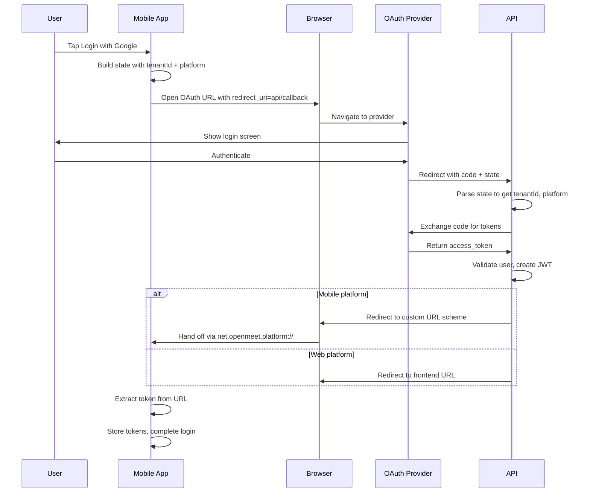

# Mobile OAuth State Management

This document explains how OAuth state and parameters are managed across different providers, particularly for mobile (Android/iOS) authentication flows.

## Flow Diagram



**Key characteristics:**
- API handles the OAuth callback (not frontend)
- State parameter carries tenantId + platform (not in redirect_uri)
- Custom URL scheme (`net.openmeet.platform:`) triggers app handoff on mobile
- Works because browsers hand off custom schemes to registered apps

## Problem

OAuth callbacks need to carry context (tenant ID, platform type) back to the API so we can:
1. Know which tenant config to use for token validation
2. Know whether to redirect to web frontend or mobile app (custom URL scheme)

Different OAuth providers have different constraints on how this data can be passed.

## Provider Strategies

### Google & GitHub OAuth

**Strategy**: Encode data in the `state` parameter

```typescript
// Frontend builds state as base64-encoded JSON
interface OAuthStateData {
  tenantId: string;
  platform: 'web' | 'android' | 'ios';
  nonce: string;  // Random value for CSRF protection
}

// Example state value
const state = btoa(JSON.stringify({
  tenantId: 'lsdfaopkljdfs',
  platform: 'android',
  nonce: 'abc123'
}));
```

**Flow**:
1. Frontend calls `/auth/google/authorize` or clicks OAuth link
2. State parameter contains encoded `{tenantId, platform, nonce}`
3. Provider redirects to `/api/v1/auth/google/callback?code=...&state=...`
4. API decodes state via `parseOAuthState()` to get tenantId and platform
5. API redirects to frontend domain (web) or custom URL scheme (mobile)

**Why this works**: Google/GitHub pass the state parameter through unchanged in the callback URL.

### Bluesky OAuth (AT Protocol)

**Strategy**: Tenant ID in redirect URI, platform in Redis

AT Protocol uses PAR (Pushed Authorization Request) which works differently:
- The state parameter is managed internally by the `@atproto/oauth-client-node` library
- We can't encode arbitrary data in state like with Google/GitHub

**Solution**:

1. **Tenant ID**: Baked into the registered `redirect_uri`
   ```typescript
   // In src/utils/bluesky.ts
   redirect_uris: [
     `${baseUrl}/api/v1/auth/bluesky/callback?tenantId=${tenantId}`,
   ],
   ```
   This works because tenantId is known at OAuth client initialization.

2. **Platform**: Stored in Redis, keyed by random `appState`
   ```typescript
   // In createAuthUrl()
   const appState = crypto.randomBytes(16).toString('base64url');

   // Pass to AT Protocol library
   const url = await client.authorize(handle, { state: appState });

   // Store platform in Redis
   await elasticacheService.set(
     `auth:bluesky:platform:${appState}`,
     platform,  // 'android' | 'ios' | 'web'
     600  // 10 minute TTL
   );
   ```

3. **On callback**: The library returns our `appState`, we look up platform from Redis
   ```typescript
   // In handleAuthCallback()
   const { session, state: appState } = await client.callback(params);
   const platform = await this.getStoredPlatform(appState);
   ```

**Why this is necessary**:
- AT Protocol requires exact `redirect_uri` matching (OAuth spec compliance)
- Platform varies per request (web vs android vs ios), can't be in registered URI
- The AT Protocol library manages state internally via PAR

## Mobile Redirect URLs

When `platform` is `android` or `ios`, the API redirects to a custom URL scheme instead of the web frontend:

```typescript
// Web redirect
https://platform.openmeet.net/auth/google/callback?token=...

// Mobile redirect (custom URL scheme)
net.openmeet.platform:/auth/google/callback?token=...
```

The custom URL scheme is configured via:
- API: `MOBILE_CUSTOM_URL_SCHEME` env var (default: `net.openmeet.platform`)
- Frontend: `APP_CUSTOM_URL_SCHEME` in config.json
- Android: `android:scheme` in AndroidManifest.xml

## Redis Keys

| Key Pattern | Purpose | TTL |
|-------------|---------|-----|
| `auth:bluesky:state:{state}` | AT Protocol OAuth state (managed by library) | 10 min |
| `auth:bluesky:platform:{appState}` | Platform type for mobile redirects | 10 min |

## Security Considerations

1. **State parameter (Google/GitHub)**: Contains a nonce for CSRF protection
2. **Redis TTL**: Platform data expires after 10 minutes
3. **Redirect URI validation**: AT Protocol validates exact URI match
4. **Custom URL scheme**: Only the registered app can handle the scheme

## Related Files

- `src/auth/types/oauth.types.ts` - OAuthStateData interface, parseOAuthState()
- `src/auth-google/auth-google.service.ts` - Google OAuth with state decoding
- `src/auth-github/auth-github.service.ts` - GitHub OAuth with state decoding
- `src/auth-bluesky/auth-bluesky.service.ts` - Bluesky OAuth with Redis platform storage
- `src/utils/bluesky.ts` - AT Protocol client initialization with tenantId in redirect_uri
