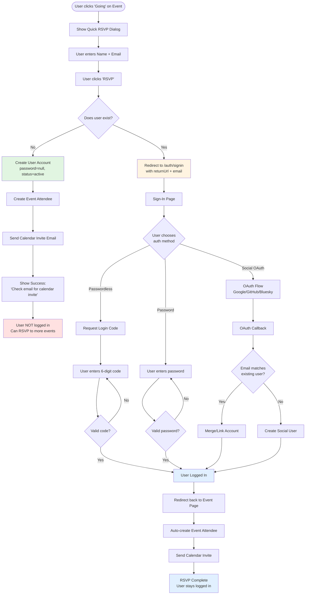
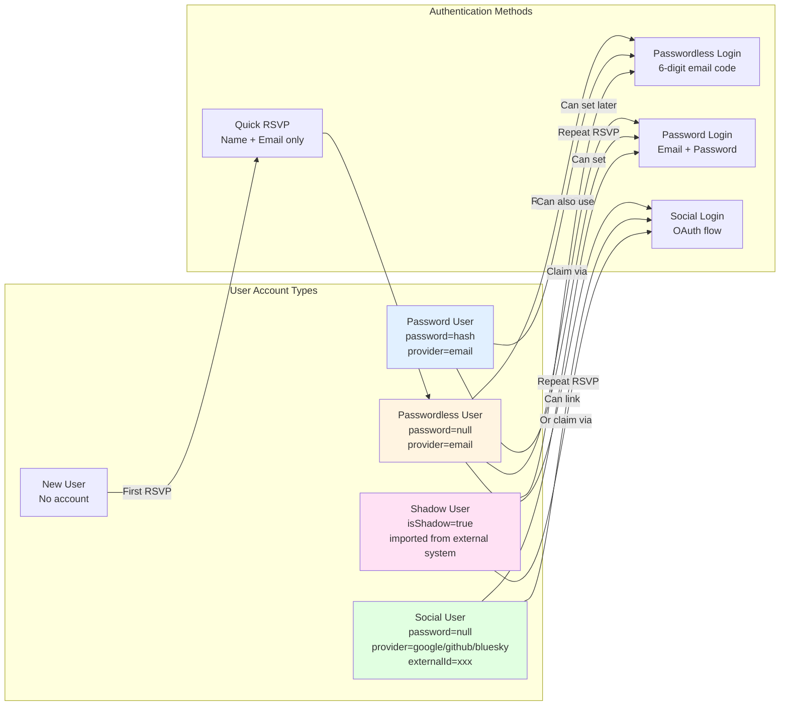
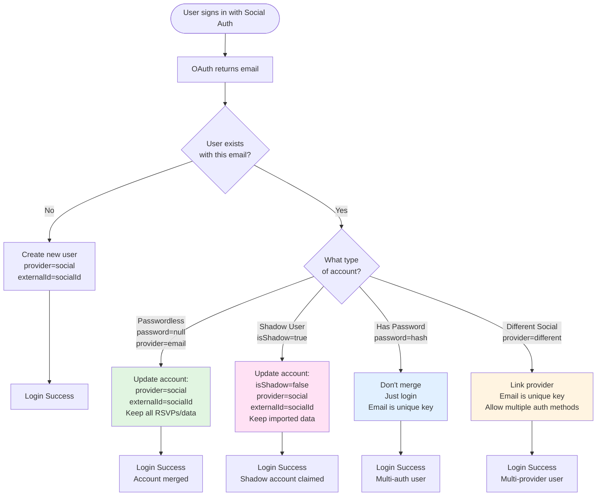
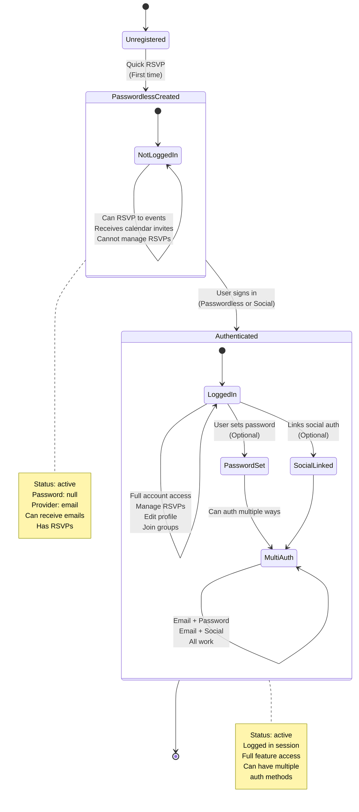
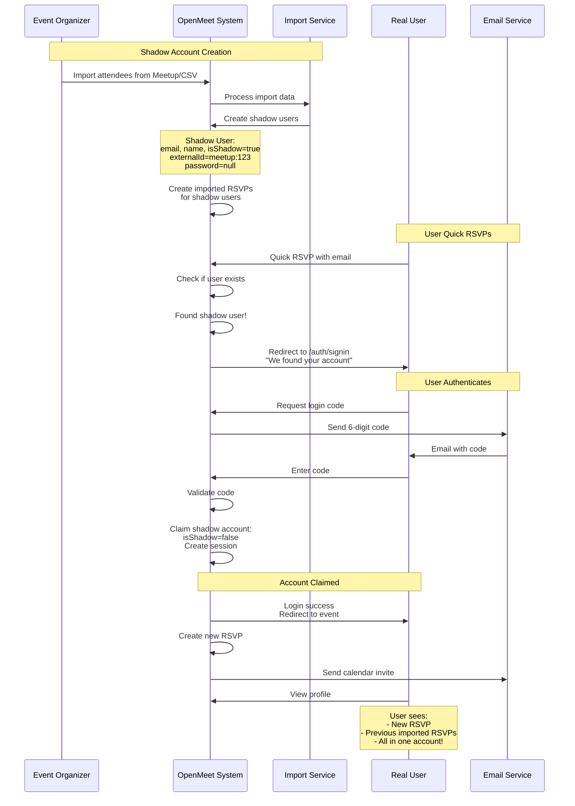
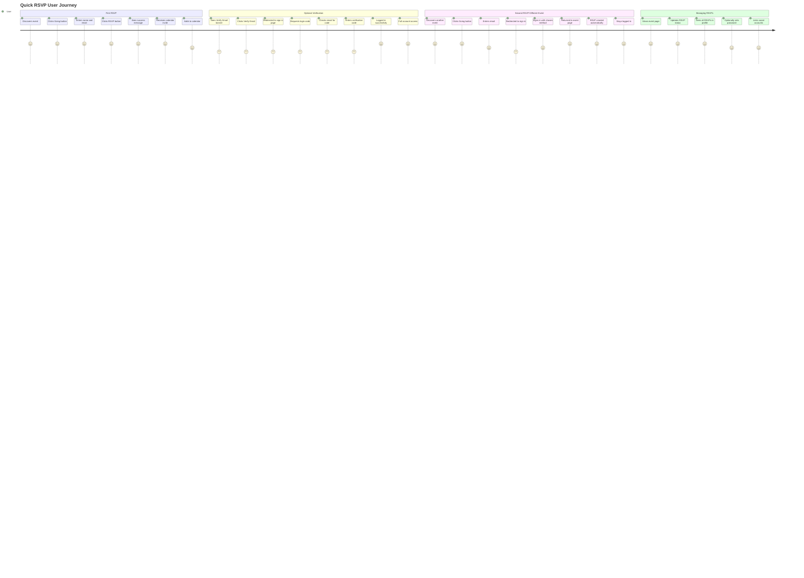

# Quick RSVP - Passwordless Onboarding Flow

**Status**: V2 Implemented ✅
**Date**: 2025-10-28 (Updated)
**Priority**: High - Adoption feature from GitHub issue #248
**Version**: 2.0 - Luma-style flow with simplified dialog

## Problem Statement

Currently, users must create a full account (with password) before they can RSVP to events. This creates friction that prevents casual users from quickly joining events. Competitors like Lu.ma have solved this with a "quick RSVP" flow that requires only name and email.

### User Pain Points
- Too many steps to RSVP (redirect → register → set password → navigate back → RSVP)
- Context loss when redirected to login page
- Decision fatigue (do I really want to create another account?)
- Abandoned RSVPs due to friction

### Business Impact
- Lower event attendance rates
- Reduced viral growth (harder for organizers to get people to join)
- Competitive disadvantage vs Lu.ma, Partiful
- Blocks Meetup.com migration (their users expect low-friction RSVP)

## Goals

### Primary Goals
1. **Reduce RSVP friction**: Allow users to RSVP with just name + email (no password)
2. **Maintain security**: Users verify email before they can manage their RSVP
3. **Enable future engagement**: Send event reminders, manage RSVP later
4. **Support multi-auth**: Allow users to later login with Google/Bluesky without duplicate accounts

### Non-Goals
- Remove password-based auth entirely (we still support it)
- Change existing user registration flow
- Implement full social account linking system (future work)

## Proposed Solution

### High-Level Flow (V2 - Implemented)

```
┌─────────────────────────────────────────────────────────────┐
│ 1. User visits event page (unauthenticated)                 │
│    - Clicks "Going" button                                   │
│    - Quick RSVP dialog appears:                             │
│      • Name field                                            │
│      • Email field                                           │
│      • "Register & RSVP" button                             │
│      • "Have an account? Log in" link                       │
└─────────────────────────────────────────────────────────────┘
                          │
                          ▼
┌─────────────────────────────────────────────────────────────┐
│ 2a. Path A: Quick RSVP (New User)                           │
│    - User enters: "John Doe" + "john@example.com"           │
│    - Clicks "Register & RSVP"                               │
│    - Backend checks: Email doesn't exist                    │
│    - Backend: Creates user (password=null, status=active)   │
│    - Backend: Creates EventAttendee                         │
│    - Backend: Sends calendar invite email                   │
│    - Response: 201 Success                                   │
│    - Dialog shows: "You're registered! Check email."        │
│    - Dialog closes, user is NOT logged in                   │
└─────────────────────────────────────────────────────────────┘
                          │
                          ▼
┌─────────────────────────────────────────────────────────────┐
│ 2b. Path B: Quick RSVP (Existing User)                      │
│    - User enters email that exists in system                │
│    - Backend checks: Email exists                           │
│    - Response: 409 "Email exists. Please sign in."          │
│    - Frontend: Stores RSVP intent in localStorage           │
│    - Frontend: Redirects to /auth/login with:               │
│      • email query param (pre-fills form)                   │
│      • returnUrl query param (event page)                   │
│      • context=quick-rsvp (shows banner)                    │
│    - Login page shows contextual banner                     │
│    - User completes login (password/email code/social)      │
│    - Backend: Auto-creates attendee after login             │
│    - Backend: Sends calendar invite                         │
│    - Frontend: Redirects back to event page                 │
│    - User is LOGGED IN, RSVP complete                       │
└─────────────────────────────────────────────────────────────┘
                          │
                          ▼
┌─────────────────────────────────────────────────────────────┐
│ 2c. Path C: User Clicks "Log in" Link                       │
│    - User clicks "Have an account? Log in"                  │
│    - Frontend: Stores RSVP intent in localStorage           │
│    - Frontend: Redirects to /auth/login with:               │
│      • email query param (if entered)                       │
│      • returnUrl query param (event page)                   │
│      • context=quick-rsvp                                   │
│    - Same flow as Path B from here                          │
└─────────────────────────────────────────────────────────────┘
                          │
                          ▼
┌─────────────────────────────────────────────────────────────┐
│ 3. User receives calendar invite email                      │
│    Subject: "You're registered for [Event Name]!"          │
│    Body:                                                     │
│      - Event details (date, time, location)                 │
│      - .ics file attachment OR calendar import link         │
│      - Link to event page                                    │
│    NOTE: No verification code in this email                 │
└─────────────────────────────────────────────────────────────┘
                          │
                          ▼
┌─────────────────────────────────────────────────────────────┐
│ 4. User sees "Verify Email" banner (Path A only)            │
│    - Flexible banner component shown on:                    │
│      • Event page                                            │
│      • Other pages as user browses                          │
│    - User clicks "Verify Email" button                      │
│    - Frontend: Calls /auth/request-email-verification       │
│    - Backend: Generates 6-digit code, sends email           │
│    - Dialog appears: "Check email for verification code"   │
└─────────────────────────────────────────────────────────────┘
                          │
                          ▼
┌─────────────────────────────────────────────────────────────┐
│ 5. User verifies email and completes profile                │
│    - User opens verification email, gets 6-digit code       │
│    - Enters code in dialog                                   │
│    - Frontend: Calls /auth/verify-email-code                │
│    - Backend: Validates code, creates session, returns JWT  │
│    - User is now LOGGED IN                                   │
│    - Can edit profile, manage RSVPs, use full features      │
└─────────────────────────────────────────────────────────────┘
```

**Key Design Principles (V2 - Implemented):**
- ✅ Quick RSVP creates user + attendee, user stays **not logged in**
- ✅ Calendar invite sent immediately, no verification code required
- ✅ Verification only happens when user clicks "Verify Email" banner (optional)
- ✅ **Simplified dialog**: Single Quick RSVP view, redirects to full login page (no embedded login)
- ✅ **RSVP intent pattern**: localStorage stores intent, completes after login
- ✅ **Luma-style flow**: First RSVP frictionless (no auth), repeat RSVP requires sign-in (409 → redirect)
- ✅ **Consistent login experience**: All login paths use same `/auth/login` page with all auth options
- ✅ **Passwordless login restricted**: Email code login only for existing users (not account creation)
- ✅ Pattern reusable for group join flow

## Flow Diagrams

### Diagram 1: Quick RSVP Flow (First vs Repeat)



### Diagram 2: User Account Types and Authentication Methods



### Diagram 3: Account Merging Rules (Email-Based)



### Diagram 4: Passwordless Account Lifecycle



### Diagram 5: Shadow User Flow



### Diagram 6: Complete User Journey Map



## Technical Design

### User Account States

**Quick RSVP User (Unverified):**
```typescript
{
  email: "john@example.com",
  firstName: "John",
  lastName: "Doe",
  provider: "email",
  password: null,           // ← Key indicator: no password set
  status: "active",         // ← Active (can receive emails, has RSVPs)
  externalId: null
}
```

**Verified User (After Email Verification):**
- Same as above, still `password = null`
- Can login via one-time email codes (passwordless)
- Can optionally set password later
- Can link social accounts

**Password User (If they set password):**
```typescript
{
  email: "john@example.com",
  provider: "email",
  password: "<bcrypt hash>",  // ← Now has password
  status: "active"
}
```

**Key Insight:** The `password` field (null or set) indicates authentication method, NOT account completeness. Status stays `active` throughout.

### Database Schema

No schema changes required! Existing `users` table supports this:

```typescript
// Existing schema already supports:
- password: nullable string
- provider: enum ('email', 'google', 'github', 'bluesky')
- status: enum ('active', 'inactive')
- email: unique string
```

### API Endpoints

#### 1. POST /auth/quick-rsvp (MODIFIED)

**Purpose:** Create account + RSVP without password, send calendar invite

**Request:**
```typescript
{
  name: string;         // "John Doe"
  email: string;        // "john@example.com"
  eventSlug: string;    // "my-awesome-event"
  status?: 'confirmed' | 'cancelled';  // Default: 'confirmed'
}
```

**Response (New User - 201 Created):**
```typescript
{
  success: true,
  message: "You're registered! Check your email for calendar invite.",
  userCreated: true
}
```

**Response (Existing User - 409 Conflict):**
```typescript
{
  statusCode: 409,
  message: "An account with this email already exists. Please log in.",
  error: "Conflict"
}
```

**Logic (V2 - UPDATED):**
1. Validate event exists (throw 404 if not)
2. Validate event is published and hasn't ended
3. **Check if user with email exists:**
   - **Exists**: Return 409 Conflict (frontend switches to login view)
   - **Not exists**: Continue to step 4
4. Parse name into firstName + lastName
5. Create new user (status=active, password=null, provider='email')
6. Create EventAttendee record
7. **Generate calendar invite (.ics file)**
8. **Send calendar invite email (NOT verification code)**
9. Return success

**Error Cases:**
- Event not found → 404
- Event not published or ended → 403
- Invalid email format → 400
- Email already exists → 409 (NEW)
- Event requires group membership → 403
- Event at capacity → 403

#### 2. POST /auth/request-login-code (MODIFIED - V2)

**Purpose:** Send passwordless login code to EXISTING users only

**Request:**
```typescript
{
  email: string;  // "john@example.com"
}
```

**Response (User Exists - 200 OK):**
```typescript
{
  success: true,
  message: "We sent a login code to your email."
}
```

**Response (User Doesn't Exist - 404 Not Found):**
```typescript
{
  statusCode: 404,
  message: "No account found with this email. Please register first.",
  error: "Not Found"
}
```

**Logic (UPDATED V2):**
1. Find user by email
2. **NEW**: If user doesn't exist, throw 404 (no account creation)
3. Check if user is active
4. Generate 6-digit login code (15min expiry)
5. Send login code email
6. Return success

**Rationale for Restriction:**
- Passwordless login is for existing users who don't remember/have password
- New users should use registration page for proper onboarding
- Quick RSVP handles frictionless new account creation
- Prevents confusion about multiple account creation paths

**Error Cases:**
- User not found → 404 "No account found with this email. Please register first."
- User inactive → 200 (silent - don't reveal account status)
- Rate limit exceeded → 429

#### 3. POST /auth/request-email-verification (NEW)

**Purpose:** Send verification code to unverified user

**Request:**
```typescript
{
  email: string;  // "john@example.com"
}
```

**Response:**
```typescript
{
  success: true,
  message: "Verification code sent to your email"
}
```

**Logic:**
1. Find user by email
2. Check if user needs verification (has password=null, not yet verified)
3. Generate 6-digit verification code (15min expiry)
4. Send verification code email
5. Return success

**Error Cases:**
- User not found → 404
- User already verified → 400 "Email already verified"
- Rate limit exceeded → 429

#### 3. POST /auth/verify-email-code (EXISTING)

**Purpose:** Verify email and login user

**Request:**
```typescript
{
  code: string;  // One-time verification code
}
```

**Response:**
```typescript
{
  token: string;          // JWT access token
  refreshToken: string;   // JWT refresh token
  tokenExpires: number;   // Timestamp
  user: User;             // User object
  sessionId: string;      // Session ID
}
```

**Logic:**
1. Validate code exists in Redis
2. Get userId + tenantId from code
3. Delete code from Redis (one-time use)
4. Create session (same as normal login)
5. Return JWT tokens
6. User is now logged in

**Error Cases:**
- Code not found → 401 "Invalid or expired code"
- Code already used → 401 "Code already used"

### Email Verification System

**Service:** Extend `TempAuthCodeService`

**Current state:**
- Only supports Matrix auth codes (5min TTL)
- Hardcoded key prefix: `matrix_auth_code:`
- No tests

**Required changes:**
```typescript
class TempAuthCodeService {
  // REFACTOR: Make TTL and key prefix configurable
  async generateAuthCode(
    userId: number,
    tenantId: string,
    options?: { ttlSeconds?: number, keyPrefix?: string }
  ): Promise<string> {
    const ttl = options?.ttlSeconds ?? 5 * 60; // Default 5min
    const prefix = options?.keyPrefix ?? 'matrix_auth_code';
    const code = randomBytes(32).toString('hex');
    const key = `${prefix}:${code}`;

    await this.elastiCacheService.set(
      key,
      { userId, tenantId, createdAt: Date.now() },
      ttl
    );
    return code;
  }

  // validateAndConsumeAuthCode - add optional keyPrefix param
  async validateAndConsumeAuthCode(
    code: string,
    keyPrefix = 'matrix_auth_code'
  ): Promise<TempAuthData | null> {
    const key = `${keyPrefix}:${code}`;
    // ... existing logic
  }
}

// Usage for email verification:
const code = await tempAuthCodeService.generateAuthCode(
  userId,
  tenantId,
  { ttlSeconds: 7 * 24 * 60 * 60, keyPrefix: 'email_verification' }
);
```

**Testing:** Add unit tests before extending (currently has none)

### Calendar Invite Generation (NEW - V2)

**Purpose:** Generate calendar invites that automatically integrate with all major calendar providers

**Service:** Create `CalendarInviteService` (new)

**Approach:** Multipart MIME email with text/calendar for automatic integration

**Why multipart MIME:**
- Single email reaches all users
- Outlook/Gmail/Apple Mail auto-detect `text/calendar` MIME part
- Shows "Add to Calendar" button automatically in email clients
- Includes HTML body with fallback "Add to Calendar" links
- Maximum compatibility across providers

**MIME Structure:**
```
Content-Type: multipart/alternative

Part 1: text/plain (plain text version)
Part 2: text/html (HTML email with Add to Calendar links)
Part 3: text/calendar; method=REQUEST (ICS data for auto-integration)
```

**ICS File Format (RFC 5545):**
```ics
BEGIN:VCALENDAR
VERSION:2.0
PRODID:-//OpenMeet//Event Calendar//EN
METHOD:REQUEST
BEGIN:VEVENT
UID:event-{eventId}-attendee-{userId}@openmeet.net
DTSTAMP:{timestamp}
DTSTART:{eventStartTimeUTC}
DTEND:{eventEndTimeUTC}
SUMMARY:{eventTitle}
DESCRIPTION:{eventDescription}
LOCATION:{eventLocation}
URL:{eventUrl}
ORGANIZER;CN={organizerName}:mailto:{organizerEmail}
ATTENDEE;CN={attendeeName};RSVP=TRUE;PARTSTAT=ACCEPTED:mailto:{attendeeEmail}
STATUS:CONFIRMED
SEQUENCE:0
BEGIN:VALARM
TRIGGER:-PT24H
ACTION:DISPLAY
DESCRIPTION:Reminder: {eventTitle} tomorrow
END:VALARM
END:VEVENT
END:VCALENDAR
```

**Add to Calendar Link Generation:**
```typescript
// Google Calendar
https://calendar.google.com/calendar/render?action=TEMPLATE&text={title}&dates={start}/{end}&details={description}&location={location}

// Outlook.com
https://outlook.live.com/calendar/0/action/compose?subject={title}&startdt={start}&enddt={end}&body={description}&location={location}

// Office 365
https://outlook.office.com/calendar/0/action/compose?subject={title}&startdt={start}&enddt={end}&body={description}&location={location}
```

**Implementation:**
```typescript
class CalendarInviteService {
  generateIcsContent(event: Event, attendee: User, organizer: User): string {
    // Generate RFC 5545 compliant ICS content
  }

  generateAddToCalendarLinks(event: Event): {
    google: string;
    outlook: string;
    office365: string;
  } {
    // Generate provider-specific URLs
  }

  async sendCalendarInvite(
    event: Event,
    attendee: User,
    organizer: User
  ): Promise<void> {
    const icsContent = this.generateIcsContent(event, attendee, organizer);
    const calendarLinks = this.generateAddToCalendarLinks(event);

    // Send multipart MIME email via MailService
    await this.mailService.sendCalendarInvite({
      to: attendee.email,
      icsContent,
      calendarLinks,
      event,
      attendee
    });
  }
}
```

**Libraries to Consider:**
- `ics` npm package for ICS generation
- `nodemailer` already supports multipart MIME
- Manual ICS generation for full control

**Integration Points:**
- Called by `quickRsvp()` after creating EventAttendee
- Called after any login that completes an RSVP
- Called when user changes RSVP status (update calendar)

### Email Templates (UPDATED - V2)

#### 1. Calendar Invite Email (NEW)

**Template:** `events/calendar-invite`

**Subject:** "You're registered for {eventTitle}!"

**Multipart Structure:**

**Part 1: HTML Body**
```html
<h1>You're registered for {eventTitle}!</h1>

<div class="event-details">
  <p>📅 {eventDate} at {eventTime}</p>
  <p>📍 {eventLocation}</p>
  <p>{eventDescription}</p>
</div>

<div class="calendar-buttons">
  <a href="{googleCalendarLink}" class="btn">Add to Google Calendar</a>
  <a href="{outlookCalendarLink}" class="btn">Add to Outlook</a>
  <a href="{office365CalendarLink}" class="btn">Add to Office 365</a>
</div>

<p><a href="{eventUrl}">View Event Details</a></p>

<p class="small-text">
  Not seeing an "Add to Calendar" button?
  Your email client may have automatically added this event to your calendar.
</p>
```

**Part 2: text/calendar (ICS data)**
- Contains full ICS content from CalendarInviteService
- MIME type: `text/calendar; method=REQUEST`
- Automatically parsed by email clients

**Variables:**
- eventTitle, eventDate, eventTime, eventLocation
- eventDescription, eventUrl
- attendeeName, organizerName
- googleCalendarLink, outlookCalendarLink, office365CalendarLink

#### 2. Email Verification Code Email (UPDATED)

**Template:** `auth/email-verification-code` (renamed from `auth/email-verification`)

**Subject:** "Verify your email - {appName}"

**Body:**
```html
<h1>Verify your email address</h1>

<p>Hi {name},</p>

<p>Enter this code to verify your email and complete your profile:</p>

<div class="verification-code">{code}</div>

<p>This code expires in 15 minutes.</p>

<p>After verification, you can:</p>
<ul>
  <li>Edit your profile</li>
  <li>Manage your RSVPs</li>
  <li>Join groups</li>
  <li>Set a password (optional)</li>
</ul>
```

**Variables:**
- name, code, appName, expiryMinutes

**Key Change:** No longer sent immediately after RSVP - only sent when user clicks "Verify Email"

### Frontend Components (UPDATED - V2)

**Current structure:**
```
EventRSVPSection (wrapper component)
├── EventAttendanceStatus (shows current status)
└── EventAttendanceButton (handles RSVP actions) ← MODIFY THIS
```

#### Changes Needed:

**1. QuickRSVPDialog.vue** (existing component - SIMPLIFIED V2 ✅)

**Implemented State:**
- Single view with Quick RSVP form (name + email)
- "Register & RSVP" button
- "Have an account? Log in" link
- Success view after RSVP
- No embedded login view

**Structure:**
```vue
<template>
  <q-dialog v-model="show">
    <!-- Success view -->
    <div v-if="currentView === 'success'">
      <q-icon name="check_circle" color="positive" size="xl" />
      <h2>You're registered!</h2>
      <p>Check your email for a calendar invite.</p>
      <q-btn @click="close">Done</q-btn>
    </div>

    <!-- Quick RSVP Form (default view) -->
    <div v-else>
      <h2>Quick RSVP</h2>
      <q-banner class="bg-blue-1">
        New to OpenMeet?
        Enter your info to create an account and RSVP in one step!
      </q-banner>
      <q-input v-model="name" label="Your Name" />
      <q-input v-model="email" label="Your Email" type="email" />
      <p class="info-text">
        We'll create your free account and send you a calendar invite.
      </p>
      <q-btn @click="submitQuickRsvp">Register & RSVP</q-btn>
      <p class="text-center">
        Have an account?
        <a @click="redirectToLogin">Log in</a>
      </p>
    </div>
  </q-dialog>
</template>

<script>
async submitQuickRsvp() {
  try {
    await api.quickRsvp({ name, email, eventSlug });
    this.currentView = 'success';
  } catch (error) {
    if (error.status === 409) {
      // Email exists - redirect to login page
      this.redirectToLogin();
    }
  }
}

redirectToLogin() {
  // Store RSVP intent in localStorage
  localStorage.setItem('rsvp_intent', JSON.stringify({
    eventSlug: this.eventSlug,
    status: 'confirmed',
    timestamp: Date.now(),
    returnUrl: window.location.href
  }));

  // Close dialog
  this.show = false;

  // Redirect to login page with context
  const loginUrl = `/auth/login?email=${encodeURIComponent(this.email)}&returnUrl=${encodeURIComponent(window.location.href)}&context=quick-rsvp`;
  window.location.href = loginUrl;
}
</script>
```

**Key behaviors:**
- Single view: Quick RSVP form (simplified)
- 409 response → Stores RSVP intent → Redirects to `/auth/login`
- "Have an account? Log in" link → Same redirect behavior
- Login page handles RSVP completion automatically
- Consistent login experience across all paths

**2. VerifyEmailBanner.vue** (NEW)

**Purpose:** Flexible component to prompt unverified users to verify email

**Props:**
- `placement`: 'event-page' | 'global' | 'profile'
- `dismissible`: boolean

**Structure:**
```vue
<template>
  <q-banner v-if="shouldShow" class="bg-warning text-white">
    <template v-slot:avatar>
      <q-icon name="warning" />
    </template>

    Verify your email to manage RSVPs and complete your profile.

    <template v-slot:action>
      <q-btn flat label="Verify Email" @click="startVerification" />
      <q-btn v-if="dismissible" flat icon="close" @click="dismiss" />
    </template>
  </q-banner>
</template>

<script>
async startVerification() {
  // Call /auth/request-email-verification
  await api.requestEmailVerification({ email: user.email });

  // Show code input dialog
  this.showCodeDialog = true;
}
</script>
```

**Usage:**
```vue
<!-- On event pages -->
<VerifyEmailBanner placement="event-page" :dismissible="true" />

<!-- In app layout (global banner) -->
<VerifyEmailBanner placement="global" :dismissible="true" />

<!-- On profile page -->
<VerifyEmailBanner placement="profile" :dismissible="false" />
```

**Visibility logic:**
- Only shown to authenticated users
- Only if user has `password === null`
- Only if user hasn't verified (check auth store)
- Can be dismissed but reappears on refresh until verified

**3. LoginComponent.vue** (existing component - ENHANCED V2 ✅)

**Implemented Features:**
- Pre-fills email from query params
- Detects Quick RSVP context from query params
- Shows contextual banner when `context=quick-rsvp`
- Checks for RSVP intent in localStorage after login
- Auto-creates RSVP and redirects to event page
- Supports all auth methods (password, email code, social)

**RSVP Intent Handling:**
```typescript
// After successful login (any method)
async handlePostLoginRedirect() {
  // 1. Check for OIDC flow first (priority)
  const oidcData = localStorage.getItem('oidc_flow_data');
  if (oidcData) {
    // Handle OIDC redirect...
    return;
  }

  // 2. Check for RSVP intent (from Quick RSVP)
  const rsvpIntent = localStorage.getItem('rsvp_intent');
  if (rsvpIntent) {
    const data = JSON.parse(rsvpIntent);

    // Check if not expired (5 minutes)
    if (Date.now() - data.timestamp < 5 * 60 * 1000) {
      // Auto-create RSVP
      await eventStore.actionAttendEvent(data.eventSlug, {
        status: data.status
      });

      // Clean up
      localStorage.removeItem('rsvp_intent');

      // Redirect to event page
      window.location.href = data.returnUrl;
      return;
    }
  }

  // 3. Normal redirect logic
  const returnUrl = route.query.returnUrl;
  if (returnUrl) {
    window.location.href = returnUrl;
  } else {
    router.replace('/');
  }
}
```

**Quick RSVP Context Banner:**
```vue
<q-banner v-if="isQuickRsvpContext" class="bg-blue-1">
  <q-icon name="celebration" />
  Sign in to complete your RSVP
  Your account already exists. Sign in to confirm your RSVP.
</q-banner>
```

**Key behaviors:**
- Email pre-filled from `?email=` query param
- Contextual messaging when coming from Quick RSVP
- RSVP created automatically after any successful login
- Works with password, passwordless code, and social auth
- Redirects back to event page after RSVP creation

**4. EventAttendanceButton.vue** (existing component - UPDATE)

**Current behavior:**
- Shows "Going" button for authenticated users
- Opens QuickRSVPDialog for unauthenticated users

**V2 Changes:**
- After login via dialog, automatically create attendance
- Handle RSVP completion in dialog, not in button component

**5. VerifyEmailCodeDialog.vue** (existing component - NO CHANGES)

**Current behavior already correct:**
- Shows 6-digit code input
- Calls `/auth/verify-email-code`
- Logs user in on success

**Used by:** VerifyEmailBanner component

## Account Linking Strategy

### Problem: User RSVPs with email, later wants to login with Google

**Scenario:**
1. User RSVPs as john@gmail.com (creates email account, password=null)
2. Later clicks "Login with Google"
3. Google returns email: john@gmail.com
4. **Question:** Do we create a new account or link to existing?

**Solution: Email-based account merging**

```typescript
async validateSocialLogin(provider, socialData, tenantId) {
  // 1. Check if user exists with this email
  let user = await userService.findByEmail(socialData.email);

  if (user) {
    // User exists - update auth method if needed
    if (user.provider === 'email' && user.password === null) {
      // Unverified email account → convert to social
      user.provider = provider;
      user.externalId = socialData.id;
      await userService.update(user.id, user);
    }
    // If they have a password or different provider, just login
    // (email is the unique key, they can auth multiple ways)
  } else {
    // New user - create via social
    user = await userService.create({...socialData, provider});
  }

  // Create session and return tokens...
}
```

**Key Rules:**
- **One email = one user** (email is UNIQUE key)
- `provider` field tracks how they first signed up
- Users can authenticate multiple ways with same email
- Auto-merge when: email matches AND account has no password

### Future: Multi-Provider Support

**Current Limitation:** One `provider` field per user

**Future Enhancement:** Add `auth_providers` table
```sql
CREATE TABLE auth_providers (
  id SERIAL PRIMARY KEY,
  user_id INTEGER REFERENCES users(id),
  provider VARCHAR(50), -- 'google', 'github', 'bluesky'
  external_id VARCHAR(255),
  created_at TIMESTAMP,
  UNIQUE(provider, external_id)
);
```

This would allow one user to have multiple linked auth methods. **Not in scope for v1.**

## Security Considerations

### Email Verification Codes
- ✓ 6-digit numeric codes (1M possibilities)
- ✓ 15-minute expiration (secure for 6-digit codes)
- ✓ One-time use (deleted after validation)
- ✓ Stored in Redis (auto-expiry)
- ✓ Multi-layer rate limiting (per-IP, per-email, per-email+code)

### Account Security
- ✓ Users with `password=null` can only login via email codes or social auth
- ✓ Email verification required before login
- ✓ JWT tokens follow existing security model
- ✓ Sessions use same security as current auth

### Spam/Abuse Prevention
- ⚠ **V1**: No rate limiting on quick RSVPs
- ⚠ **Future**: Add rate limiting (e.g., max 5 RSVPs per email per hour)
- ⚠ **Future**: Add CAPTCHA for suspicious activity

## Testing Strategy

### Unit Tests

**Backend:**
- ✓ QuickRsvpDto validation
- ✓ VerifyEmailCodeDto validation
- ✓ TempAuthCodeService.generateEmailVerificationCode()
- ✓ TempAuthCodeService.validateEmailVerificationCode()
- ✓ AuthService.quickRsvp() - all scenarios
- ✓ AuthService.verifyEmailCode() - all scenarios

**Frontend:**
- ✓ QuickRSVPModal renders correctly
- ✓ QuickRSVPModal validates email
- ✓ QuickRSVPModal handles API errors
- ✓ Email verification page handles code correctly

### Integration Tests
- ✓ POST /auth/quick-rsvp creates user + RSVP
- ✓ POST /auth/verify-email-code logs user in
- ✓ Duplicate RSVPs are idempotent
- ✓ Invalid codes are rejected

### E2E Tests
- ✓ Complete flow: RSVP → Email → Verify → Login → See RSVP
- ✓ Social login after quick RSVP merges accounts
- ✓ User can set password after verification

## Implementation Status (V2 - Completed ✅)

### V2 Implementation Completed: 2025-10-28

**Backend Changes:**
- ✅ AuthService.quickRsvp() - Returns 409 for existing users (Luma-style)
- ✅ AuthService.requestLoginCode() - Restricted to existing users only (no account creation)
- ✅ Calendar invite integration with event RSVP system
- ✅ E2E tests updated for new flow (13/13 passing)

**Frontend Changes:**
- ✅ QuickRSVPDialog - Simplified to single view, redirects to login page
- ✅ LoginComponent - RSVP intent handling, email pre-fill, contextual banner
- ✅ RSVP intent pattern - localStorage-based, 5-minute expiry
- ✅ Removed embedded login view from dialog
- ✅ Removed social login buttons from Quick RSVP main view

**Key Design Decisions:**
- ✅ **Luma-style flow**: First RSVP frictionless, repeat requires authentication
- ✅ **Simplified UX**: Single consistent login page for all authentication paths
- ✅ **Security**: Passwordless login only for existing users
- ✅ **Consistency**: All paths (409, "Log in" link, manual login) use same flow

**What Changed from Original V2 Plan:**
- ❌ **No embedded login view**: Originally planned two-view dialog, implemented redirect instead
- ✅ **Simpler UX**: Single-purpose components, clear separation of concerns
- ✅ **Better consistency**: All login flows use same `/auth/login` page
- ✅ **Clearer patterns**: RSVP intent pattern reusable for other flows

**Remaining Items (Future):**
- [ ] Calendar invite email testing across email clients (Gmail, Outlook, Apple Mail)
- [ ] Verify Email banner component (optional feature)
- [ ] Group join flow adaptation
- [ ] Production monitoring and metrics tracking

**Status Summary:**
Core V2 implementation is complete and functional. All E2E tests passing. Manual testing in progress.

## Success Metrics

**Primary:**
- ↑ RSVP conversion rate (target: +30%)
- ↑ New user registrations via events
- ↓ Time to first RSVP (target: <30 seconds)

**Secondary:**
- Email verification rate (target: >60% within 24hr)
- User satisfaction (qualitative feedback)
- Reduced support tickets about "can't RSVP"

## UX Refinements

### Mobile Optimization

**Issue:** Standard modals can feel awkward on mobile devices.

**Solution:** Use Quasar bottom sheet on mobile, modal on desktop
```vue
<q-dialog
  v-model="showQuickRsvp"
  :position="$q.screen.lt.md ? 'bottom' : 'standard'"
  :maximized="$q.screen.lt.sm"
>
  <!-- Quick RSVP form -->
</q-dialog>
```

- Desktop: Centered modal (familiar web pattern)
- Tablet: Bottom sheet (easier thumb reach)
- Mobile: Maximized sheet (full-screen form)

### Returning User Experience - Cookie-based Auto-Login ⏸️ NOT IMPLEMENTED

**Status**: Deferred to V2

**Reasoning**:
- 15-minute code expiry is too short for cookie-based auto-login
- Would require separate long-lived token system
- Email verification link is sufficient for V1

**Future Enhancement**:
If implementing, would need:
- Separate "remember me" token (30-day expiry)
- Different security model than verification codes
- Device fingerprinting for added security

## Design Decisions - FINALIZED ✅

### 1. **Returning user flow**
Email verification required (15-minute expiry). No auto-login in V1.

### 2. **Rate limiting**
Multi-layer throttling (per-IP, per-email, per-resource, per-combination)

### 3. **CAPTCHA**
None in v1. Add if abused.

### 4. **Email resend**
None in v1. RSVP is idempotent (just resubmit).

### 5. **Name parsing**
Split on first space: `firstName = name.split(' ')[0]`, `lastName = name.split(' ').slice(1).join(' ')`

### 6. **Social auth merging**
Silent auto-merge when email matches (same email = same person)

## Limitations (V1)

### Group/Member-Only Events

**Current Behavior:** Quick RSVP is **blocked** for events that require group membership.

**Reasoning:**
- V1 focuses on public events to reduce complexity
- Group membership requires additional approval workflows
- Keeps initial scope manageable

**Error Response:**
```json
{
  "statusCode": 403,
  "message": "This event requires group membership. Please register and join the group to RSVP."
}
```

**Implementation:**
- Check if event has associated group requirement
- Reject quick RSVP requests for group events
- Return clear error message directing user to full registration

**Future Enhancement (V2):**
Add automatic group membership request during quick RSVP:
1. User quick RSVPs to group event
2. System creates user + pending group membership request
3. Group admin receives notification to approve
4. RSVP becomes active when membership approved
5. User receives email when approved

This would enable the same low-friction experience for group events while maintaining group admin control.

## Password Management for Passwordless Users

**Goal:** Enable passwordless users to optionally set a password without friction or confusion.

### Issue
Passwordless users couldn't set passwords - profile page required "Current Password" which they didn't have.

### Solution
- **Backend:** Allow setting password without old password if user has `password: null`
- **Frontend:** Profile page shows "Set Account Password" (not "Change") for passwordless users, hides current password field
- **Discovery:** Hint on email verification success page links to profile settings

**Why:** Maintains low-friction onboarding while giving users password option if they want it. Passwordless auth remains valid path.

## Future Enhancements

- **Group membership auto-join:** Allow quick RSVP for group events with pending approval (see above)
- **Phone verification:** Alternative to email for some regions
- **Magic links:** Passwordless login for existing users
- **Account linking UI:** Explicit UI for linking multiple auth methods
- **RSVP reminders:** Automated email reminders before event
- **Waitlist support:** Quick RSVP to waitlist when event is full

## References

- Lu.ma RSVP flow: [Screenshots in claude/screenshot/]
- GitHub Issue #248: https://github.com/openmeet-team/openmeet-platform/issues/248
- Existing auth system: `openmeet-api/src/auth/`
- TempAuthCodeService: `openmeet-api/src/auth/services/temp-auth-code.service.ts`
